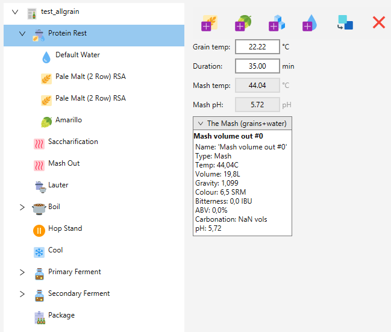
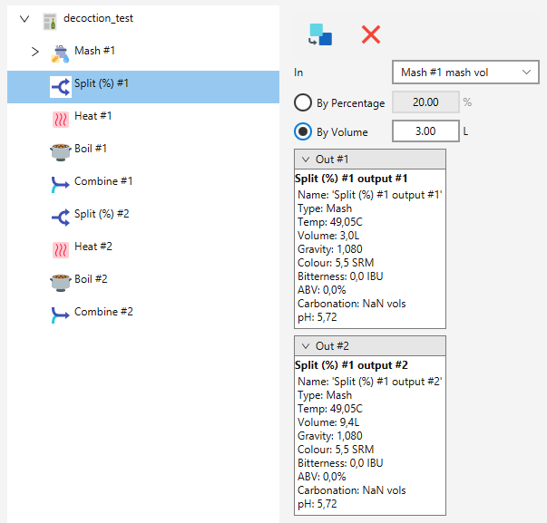
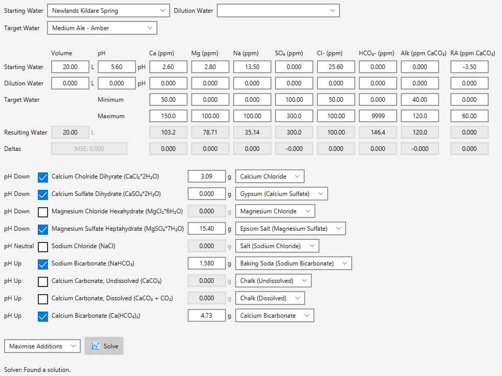

Brewday
=======
Brewday is a beer brewing app that is process-centric instead of recipe-centric.

The recipe-centric UX approach and data models of all other available beer 
brewing apps haven't really changed since ProMash. Brewday attempts to put the 
focus on process design, rather than recipe design. It aims to support building 
process flows impossible with current software.

Examples of processes impossible to represent in other brewing apps:
 * Parti-gyle brewing 
 * Splitting a batch at any stage, for example
     * Before the boil
     * After the boil
     * Before fermentation
 * Recombining any of the above after the are split and boiled, fermented, or otherwise processed
 * Freeze concentration after (or before) fermentation 
 * Arbitrarily complicated decoction mash schedules
 * Arbitrarily complicated fermentation schedules

Current status
-------------- 
Alpha. 
This is alpha software; it might crash while you're doing important work, delete
your saved data, calculate your recipe wrong, etc. Data saved with this version
may not load in future versions.
I have migrated my brewing to Brewday.

Running it
----------
* Grab the latest [release](https://github.com/alanmclachlan/brewday/releases).
* Unzip and execute brewday.exe (requires 64-bit Windows).

Features
------------
 * Process centric recipe design. Process steps can be combined in any way to 
 create processes of arbitrary complexity. 
 * Process templates can be saved for future use creating similar recipes.
 * Equipment profiles
 * Explicit separation of recipes vs batches, including a 1-to-many relationship. 
 * Basic inventory management, integrated with batches.
 * Reference database of waters, water profiles, fermentables, hops, yeast, misc.
 * Reference database of styles.
 * BeerXML import. CSV import of batch data.
 * Water Builder tool, uses linear programming to find water additions to fit a 
 water profile.
 * IBU calculation models: Tinseth, Rager, Garetz, Daniels
 * Mash pH models: MpH, EZ Water
 * The backend is json files in local storage.
 
Screenshots
-----------
**A generic all grain recipe featuring a step mash.**

**A decoction schedule**

Note that this is not a complete recipe.

**Water builder vanity shot**

Look at that LP

