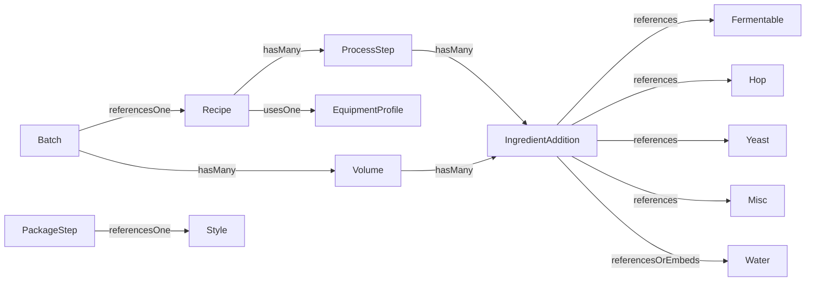

# Brewday Data Model Document

## Purpose

This document defines the persisted and runtime data model used by Brewday, with emphasis on:

- JSON file layout and top-level shapes
- Entity fields, types, defaults, and constraints
- Relationships and cardinalities
- Serialization contracts and polymorphic discriminators
- Validation, invariants, failure modes, and compatibility behavior

## Persistence Architecture

Brewday persists data as JSON files in the configured DB directory (default `data/db`).

- Orchestration: `src/main/java/mclachlan/brewday/db/Database.java`
- Generic collection silo: `src/main/java/mclachlan/brewday/db/v2/SimpleMapSilo.java`
- Settings singleton silo: `src/main/java/mclachlan/brewday/db/v2/MapSingletonSilo.java`
- JSON I/O utility: `src/main/java/mclachlan/brewday/db/v2/V2Utils.java`
- Reflection-based serializer for simple entities: `src/main/java/mclachlan/brewday/db/v2/ReflectiveSerialiser.java`

Model characteristic:

- Most persisted collections are map-like in memory (`Map<String,T>`) and stored as JSON arrays on disk.
- `settings.json` is persisted as a JSON object/map.
- No explicit schema version key is enforced globally.

## Persisted File Inventory

Files are loaded and saved centrally by `Database`.

- `recipes.json` -> `Recipe`
- `processtemplates.json` -> `Recipe` (template recipes)
- `batches.json` -> `Batch`
- `inventory.json` -> `InventoryLineItem`
- `fermentables.json` -> `Fermentable`
- `hops.json` -> `Hop`
- `yeasts.json` -> `Yeast`
- `miscs.json` -> `Misc`
- `water.json` -> `Water`
- `water_parameters.json` -> `WaterParameters`
- `styles.json` -> `Style`
- `equipment_profiles.json` -> `EquipmentProfile`
- `settings.json` -> settings map

Representative examples exist under `test_data/test_db`.

## Type System and Serialization Contracts

## Primitive and Supporting Types

- `String`, `boolean`, numeric primitives/wrappers are persisted as JSON scalar values.
- Enums are persisted by enum name strings and parsed back via `Enum.valueOf(...)` in serializers.
- Domain quantities use structured objects (`Quantity`), not raw numbers, to preserve units and estimate semantics.

## `Quantity`

- Class: `src/main/java/mclachlan/brewday/math/Quantity.java`
- Serializer: `src/main/java/mclachlan/brewday/db/QuantitySerialiser.java`

Persisted fields:

- `amount`: numeric value as string/number (serializer normalizes to `double`)
- `unit`: enum name (`Quantity.Unit`)
- `estimate`: boolean

Rules:

- Unknown `unit` fails deserialization.
- `estimate` defaults are serializer-controlled (explicitly written where used).

## `Volume`

- Class: `src/main/java/mclachlan/brewday/process/Volume.java`
- Serializer: `src/main/java/mclachlan/brewday/db/VolumeSerialiser.java`

Persisted fields:

- `name`: string key/label
- `type`: enum (`Volume.Type`)
- `metrics`: map from `Volume.Metric` -> `Quantity`
- `ingredientAdditions`: array of `IngredientAddition`

Rules:

- Estimated metrics may be omitted on save in some code paths to reduce persisted noise.
- Metric enum parsing is strict.

## Core Entity Catalog

## `Recipe` (aggregate root)

- Class: `src/main/java/mclachlan/brewday/recipe/Recipe.java`
- Serializer: `src/main/java/mclachlan/brewday/db/RecipeSerialiser.java`

Persisted fields:

- `name`: string, unique logical identity
- `desc`: string description (maps to `description` field in class)
- `tags`: array of string
- `equipmentProfile`: string foreign key by profile name
- `steps`: array of polymorphic `ProcessStep`

Defaults/compatibility behavior:

- Missing `tags` are treated as empty list by serializer fallback logic.
- Field-name divergence is intentional (`description` in object vs `desc` in JSON).

Execution invariants:

- Step graph must be acyclic for deterministic topological sort.
- Missing referenced volumes or invalid dependencies trigger process exceptions.

## `ProcessStep` polymorphic hierarchy

- Base class path: `src/main/java/mclachlan/brewday/process/ProcessStep.java`
- Serializer: `src/main/java/mclachlan/brewday/db/StepSerialiser.java`
- Discriminator field: `type`

Common persisted fields across step types:

- `name`
- `description`
- `type`
- `ingredients` (array of `IngredientAddition`, where applicable)
- Input/output volume references depending on step subtype

Known step type enum values (from serializer/domain):

- `MASH`
- `MASH_INFUSION`
- `LAUTER`
- `BATCH_SPARGE`
- `BOIL`
- `DILUTE`
- `COOL`
- `HEAT`
- `FERMENT`
- `STAND`
- `SPLIT`
- `COMBINE`
- `PACKAGE`

Subtype-specific field examples:

- Mash-like: target temp/time, pH, strike volume references, mash outputs.
- Lauter/sparge: input mash/wort volume refs, output refs, losses/efficiencies.
- Boil: duration, trub/chiller-loss behavior, evaporation or target/output assumptions.
- Ferment: temp/time profile, attenuation-related fields, output beer refs.
- Combine/split: multiple input/output volume names.
- Package: packaging type, style reference (`styleId`), carbonation targets.

Strictness:

- Unknown `type` values throw `BrewdayException` during deserialization.

## `IngredientAddition` polymorphic hierarchy

- Base class: `src/main/java/mclachlan/brewday/process/IngredientAddition.java`
- Serializer: `src/main/java/mclachlan/brewday/db/IngredientAdditionSerialiser.java`
- Discriminator field: `type`

Common persisted fields:

- `name`
- `quantity`
- `time` (seconds)
- `unit` (timing unit enum)
- `type`

Type variants and references:

- Fermentable addition: field `fermentable` (string FK to `Fermentable.name`)
- Hop addition: field `hop` (string FK to `Hop.name`)
- Yeast addition: field `yeast` (string FK to `Yeast.name`)
- Misc addition: field `misc` (string FK to `Misc.name`)
- Water addition:
  - Either `water` as FK by name
  - Or embedded/combined water payload indicated by `isCombinedWater` and water-chemistry fields

Compatibility behavior:

- Serializer includes fallback/default behavior for some legacy unit omissions.

## `Batch`

- Class: `src/main/java/mclachlan/brewday/batch/Batch.java`
- Serializer: `src/main/java/mclachlan/brewday/db/BatchSerialiser.java`

Persisted fields:

- `name`: string (maps to batch id/identity)
- `description`: string
- `recipe`: string FK to recipe name
- `date`: string in `dd-MMM-yyyy`
- `inventoryConsumed`: boolean
- `measurements`: map of measurement name -> `Volume`

Rules:

- Date format parsing is strict; malformed values fail deserialization.
- `recipe` reference consistency is maintained by UI rename/delete cascade paths.

## `InventoryLineItem`

- Class: `src/main/java/mclachlan/brewday/inventory/InventoryLineItem.java`
- Serializer: `src/main/java/mclachlan/brewday/db/InventoryLineItemSerialiser.java`

Persisted fields:

- `ingredient`: string
- `type`: enum (`IngredientAddition.Type`)
- `quantity`: numeric/quantity amount
- `unit`: enum (`Quantity.Unit`)

Identity convention:

- Logical unique display key is derived as ingredient plus type label.

## Reference Data Entities (reflective serialization)

These are generally keyed by `name` and persisted with explicit field allowlists configured in `Database`.

## `EquipmentProfile`

- Class: `src/main/java/mclachlan/brewday/equipment/EquipmentProfile.java`
- Serializer strategy: `ReflectiveSerialiser`
- Used by `Recipe.equipmentProfile`

Typical fields include vessel capacities and process loss assumptions used by mash/boil/ferment warnings and calculations.

## `Fermentable`

- Class: `src/main/java/mclachlan/brewday/ingredients/Fermentable.java`
- Reflective serialization fields include identity/classification and contribution metrics.
- Common persisted keys in datasets include:
  - `name`, `type`, `yield`, `colour`, `bufferingCapacity`

## `Hop`

- Class: `src/main/java/mclachlan/brewday/ingredients/Hop.java`
- Common persisted keys:
  - `name`, `alphaAcid`, `betaAcid`, `form`, `type`

## `Yeast`

- Class: `src/main/java/mclachlan/brewday/ingredients/Yeast.java`
- Common persisted keys:
  - `name`, `form`, `type`, `attenuation`, flocculation and temperature bounds

## `Misc`

- Class: `src/main/java/mclachlan/brewday/ingredients/Misc.java`
- Persisted keys describe type/use/category and any dosage/application metadata.

## `Water`

- Class: `src/main/java/mclachlan/brewday/ingredients/Water.java`
- Common persisted keys:
  - `name`, ionic composition fields, `ph`

Runtime-derived (not persisted as source-of-truth):

- Alkalinity/residual alkalinity values are computed by formula methods.

## `WaterParameters`

- Class: `src/main/java/mclachlan/brewday/math/WaterParameters.java`
- Stores preferred min/max ranges and target values used in chemistry guidance.

## `Style`

- Class: `src/main/java/mclachlan/brewday/style/Style.java`
- Common persisted keys:
  - identification metadata and min/max ranges for OG/FG/IBU/SRM/ABV/carbonation

Referenced by:

- `PackageStep.styleId`

## Settings Model

- Wrapper class: `src/main/java/mclachlan/brewday/Settings.java`
- Persistence silo: `MapSingletonSilo` to `settings.json`
- Top-level shape: JSON object map (`{ "key": value, ... }`)

Common setting domains:

- Application versioning metadata
- DB path or runtime integration toggles
- UI/preferences
- Optional git backend enablement/configuration

## Relationship Model

Cardinality summary:

- One `Recipe` contains many `ProcessStep`.
- One `ProcessStep` contains many `IngredientAddition`.
- Many `Recipe` may reference one `EquipmentProfile` by name.
- Many `Batch` may reference one `Recipe` by name.
- One `Batch` can store many named measured `Volume` entries.
- `IngredientAddition` references one ingredient entity depending on type.

## JSON Shapes by File

## Array-based collection files

Top-level shape:

- `[ {entityObject1}, {entityObject2}, ... ]`

Used by:

- `recipes.json`, `batches.json`, `inventory.json`, `fermentables.json`, `hops.json`, `yeasts.json`, `miscs.json`, `water.json`, `water_parameters.json`, `styles.json`, `equipment_profiles.json`, `processtemplates.json`

## `settings.json`

Top-level shape:

- `{ "settingKey": settingValue, ... }`

## Representative key sets from sample DB files

- `recipes.json`: `name`, `equipmentProfile`, `tags`, `steps`
- Step object keys vary by subtype but include `name`, `description`, `type`, `ingredients`
- Ingredient addition object keys include `type`, `time`, `unit`, `quantity` and ingredient-specific ref keys
- `batches.json`: `name`, `recipe`, `description`, `date`, `inventoryConsumed`, `measurements`
- `inventory.json`: `ingredient`, `type`, `unit`, `quantity`

## Persisted vs Computed Data Boundaries

Persisted:

- Canonical recipe definitions, step parameters, ingredient references
- Batch metadata and captured measurements
- Reference ingredient/equipment/style datasets
- Settings and inventory stock lines

Computed at runtime (not canonical persisted source):

- Step execution logs and intermediate simulation state
- Many calculated volume metrics and prediction values
- Mash pH/temp estimates, boil timing estimates, fermentation estimates
- Water chemistry derived fields (for example alkalinity derivatives)

Implication:

- Re-running recipe execution after load is required to regenerate transient computed outputs from persisted inputs.

## Validation and Invariants

## Structural and referential invariants

- Step dependency graph must not contain cycles for successful topological ordering.
- Volume references used by steps must exist in current `Volumes` map.
- Enum values for types/units/metrics must be valid known names.
- Batch `date` must conform to expected parser format.

## Domain-required ingredient rules

- Mash workflows require fermentable additions and strike water presence.
- Boil workflows without explicit input volume require water additions.
- Ferment workflows on wort require yeast addition.

## Capacity and style conformance checks

- Equipment capacity mismatches produce warnings (mash tun, boil kettle, fermenter).
- Packaging/style checks compare measured/predicted stats against style limits and issue warnings.

## Failure modes

- Unknown serializer discriminator (`type`) causes immediate deserialization exceptions.
- Missing referenced volumes or invalid process wiring cause runtime `BrewdayException`.
- Invalid enum names in JSON cause load failure.
- Save failure triggers backup-restore behavior; partial writes are guarded by rollback logic in `Database`.

## Schema Evolution and Backward Compatibility

Current strategy:

- No global schema version or migration framework.
- Backward compatibility handled ad hoc in serializers/import flows.

Observed compatibility tactics:

- Missing optional fields receive defaults during deserialization (`tags`, some unit fields).
- Import logic includes targeted normalization/fixes for legacy datasets.

Gap:

- Without explicit versioning/migrations, long-term maintainability depends on serializer defensive coding and importer patch logic.

## Data Integrity Checklist for Future Changes

When introducing or changing fields/entities:

1. Update domain class, serializer, and sample test data together.
2. Define default behavior for missing legacy fields.
3. Add import compatibility handling where external formats may omit required values.
4. Preserve stable identity keys (`name`-based maps) or provide migration rules.
5. Validate all enum expansions in parser/serializer switch logic.
6. Re-test `Database.loadAll()` and `saveAll()` round-trip against old and new datasets.
7. Verify UI rename/delete cascades for all name-based references.

## Source File Reference Index

- Persistence coordinator: `src/main/java/mclachlan/brewday/db/Database.java`
- Generic silo layer: `src/main/java/mclachlan/brewday/db/v2/SimpleMapSilo.java`
- Reflective serializer: `src/main/java/mclachlan/brewday/db/v2/ReflectiveSerialiser.java`
- Recipe serializer: `src/main/java/mclachlan/brewday/db/RecipeSerialiser.java`
- Step serializer: `src/main/java/mclachlan/brewday/db/StepSerialiser.java`
- Ingredient addition serializer: `src/main/java/mclachlan/brewday/db/IngredientAdditionSerialiser.java`
- Batch serializer: `src/main/java/mclachlan/brewday/db/BatchSerialiser.java`
- Volume serializer: `src/main/java/mclachlan/brewday/db/VolumeSerialiser.java`
- Quantity serializer: `src/main/java/mclachlan/brewday/db/QuantitySerialiser.java`
- Inventory serializer: `src/main/java/mclachlan/brewday/db/InventoryLineItemSerialiser.java`
- Sample persisted data: `test_data/test_db/recipes.json`, `test_data/test_db/batches.json`, `test_data/test_db/inventory.json`

