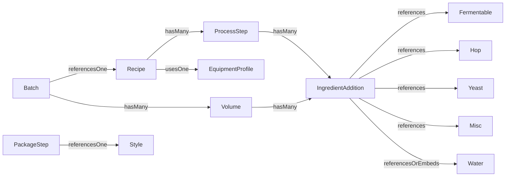

# Brewday Data Model Document

## Purpose

This document is a data dictionary for the Brewday application. It catalogues all logical data types, their properties and Java types, supported enums, the quantity/unit system, the volume metrics model, and the equations and calculation support.

For persistence architecture, serialization contracts, JSON file layouts, backup/restore behaviour, schema evolution strategy, and validation/failure modes, see [design-document.md](design-document.md).

## Quantity and Unit System

All numeric domain values with physical meaning are represented as typed `Quantity` objects rather than raw numbers.

### Quantity (abstract base)

Source: `src/main/java/mclachlan/brewday/math/Quantity.java`

| Field | Java Type | Description |
|-------|-----------|-------------|
| (internal value) | `double` | Stored in a canonical base unit specific to each subclass |
| (unit) | `Quantity.Unit` | The unit this quantity is expressed in |
| `estimated` | `boolean` | Whether the value is estimated (true) or measured (false); default `true` |

Conversion is performed by `get(Unit)` and `set(double, Unit)` methods on each subclass, which convert between the requested unit and the internal canonical unit. The `set(...)` methods are package-private, making Quantity instances effectively immutable outside the `math` package.

### Quantity.Type Enum

Groups units into measurement categories. Each type defines a default unit.

| Type | Default Unit |
|------|-------------|
| `WEIGHT` | `GRAMS` |
| `LENGTH` | `MILLIMETRE` |
| `VOLUME` | `MILLILITRES` |
| `TEMPERATURE` | `CELSIUS` |
| `FLUID_DENSITY` | `PLATO` |
| `COLOUR` | `SRM` |
| `BITTERNESS` | `IBU` |
| `CARBONATION` | `VOLUMES` |
| `PRESSURE` | `KPA` |
| `TIME` | `SECONDS` |
| `SPECIFIC_HEAT` | `JOULE_PER_KG_CELSIUS` |
| `DIASTATIC_POWER` | `LINTNER` |
| `POWER` | `KILOWATT` |
| `OTHER` | (none) |

### Quantity.Unit Enum

All 40 unit values, grouped by measurement type:

| Type | Unit Values |
|------|-------------|
| Weight | `MILLIGRAMS`, `GRAMS`, `KILOGRAMS`, `OUNCES`, `POUNDS`, `PACKET_11_G` |
| Length | `MILLIMETRE`, `CENTIMETRE`, `METRE`, `KILOMETER`, `INCH`, `FOOT`, `YARD`, `MILE` |
| Volume | `MILLILITRES`, `LITRES`, `US_FLUID_OUNCE`, `US_GALLON` |
| Temperature | `CELSIUS`, `KELVIN`, `FAHRENHEIT` |
| Fluid Density | `GU`, `SPECIFIC_GRAVITY`, `PLATO` |
| Colour | `SRM`, `LOVIBOND`, `EBC` |
| Bitterness | `IBU` |
| Carbonation | `GRAMS_PER_LITRE`, `VOLUMES` |
| Pressure | `KPA`, `PSI`, `BAR` |
| Time | `SECONDS`, `MINUTES`, `HOURS`, `DAYS` |
| Specific Heat | `JOULE_PER_KG_CELSIUS` |
| Diastatic Power | `LINTNER` |
| Percentage | `PERCENTAGE` (float 0..1), `PERCENTAGE_DISPLAY` (int 0..100) |
| Power | `KILOWATT` |
| Other | `PPM`, `PH`, `MEQ_PER_KILOGRAM` |

Each `Unit` carries a display label and abbreviation loaded from string resources.

### Typed Quantity Subclasses

Each subclass restricts valid units to its measurement type and stores the value internally in one canonical base unit. Conversions happen inside `get(Unit)` / `set(double, Unit)`.

| Subclass | Canonical Internal Unit | Supported Units | Arithmetic Methods |
|----------|------------------------|-----------------|-------------------|
| `WeightUnit` | grams | MILLIGRAMS, GRAMS, KILOGRAMS, OUNCES, POUNDS, PACKET_11_G | `add`, `subtract` |
| `LengthUnit` | millimetres | MILLIMETRE, CENTIMETRE, METRE, KILOMETER, INCH, FOOT, YARD, MILE | -- |
| `VolumeUnit` | millilitres | MILLILITRES, LITRES, US_FLUID_OUNCE, US_GALLON | `add` |
| `TemperatureUnit` | Celsius | CELSIUS, KELVIN, FAHRENHEIT | -- |
| `DensityUnit` | GU (gravity units) | GU, SPECIFIC_GRAVITY, PLATO | `add` |
| `ColourUnit` | SRM | SRM, LOVIBOND, EBC | -- |
| `BitternessUnit` | IBU | IBU | `add` |
| `CarbonationUnit` | grams/litre | GRAMS_PER_LITRE, VOLUMES | -- |
| `PressureUnit` | kPa | KPA, PSI, BAR | -- |
| `TimeUnit` | seconds | SECONDS, MINUTES, HOURS, DAYS | -- |
| `PowerUnit` | kilowatts | KILOWATT | -- |
| `PercentageUnit` | float 0..1 | PERCENTAGE, PERCENTAGE_DISPLAY | -- |
| `PpmUnit` | ppm | PPM | -- |
| `PhUnit` | pH | PH | -- |
| `DiastaticPowerUnit` | Lintner | LINTNER | -- |
| `ArbitraryPhysicalQuantity` | variable (stores its own Unit) | JOULE_PER_KG_CELSIUS, MEQ_PER_KILOGRAM, or any Unit | -- |

Source files: `src/main/java/mclachlan/brewday/math/` (one file per subclass, plus `Quantity.java`).

`ArbitraryPhysicalQuantity` is a special case: it stores its own `Unit` field and does not perform conversions. It is used for one-off physical quantities (specific heat, buffering capacity) that don't need multi-unit conversion.

### Key Conversion Formulas

| Domain | Conversion |
|--------|-----------|
| Weight | `GRAMS_PER_OUNCE = 28.3495`, `GRAMS_PER_POUND = 455`, `PACKET_11_G = 11g` |
| Volume | `ML_PER_US_FL_OZ = 29.5735`, `ML_PER_US_GALLON = 3785.41` |
| Temperature | `K = C + 273.15`, `F = C * 9/5 + 32` |
| Density | SG = `(1000 + GU) / 1000`; GU->Plato via cubic polynomial; Plato->GU via rational formula |
| Colour | Lovibond = `(SRM + 0.6) / 1.3546`; EBC = `SRM * 1.97` |
| Carbonation | Volumes CO2 = `g_per_litre * 0.51` |
| Pressure | PSI = `kPa / 6.89475728`; BAR = `kPa / 100` |
| Percentage | PERCENTAGE_DISPLAY = `PERCENTAGE * 100` |

## Reference Data Types

### Fermentable

Source: `src/main/java/mclachlan/brewday/ingredients/Fermentable.java`

| Field | Java Type | Notes |
|-------|-----------|-------|
| `name` | `String` | Unique key |
| `description` | `String` | |
| `type` | `Fermentable.Type` | See enum below |
| `origin` | `String` | Country/region of origin |
| `supplier` | `String` | |
| `yield` | `PercentageUnit` | Extract yield percentage |
| `colour` | `ColourUnit` | Grain/extract colour |
| `addAfterBoil` | `boolean` | |
| `coarseFineDiff` | `PercentageUnit` | |
| `moisture` | `PercentageUnit` | |
| `diastaticPower` | `DiastaticPowerUnit` | Enzymatic power |
| `protein` | `PercentageUnit` | |
| `maxInBatch` | `PercentageUnit` | Maximum recommended percentage in grain bill |
| `recommendMash` | `boolean` | |
| `ibuGalPerLb` | `double` | IBU contribution for pre-hopped extracts |
| `distilledWaterPh` | `PhUnit` | pH when mashed in distilled water |
| `bufferingCapacity` | `ArbitraryPhysicalQuantity` | pH buffering capacity (mEq/kg) |
| `lacticAcidContent` | `PercentageUnit` | For acidulated malts |

**Fermentable.Type enum:** `GRAIN`, `SUGAR`, `LIQUID_EXTRACT`, `DRY_EXTRACT`, `ADJUNCT`, `JUICE`, `HONEY` (each with a `sortOrder` and default quantity unit/type).

### Hop

Source: `src/main/java/mclachlan/brewday/ingredients/Hop.java`

| Field | Java Type | Notes |
|-------|-----------|-------|
| `name` | `String` | Unique key |
| `description` | `String` | |
| `type` | `Hop.Type` | See enum below |
| `form` | `Hop.Form` | See enum below |
| `origin` | `String` | |
| `substitutes` | `String` | |
| `alphaAcid` | `PercentageUnit` | Alpha acid content |
| `betaAcid` | `PercentageUnit` | Beta acid content (used in Garetz formula) |
| `humulene` | `PercentageUnit` | Oil composition |
| `caryophyllene` | `PercentageUnit` | Oil composition |
| `cohumulone` | `PercentageUnit` | Oil composition |
| `myrcene` | `PercentageUnit` | Oil composition |
| `hopStorageIndex` | `PercentageUnit` | HSI for freshness/aging calculations |

**Hop.Type enum:** `BITTERING`, `AROMA`, `BOTH` (each with `sortOrder`).

**Hop.Form enum:** Each constant carries process-behaviour properties that drive calculation and UI behaviour.

| Constant | utilisationMultiplier | absorptionMultiplier | particulateFraction | alphaAvailability | isPreIsomerized | Default Unit |
|---|---|---|---|---|---|---|
| `LEAF` | 1.00 | 1.00 | 1.00 | 1.00 | false | grams |
| `PLUG` | 1.02 | 0.95 | 0.95 | 1.02 | false | grams |
| `PELLET_T90` | 1.10 | 0.70 | 0.75 | 1.08 | false | grams |
| `CRYO` | 1.15 | 0.35 | 0.40 | 1.15 | false | grams |
| `CO2_EXTRACT` | 1.25 | 0.00 | 0.05 | 1.25 | false | millilitres |
| `ISOMERIZED_EXTRACT` | 1.00 | 0.00 | 0.00 | 1.00 | true | millilitres |

- `utilisationMultiplier` -- scales legacy IBU formulas relative to the formula's baseline form.
- `absorptionMultiplier` -- scales hop wort absorption losses relative to whole-cone baseline (future use).
- `particulateFraction` -- fraction of insoluble hop matter entering the process stream (future use).
- `alphaAvailability` -- fraction of alpha acids realistically available for extraction; applied in `calcHopAlphaAcidsMg()`.
- `isPreIsomerized` -- when true, additions bypass isomerisation equations and contribute directly to iso-alpha-acid mass.

Legacy migration: persisted JSON value `"PELLET"` is mapped to `PELLET_T90` on deserialisation.

### Yeast

Source: `src/main/java/mclachlan/brewday/ingredients/Yeast.java`

| Field | Java Type | Notes |
|-------|-----------|-------|
| `name` | `String` | Unique key |
| `description` | `String` | |
| `type` | `Yeast.Type` | See enum below |
| `form` | `Yeast.Form` | See enum below |
| `laboratory` | `String` | |
| `productId` | `String` | |
| `attenuation` | `PercentageUnit` | Apparent attenuation |
| `flocculation` | `Yeast.Flocculation` | See enum below |
| `minTemp` | `TemperatureUnit` | Min fermentation temperature |
| `maxTemp` | `TemperatureUnit` | Max fermentation temperature |
| `recommendedStyles` | `String` | |

**Yeast.Type enum:** `ALE`, `LAGER`, `WHEAT`, `WINE`, `CHAMPAGNE`.

**Yeast.Form enum:** `LIQUID`, `DRY`, `SLANT`, `CULTURE` (DRY defaults to WEIGHT/PACKET_11_G; others to VOLUME/MILLILITRES).

**Yeast.Flocculation enum:** `LOW`, `MEDIUM`, `HIGH`, `VERY_HIGH`.

### Misc

Source: `src/main/java/mclachlan/brewday/ingredients/Misc.java`

| Field | Java Type | Notes |
|-------|-----------|-------|
| `name` | `String` | Unique key |
| `description` | `String` | |
| `type` | `Misc.Type` | See enum below |
| `use` | `Misc.Use` | See enum below |
| `usageRecommendation` | `String` | Free-text usage description |
| `measurementType` | `Quantity.Type` | Determines how quantity is measured |
| `waterAdditionFormula` | `Misc.WaterAdditionFormula` (nullable) | Optional; when set on a water agent, enables brewing-salt / acid chemistry; see enum below |
| `acidContent` | `PercentageUnit` | Only valid when formula is an acid |

**Misc.Type enum:** `SPICE`, `FINING`, `WATER_AGENT`, `HERB`, `FLAVOUR`, `OTHER` (each with `sortOrder`).

**Misc.Use enum:** `BOIL`, `MASH`, `PRIMARY`, `SECONDARY`, `BOTTLING`.

**Misc.WaterAdditionFormula enum:** `CALCIUM_CARBONATE_UNDISSOLVED`, `CALCIUM_CARBONATE_DISSOLVED`, `CALCIUM_SULPHATE_DIHYDRATE`, `CALCIUM_CHLORIDE_DIHYDRATE`, `MAGNESIUM_SULFATE_HEPTAHYDRATE`, `SODIUM_BICARBONATE`, `SODIUM_CHLORIDE`, `CALCIUM_BICARBONATE`, `MAGNESIUM_CHLORIDE_HEXAHYDRATE`, `CALCIUM_HYDROXIDE`, `LACTIC_ACID`, `PHOSPHORIC_ACID`.

### Water

Source: `src/main/java/mclachlan/brewday/ingredients/Water.java`

| Field | Java Type | Notes |
|-------|-----------|-------|
| `name` | `String` | Unique key |
| `description` | `String` | |
| `calcium` | `PpmUnit` | Ca2+ concentration |
| `bicarbonate` | `PpmUnit` | HCO3- concentration |
| `sulfate` | `PpmUnit` | SO4 2- concentration |
| `chloride` | `PpmUnit` | Cl- concentration |
| `sodium` | `PpmUnit` | Na+ concentration |
| `magnesium` | `PpmUnit` | Mg2+ concentration |
| `ph` | `PhUnit` | Source water pH |

**Computed (not persisted):** `getAlkalinity()` and `getResidualAlkalinity()` return derived `PpmUnit` values.

**Water.Component enum:** `CALCIUM`, `BICARBONATE`, `SULFATE`, `CHLORIDE`, `SODIUM`, `MAGNESIUM`.

### WaterParameters

Source: `src/main/java/mclachlan/brewday/math/WaterParameters.java`

Min/max target ranges for water chemistry guidance, used by the `WaterBuilder` optimizer.

| Field | Java Type | Notes |
|-------|-----------|-------|
| `name` | `String` | Unique key |
| `description` | `String` | |
| `minCalcium` | `PpmUnit` | |
| `maxCalcium` | `PpmUnit` | |
| `minBicarbonate` | `PpmUnit` | |
| `maxBicarbonate` | `PpmUnit` | |
| `minSulfate` | `PpmUnit` | |
| `maxSulfate` | `PpmUnit` | |
| `minChloride` | `PpmUnit` | |
| `maxChloride` | `PpmUnit` | |
| `minSodium` | `PpmUnit` | |
| `maxSodium` | `PpmUnit` | |
| `minMagnesium` | `PpmUnit` | |
| `maxMagnesium` | `PpmUnit` | |
| `minAlkalinity` | `PpmUnit` | As ppm CaCO3 |
| `maxAlkalinity` | `PpmUnit` | As ppm CaCO3 |
| `minResidualAlkalinity` | `PpmUnit` | |
| `maxResidualAlkalinity` | `PpmUnit` | |

### EquipmentProfile

Source: `src/main/java/mclachlan/brewday/equipment/EquipmentProfile.java`

| Field | Java Type | Notes |
|-------|-----------|-------|
| `name` | `String` | Unique key |
| `description` | `String` | |
| `mashTunVolume` | `VolumeUnit` | Max mash tun capacity |
| `mashTunWeight` | `WeightUnit` | Mass of mash tun (thermal mass calculations) |
| `conversionEfficiency` | `PercentageUnit` | Braukaiser conversion efficiency |
| `mashTunSpecificHeat` | `ArbitraryPhysicalQuantity` | Specific heat in J/(kg*C) |
| `boilKettleVolume` | `VolumeUnit` | Max boil kettle capacity |
| `boilKettleDiameter` | `LengthUnit` | Internal diameter (mIBU model) |
| `boilKettleOpeningDiameter` | `LengthUnit` | Lid/opening diameter (mIBU model) |
| `boilElementPower` | `PowerUnit` | Element rating in kW |
| `boilEvapourationRate` | `PercentageUnit` | Percent wort lost per hour of boil |
| `hopUtilisation` | `PercentageUnit` | System hop utilisation multiplier |
| `fermenterVolume` | `VolumeUnit` | Max fermenter capacity |
| `lauterLoss` | `VolumeUnit` | Volume lost in lautering |
| `trubAndChillerLoss` | `VolumeUnit` | Boiler-to-fermenter loss |
| `elevation` | `LengthUnit` | Altitude above sea level (affects boiling point) |
| `ambientTemperature` | `TemperatureUnit` | Ambient air temp for Stand cooling and hop-stand IBU models |
| `topUpWater` | `double` | BeerXML compatibility only |
| `topUpKettle` | `double` | BeerXML compatibility only |
| `batchSize` | `VolumeUnit` | BeerXML compatibility only |

### Style

Source: `src/main/java/mclachlan/brewday/style/Style.java`

| Field | Java Type | Notes |
|-------|-----------|-------|
| `name` | `String` | Unique composite key (e.g. "19A/American Amber Ale/BJCP2015") |
| `displayName` | `String` | Human-readable name |
| `styleGuideName` | `String` | Name per style guide |
| `category` | `String` | Category name |
| `categoryNumber` | `String` | e.g. "19" |
| `styleLetter` | `String` | e.g. "A" |
| `styleGuide` | `String` | e.g. "BJCP 2015" |
| `type` | `Style.Type` | See enum below |
| `ogMin` | `DensityUnit` | Min original gravity |
| `ogMax` | `DensityUnit` | Max original gravity |
| `fgMin` | `DensityUnit` | Min final gravity |
| `fgMax` | `DensityUnit` | Max final gravity |
| `ibuMin` | `BitternessUnit` | Min bitterness |
| `ibuMax` | `BitternessUnit` | Max bitterness |
| `colourMin` | `ColourUnit` | Min colour |
| `colourMax` | `ColourUnit` | Max colour |
| `carbMin` | `CarbonationUnit` | Min carbonation |
| `carbMax` | `CarbonationUnit` | Max carbonation |
| `abvMin` | `PercentageUnit` | Min ABV |
| `abvMax` | `PercentageUnit` | Max ABV |
| `notes` | `String` | Descriptive style notes |
| `profile` | `String` | Detailed style profile |
| `ingredients` | `String` | Ingredient guidelines |
| `examples` | `String` | Commercial examples |

**Style.Type enum:** `LAGER`, `ALE`, `MEAD`, `WHEAT`, `MIXED`, `CIDER`.

## Core Domain Types

### Recipe (aggregate root)

Source: `src/main/java/mclachlan/brewday/recipe/Recipe.java`

| Field | Java Type | Persisted | Notes |
|-------|-----------|-----------|-------|
| `name` | `String` | Yes | Unique recipe identity |
| `description` | `String` | Yes | Serialized as `desc` in JSON |
| `tags` | `List<String>` | Yes | Missing tags treated as empty list |
| `equipmentProfile` | `String` | Yes | FK to `EquipmentProfile.name` |
| `steps` | `List<ProcessStep>` | Yes | Ordered list of process steps |
| `volumes` | `Volumes` | No | Runtime volume cache from execution |
| `log` | `ProcessLog` | No | Runtime execution log |

Execution invariant: the step graph must be acyclic for deterministic topological sort. Missing referenced volumes or invalid dependencies trigger process exceptions.

### Batch

Source: `src/main/java/mclachlan/brewday/batch/Batch.java`

| Field | Java Type | Persisted | Notes |
|-------|-----------|-----------|-------|
| `id` | `String` | Yes | Unique batch identity (serves as `getName()`) |
| `recipe` | `String` | Yes | FK to `Recipe.name` |
| `date` | `LocalDate` | Yes | Serialized as `dd-MMM-yyyy` (English locale); reader also accepts ISO-8601 `yyyy-MM-dd` |
| `description` | `String` | Yes | |
| `inventoryConsumed` | `boolean` | Yes | Whether inventory for this batch has been consumed |
| `actualVolumes` | `Volumes` | Yes | Actual volumes measured during the brew session |

Reference consistency: `recipe` reference is maintained by UI rename/delete cascade paths.

### InventoryLineItem

Source: `src/main/java/mclachlan/brewday/inventory/InventoryLineItem.java`

| Field | Java Type | Notes |
|-------|-----------|-------|
| `ingredient` | `String` | Ingredient name reference |
| `type` | `IngredientAddition.Type` | Type of ingredient |
| `quantity` | `Quantity` | Stock amount |
| `unit` | `Quantity.Unit` | Stock unit |

Identity: the logical unique display key is derived as `ingredient + " - [" + type.name() + "]"`.

### Settings

Source: `src/main/java/mclachlan/brewday/Settings.java`

Backed by `Map<String, String>`. Key setting domains:

**Brewing defaults:** `default.equipment.profile`

**Hop bitterness models:**
- `hop.bitterness.formulas` -- comma-separated `HopBitternessFormula` names (order preserved)
- Deprecated `hop.bitterness.formula` migrated on load
- Adjustments: `mash.hop.utilisation`, `first.wort.hop.utilisation`, `hop.adjustment.leaf`, `hop.adjustment.plug`, `hop.adjustment.pellet` (applies to PELLET_T90)
- Model-specific: `tinseth.max.utilisation`, `garetz.yeast.factor`, `garetz.pellet.factor`, `garetz.bag.factor`, `garetz.filter.factor`

**Mash pH models:**
- `mash.ph.models` -- comma-separated `MashPhModel` names (order preserved)
- Deprecated `mash.ph.model` migrated on load
- `mph.malt.buffering.correction.factor`

**Backend/sync:** `backend.git.enabled`, `backend.git.auto.push`, `backend.git.remote.repo` (deprecated), Google Drive settings

**Swing Look-and-Feel:** `swing.laf` (values: `flat.light`, `flat.dark`, `flat.darcula`, `flat.intellij`, `nimbus`, `metal`, `system`)

**UX:** `ux.ingredient.additions.from.inventory.only`

**Import/export:** `last.import.directory`, `last.export.directory`

**Feature toggles:** `feature.remote.backends`

**Settings.HopBitternessFormula enum:** `TINSETH`, `TINSETH_BEERSMITH`, `RAGER`, `GARETZ`, `DANIELS`, `MIBU`, `SMPH`, `BREWDAY`. Each maps to a `Volume.Metric` via `"BITTERNESS_" + name()`.

**Settings.MashPhModel enum:** `EZ_WATER`, `MPH`, `KAISER_WATER`. Each maps to a `Volume.Metric` via `"PH_" + name()`.

## Process Steps

### ProcessStep (abstract base)

Source: `src/main/java/mclachlan/brewday/process/ProcessStep.java`

Common persisted fields across all step types:

| Field | Java Type | Notes |
|-------|-----------|-------|
| `name` | `String` | Step identity |
| `description` | `String` | |
| `type` | `ProcessStep.Type` | Discriminator enum |
| `ingredients` | `List<IngredientAddition>` | Polymorphic ingredient additions |

Runtime (non-persisted) fields: `recipe` (back-reference), `volumes` (runtime volume map), `processLog`, `stepIndex`.

**ProcessStep.Type enum:** `MASH`, `MASH_INFUSION`, `STEEP`, `LAUTER`, `BATCH_SPARGE`, `FLY_SPARGE`, `BOIL`, `DILUTE`, `HEAT`, `COOL`, `FERMENT`, `STAND`, `SPLIT`, `COMBINE`, `FREEZE_CONCENTRATE`, `PACKAGE`. Each carries a display name, i18n description key, and `sortOrder`.

### Class Hierarchy

```
ProcessStep (abstract)
+-- Mash
+-- MashInfusion
+-- Lauter
+-- BatchSparge
+-- FlySparge
+-- Boil
+-- FluidVolumeProcessStep (abstract: adds inputVolume/outputVolume String pair)
    +-- Dilute
    +-- Cool
    +-- Heat
    +-- Ferment
    +-- Stand
    +-- Split
    +-- Combine
    +-- PackageStep
    +-- FreezeConcentrate
```

Steps extending `ProcessStep` directly (Mash, MashInfusion, Lauter, BatchSparge, FlySparge, Boil) manage their own volume name fields specific to their brewing semantics. Steps extending `FluidVolumeProcessStep` share a common `inputVolume` / `outputVolume` String pair.

### Supported Ingredient Additions by Step Type

Each step declares which `IngredientAddition.Type` values it accepts via `getSupportedIngredientAdditions()`. The UI uses this as the single source of truth for which "add ingredient" buttons to show.

| Step Type | Supported Additions |
|-----------|-------------------|
| Mash | All (WATER, FERMENTABLES, HOPS, YEAST, MISC, YEAST_CULTURE) |
| MashInfusion | All |
| BatchSparge | All |
| FlySparge | All |
| Boil | All |
| Stand | All |
| Ferment | All |
| PackageStep | All |
| Lauter | HOPS only |
| Dilute | WATER only |
| Cool | None |
| Heat | None |
| Split | None |
| Combine | None |
| FreezeConcentrate | None |

### Mash

Source: `src/main/java/mclachlan/brewday/process/Mash.java`. Supported additions: all types.

| Field | Java Type | Notes |
|-------|-----------|-------|
| `inputMashVolume` | `String` | Nullable |
| `outputMashVolume` | `String` | Output volume name |
| `duration` | `TimeUnit` | Mash duration |
| `grainTemp` | `TemperatureUnit` | Grain temperature |

### MashInfusion

Source: `src/main/java/mclachlan/brewday/process/MashInfusion.java`. Supported additions: all types.

| Field | Java Type | Notes |
|-------|-----------|-------|
| `inputMashVolume` | `String` | Input mash volume |
| `outputMashVolume` | `String` | Output mash volume |
| `rampTime` | `TimeUnit` | Ramp time |
| `standTime` | `TimeUnit` | Stand time at target |

### Lauter

Source: `src/main/java/mclachlan/brewday/process/Lauter.java`. Supported additions: HOPS only.

| Field | Java Type | Notes |
|-------|-----------|-------|
| `inputMashVolume` | `String` | |
| `outputLauteredMashVolume` | `String` | Spent grain output |
| `outputFirstRunnings` | `String` | First runnings wort output |

### BatchSparge

Source: `src/main/java/mclachlan/brewday/process/BatchSparge.java`. Supported additions: all types.

| Field | Java Type | Notes |
|-------|-----------|-------|
| `mashVolume` | `String` | Input mash volume |
| `wortVolume` | `String` | Input first runnings |
| `outputCombinedWortVolume` | `String` | Combined wort output |
| `outputSpargeRunnings` | `String` | Sparge runnings output |
| `outputMashVolume` | `String` | Spent grain output |

### FlySparge

Source: `src/main/java/mclachlan/brewday/process/FlySparge.java`. Supported additions: all types (water in practice). Models continuous sparging as a single extraction pass: drainable wort plus all sparge liquor become the collected pre-boil wort, with an informational spent-grain output. No first/sparge runnings are produced. Extract recovery uses an ideal displacement-washing approximation (`recovery = 1 - exp(-spargeWater / retainedLiquor)`); collected gravity is derived from recovered extract via `Equations.calcGravityFromExtract`.

| Field | Java Type | Notes |
|-------|-----------|-------|
| `inputMashVolume` | `String` | Input mash volume |
| `outputCollectedWort` | `String` | Collected kettle wort output (WORT) |
| `outputSpentGrain` | `String` | Informational spent grain output (MASH) |

### Boil

Source: `src/main/java/mclachlan/brewday/process/Boil.java`. Supported additions: all types.

| Field | Java Type | Notes |
|-------|-----------|-------|
| `inputWortVolume` | `String` | |
| `outputWortVolume` | `String` | |
| `outputTrubVolume` | `String` | Trub/loss output |
| `duration` | `TimeUnit` | Boil duration |
| `removeTrubAndChillerLoss` | `boolean` | Whether to apply trub/chiller loss |

### Dilute

Source: `src/main/java/mclachlan/brewday/process/Dilute.java`. Supported additions: WATER only.

| Field | Java Type | Notes |
|-------|-----------|-------|
| `inputVolume` | `String` | Inherited from FluidVolumeProcessStep |
| `outputVolume` | `String` | Inherited |
| `removeTrubAndChillerLoss` | `boolean` | |

### Cool

Source: `src/main/java/mclachlan/brewday/process/Cool.java`. Supported additions: none.

| Field | Java Type | Notes |
|-------|-----------|-------|
| `inputVolume` | `String` | Inherited |
| `outputVolume` | `String` | Inherited |
| `targetTemp` | `TemperatureUnit` | Target cooling temperature |
| `removeTrubAndChillerLoss` | `boolean` | |

### Heat

Source: `src/main/java/mclachlan/brewday/process/Heat.java`. Supported additions: none.

| Field | Java Type | Notes |
|-------|-----------|-------|
| `inputVolume` | `String` | Inherited |
| `outputVolume` | `String` | Inherited |
| `targetTemp` | `TemperatureUnit` | Target temperature |
| `rampTime` | `TimeUnit` | Ramp time |
| `standTime` | `TimeUnit` | Stand time at target |

### Ferment

Source: `src/main/java/mclachlan/brewday/process/Ferment.java`. Supported additions: all types.

| Field | Java Type | Notes |
|-------|-----------|-------|
| `inputVolume` | `String` | Inherited |
| `outputVolume` | `String` | Inherited |
| `startTemp` | `TemperatureUnit` | Start fermentation temperature |
| `endTemp` | `TemperatureUnit` | End fermentation temperature |
| `duration` | `TimeUnit` | Duration (days) |
| `removeTrubAndChillerLoss` | `boolean` | |
| `fermentType` | `Ferment.FermentType` | See enum below; default `PRIMARY` |

Legacy migration: persisted `temp` (single value) is migrated to both `startTemp` and `endTemp` on read.

**Ferment.FermentType enum:** `PRIMARY`, `SECONDARY`, `TERTIARY`, `STARTER`, `CONDITIONING`, `SOURING`.

### Steep

Source: `src/main/java/mclachlan/brewday/process/Steep.java`. Supported additions: `WATER`, `FERMENTABLES`, `MISC`.

| Field | Java Type | Notes |
|-------|-----------|-------|
| `inputVolume` | `String` | Inherited; optional (null for bootstrapped liquor) |
| `outputVolume` | `String` | Inherited |
| `duration` | `TimeUnit` | Steep duration |
| `coolingCoefficient` | `double` | Newtonian cooling k/hr |

**Process behaviour:** After extract/colour are calculated on the full steep liquor, runoff volume is reduced by `Equations.calcAbsorbedWater(steepedGrains, 0)` (apparent 1 L/kg; no mash conversion term). Gravity, colour, and ABV reconcentrate from the steep liquor volume into the post-absorption, post-cooling volume.

### Stand

Source: `src/main/java/mclachlan/brewday/process/Stand.java`. Supported additions: all types.

| Field | Java Type | Notes |
|-------|-----------|-------|
| `inputVolume` | `String` | Inherited; optional (null for bootstrapped liquor) |
| `outputVolume` | `String` | Inherited |
| `duration` | `TimeUnit` | Stand duration |
| `removeTrubAndChillerLoss` | `boolean` | |
| `coolingCoefficient` | `double` | Newtonian cooling k/hr |

### Split

Source: `src/main/java/mclachlan/brewday/process/Split.java`. Supported additions: none.

| Field | Java Type | Notes |
|-------|-----------|-------|
| `inputVolume` | `String` | Inherited |
| `outputVolume` | `String` | Inherited (primary output) |
| `outputVolume2` | `String` | Secondary output |
| `splitType` | `Split.Type` | See enum below |
| `splitPercent` | `PercentageUnit` | Percentage to primary output (nullable) |
| `splitVolume` | `VolumeUnit` | Absolute volume (nullable) |

**Split.Type enum:** `PERCENTAGE`, `ABSOLUTE`.

### Combine

Source: `src/main/java/mclachlan/brewday/process/Combine.java`. Supported additions: none.

| Field | Java Type | Notes |
|-------|-----------|-------|
| `inputVolume` | `String` | Inherited (first input) |
| `outputVolume` | `String` | Inherited |
| `inputVolume2` | `String` | Second input |
| `pitchCombine` | `boolean` | When true, allows WORT + BEER blend with WORT output for yeast starter pitch |

### PackageStep

Source: `src/main/java/mclachlan/brewday/process/PackageStep.java`. Supported additions: all types.

| Field | Java Type | Notes |
|-------|-----------|-------|
| `inputVolume` | `String` | Inherited |
| `outputVolume` | `String` | Inherited |
| `packagingLoss` | `VolumeUnit` | Volume lost to packaging |
| `styleId` | `String` | FK to `Style.name` |
| `packagingType` | `PackageStep.PackagingType` | Physical package; see enum below |
| `carbonationMethod` | `PackageStep.CarbonationMethod` | How carbonation is achieved; see enum below |
| `forcedCarbonation` | `CarbonationUnit` | Target carbonation for `FORCE_CARB` only (nullable) |
| `speiseVolume` | `String` | Read-only `WORT` volume reference for `SPEISE` (nullable; JSON key `speiseVolume`) |
| `krausenRecipeName` | `String` | Source recipe name for `KRAUSENING` (nullable; not consumed or modified) |
| `krausenVolumeName` | `String` | `WORT` or `BEER` volume name within `krausenRecipeName` (nullable) |

**PackageStep.PackagingType enum:** `BOTTLE`, `KEG`, `CASK` (vessel only).

**PackageStep.CarbonationMethod enum:** `FORCE_CARB`, `PRIMING_SUGAR`, `SPEISE`, `SPUNDING`, `KRAUSENING`.

Valid combinations: `BOTTLE` + `PRIMING_SUGAR`; `KEG` + `PRIMING_SUGAR`; `KEG` + `FORCE_CARB`; `CASK` + priming/Speise/Spunding/Krausening (same as KEG except **not** `FORCE_CARB`); any vessel + `SPEISE` when a valid Speise wort volume is configured; any vessel + `SPUNDING` when the input beer has gravity and predictable terminal FG. Legacy `KEG_WITH_PRIMING` migrates to `KEG` + `PRIMING_SUGAR` on load.

**Speise (`SPEISE`):** Packaging loss and hop absorption apply to the beer input only; the full Speise wort volume is then added (the Speise volume is not consumed or updated in `Volumes`). Output package volume = beer after loss + Speise volume. Colour, IBU, pH, hop-acid masses, and ingredients come from blending beer and Speise (`Combine.blendLikeCombine`). Output OG and FG remain the incoming beer values. CO₂ and ABV increases use 100% attenuation of the fermentable portion of Speise extract (mass balance: 1 g fermentable extract → 0.5 g ethanol + 0.5 g CO₂, per `Equations.calcPackagingFermentationFromExtract`), added to the beer’s residual carbonation and ABV.

**Spunding (`SPUNDING`):** No added liquid; output volume = beer after packaging loss and hop absorption only. Packaging gravity = input beer `gravity` at apply time. Predicted terminal FG = `FermentationCalculator.calcPredictedTerminalFg` (yeast attenuation on the beer volume and package-step yeast pitches, capped by wort fermentability; wort-only fallback if no viable yeast). Remaining fermentable extract = `getExtractContent` at packaging gravity minus at predicted terminal gravity, using **pre-loss** beer volume for mass (`calcRemainingFermentableExtractInBeer`); the entire gravity delta is treated as fermentable (no extra fermentability factor). CO₂ and ABV from that mass use **post-loss** packaged volume as the per-litre denominator (`calcPackagingFermentationFromExtract`). Output represents fully conditioned beer: **FG** = predicted terminal; **OG** unchanged; carbonation and ABV = beer baseline plus generated from 100% attenuation of remaining extract. Legacy persisted `expectedFinalGravity` on old recipes is ignored.

**Krausening (`KRAUSENING`):** Krausen liquid is resolved read-only from `krausenRecipeName` + `krausenVolumeName` via `KrausenSourceResolver` (same-recipe volume from the live run when present; otherwise an ephemeral `Recipe.run` on the source recipe). Packaging loss applies to the beer input only; output package volume = beer after loss + krausen volume. Sensory metrics and baseline carbonation/ABV come from `Combine.blendLikeCombine` (beer + krausen → `BEER`). Remaining fermentable extract in the krausen snapshot only: **WORT** → `calcFermentableExtractFromWort` (Speise-equivalent); **BEER** → `calcRemainingFermentableExtractInBeer` using current gravity and `FermentationCalculator.calcPredictedTerminalFg` on the snapshot. 100% of that extract is fermented via `calcPackagingFermentationFromExtract` on the **post-blend** package volume. Output FG = `calcCombinedGravity` of packaged beer at its current FG plus krausen volume at krausen terminal FG (conditioning completes the krausen stream only; the main beer FG is not re-attenuated). Source recipe and volume are never written back.

### FreezeConcentrate

Source: `src/main/java/mclachlan/brewday/process/FreezeConcentrate.java`. Supported additions: none.

| Field | Java Type | Notes |
|-------|-----------|-------|
| `inputVolume` | `String` | Inherited |
| `outputVolume` | `String` | Inherited |
| `duration` | `TimeUnit` | Freeze duration |
| `freezerTemperature` | `TemperatureUnit` | Freezer temperature |
| `waterRemovalPercentOverride` | `Double` | Nullable override for water removal % |
| `processEfficiency` | `double` | Default 0.6 |
| `ethanolRetentionFactor` | `double` | Default 0.97 |
| `extractRetentionFactor` | `double` | Default 0.995 |
| `ibuRetentionFactor` | `double` | Default 0.98 |
| `co2RetentionFactor` | `double` | Default 0.2 |
| `vesselGeometryFactor` | `double` | Default 1.0 |

## Ingredient Additions

### IngredientAddition (abstract base)

Source: `src/main/java/mclachlan/brewday/recipe/IngredientAddition.java`

Common persisted fields across all addition types:

| Field | Java Type | Notes |
|-------|-----------|-------|
| `quantity` | `Quantity` | Amount of ingredient |
| `unit` | `Quantity.Unit` | Display/storage unit |
| `time` | `TimeUnit` | Duration the addition is present (boil time, etc.) |

Abstract: `getType()`, `getName()`, `getAdditionQuantityType()`.

**IngredientAddition.Type enum:** `WATER` (sort 1), `FERMENTABLES` (sort 2), `HOPS` (sort 3), `YEAST` (sort 4), `MISC` (sort 5), `YEAST_CULTURE` (sort 6).

### FermentableAddition

Source: `src/main/java/mclachlan/brewday/recipe/FermentableAddition.java`

| Field | Java Type | Notes |
|-------|-----------|-------|
| `fermentable` | `Fermentable` | Reference to fermentable definition; persisted as name FK |

Typical quantity unit: KILOGRAMS or POUNDS (weight).

### HopAddition

Source: `src/main/java/mclachlan/brewday/recipe/HopAddition.java`

| Field | Java Type | Notes |
|-------|-----------|-------|
| `hop` | `Hop` | Reference to hop definition; persisted as name FK |
| `use` | `HopAddition.Use` | BeerXML import only |
| `boiledTime` | `TimeUnit` | Runtime only: cumulative time already boiled |

**HopAddition.Use enum:** `BOIL`, `DRY_HOP`, `MASH`, `FIRST_WORT`, `AROMA` (BeerXML import support).

Typical quantity unit: GRAMS or OUNCES (weight).

### YeastAddition

Source: `src/main/java/mclachlan/brewday/recipe/YeastAddition.java`

| Field | Java Type | Notes |
|-------|-----------|-------|
| `yeast` | `Yeast` | Reference to yeast definition; persisted as name FK |
| `addToSecondary` | `boolean` | BeerXML support flag |

`time` is read for backward compatibility but not written on save.

### YeastCulture

Source: `src/main/java/mclachlan/brewday/recipe/YeastCulture.java`

| Field | Java Type | Notes |
|-------|-----------|-------|
| `yeast` | `Yeast` | Reference to yeast definition; persisted as name FK |
| `cellCount` | `long` | Total viable cell count |
| `viability` | `PercentageUnit` | Viability percentage (nullable) |
| `generation` | `int` | Reuse generation counter |
| `activityState` | `YeastActivityState` | See enum below |
| `sourceType` | `YeastSourceType` | See enum below |

Factory method: `fromPitch(YeastAddition)` creates a culture from a simple pitch addition.

**YeastActivityState enum:** `ACTIVE`, `DORMANT`, `FLOCCULATED`, `STRESSED`, `EXHAUSTED`.

**YeastSourceType enum:** `DIRECT_PITCH`, `STARTER`, `REPITCHED_SLURRY`, `HARVESTED`, `BOTTLE_DREGS`.

No recipe editor UI in the current release; persisted on batch/runtime `Volume.ingredientAdditions`.

### MiscAddition

Source: `src/main/java/mclachlan/brewday/recipe/MiscAddition.java`

| Field | Java Type | Notes |
|-------|-----------|-------|
| `misc` | `Misc` | Reference to misc definition; persisted as name FK |

Quantity unit varies by misc type (weight, volume, or item count).

### WaterAddition

Source: `src/main/java/mclachlan/brewday/recipe/WaterAddition.java`

| Field | Java Type | Notes |
|-------|-----------|-------|
| `water` | `Water` | Reference to water profile; persisted as name FK (null for combined water) |
| `temperature` | `TemperatureUnit` | Temperature of the water addition |

When `isCombinedWater` is true (in serialization), water chemistry is embedded inline with fields: `calcium`, `bicarbonate`, `sulfate`, `chloride`, `sodium`, `magnesium` (PPM values) and `ph` (pH value) rather than referencing a named Water profile.

Typical quantity unit: LITRES or US_GALLON (volume).

Convenience method: `getCombination(WaterAddition)` blends two water profiles.

## Volume (Runtime Container)

Source: `src/main/java/mclachlan/brewday/process/Volume.java`

Volumes represent the state of liquid at each point in the process graph.

| Field | Java Type | Notes |
|-------|-----------|-------|
| `name` | `String` | Unique volume name |
| `type` | `Volume.Type` | See enum below |
| `metrics` | `Map<Metric, Quantity>` | Bag of metrics; not all apply to every volume type |
| `ingredientAdditions` | `List<IngredientAddition>` | Ingredient additions carried in this volume |
| `style` | `Style` | Style reference (beer volumes only) |

### Volume.Type Enum

| Value | Sort Order |
|-------|-----------|
| `MASH` | 1 |
| `WORT` | 2 |
| `BEER` | 3 |

### Volume.Metric Enum

All 24 metric keys with their quantity types:

| Metric | Quantity Subclass | Notes |
|--------|------------------|-------|
| `NAME` | -- | String identifier (not a Quantity) |
| `VOLUME` | `VolumeUnit` | Liquid volume |
| `TEMPERATURE` | `TemperatureUnit` | |
| `GRAVITY` | `DensityUnit` | Current gravity |
| `ORIGINAL_GRAVITY` | `DensityUnit` | Original gravity (preserved through fermentation) |
| `COLOUR` | `ColourUnit` | |
| `BITTERNESS_TINSETH` | `BitternessUnit` | IBU via Tinseth formula |
| `BITTERNESS_TINSETH_BEERSMITH` | `BitternessUnit` | IBU via Tinseth (BeerSmith variant) |
| `BITTERNESS_RAGER` | `BitternessUnit` | IBU via Rager formula |
| `BITTERNESS_GARETZ` | `BitternessUnit` | IBU via Garetz formula |
| `BITTERNESS_DANIELS` | `BitternessUnit` | IBU via Daniels formula |
| `BITTERNESS_MIBU` | `BitternessUnit` | IBU via mIBU formula |
| `BITTERNESS_SMPH` | `BitternessUnit` | IBU via SMPH formula (Alchemy Overlord) |
| `BITTERNESS_BREWDAY` | `BitternessUnit` | IBU via Brewday formula (derived from iso-alpha mass) |
| `ABV` | `PercentageUnit` | Alcohol by volume |
| `FERMENTABILITY` | `PercentageUnit` | Wort fermentability |
| `EXTRACT` | -- | Extract content |
| `CARBONATION` | `CarbonationUnit` | CO2 content |
| `PH` | `PhUnit` | **Deprecated** (legacy, replaced by per-model metrics) |
| `PH_EZ_WATER` | `PhUnit` | pH via EZ Water model |
| `PH_MPH` | `PhUnit` | pH via MPH model |
| `PH_KAISER_WATER` | `PhUnit` | pH via Kaiser Water model |
| `ALPHA_ACIDS_MG` | `WeightUnit` | Non-isomerized alpha acids (total mg in volume) |
| `ISO_ALPHA_ACIDS_MG` | `WeightUnit` | Isomerized alpha acids (total mg in volume) |

### Hop Acid Mass Metrics

`ALPHA_ACIDS_MG` and `ISO_ALPHA_ACIDS_MG` track **total milligrams** of hop acids in the volume (not concentration). Partition semantics: hop additions increase `ALPHA_ACIDS_MG`; isomerization moves mass from `ALPHA_ACIDS_MG` to `ISO_ALPHA_ACIDS_MG`.

`BITTERNESS_BREWDAY` is derived from iso-alpha mass: `IBU = ISO_ALPHA_ACIDS_MG / volume_L`. Process steps sync this metric after iso-alpha mass or volume changes; volume-change and combine propagation skip the usual IBU scaling/averaging used for utilisation-based models.

| Operation | Propagation Rule |
|-----------|-----------------|
| Hop addition | Add alpha mass; isomerization transfers alpha -> iso |
| Combine | Sum masses from inputs |
| Dilute / boil-off / cooling shrinkage | Conserve mass; volume changes only |
| Split / lauter / trub partition / packaging loss | Proportional: `mg_out = mg_in * (volume_out / volume_in)` |
| Modeled loss (fermentation iso retention, freeze concentrate) | Scale by retention or concentration factor |

### Bitterness Model Configuration

Which IBU formulas are computed and shown is controlled by settings key `hop.bitterness.formulas` (comma-separated `HopBitternessFormula` names, order preserved). Legacy persisted key `BITTERNESS` is migrated on load to the first entry in this list.

### Mash pH Model Configuration

Which pH models are computed is controlled by settings key `mash.ph.models` (comma-separated `MashPhModel` names, order preserved). Legacy persisted key `PH` is migrated on load to the first entry.

Mash steps compute pH only for reported models. `Volume.getPh()` returns the first reported model; `Volume.setPh(PhUnit)` sets all reported models to the same value.

pH is a first-class metric tracked throughout the process graph. It is **not** re-derived from acid/base chemistry after mash; instead it is propagated and blended using simple, practical rules:

- **Propagation:** every fluid output carries pH forward. Steps that do not change pH copy all per-model metrics via `PhVolumes.copyAll` (eg lautered mash, first runnings, stand, boil, cool, spent grain).
- **Hydrogen-ion (logarithmic) blending:** because pH is logarithmic, mixing two streams uses `Equations.calcCombinedPh` ( `[H+] = 10^-pH`, volume-weighted, then `pH = -log10([H+])` ), applied independently per model via `PhVolumes.applyCombined`. This is used when combining volumes (`Combine`, mash merge, sparge combined wort) and when blending water into a liquid (`Dilute`, `MashInfusion`, sparge runnings/collected wort) via `PhVolumes.applyWaterBlend`. `Split` leaves both branches' pH unchanged.
- **Sparge water/runoff:** `BatchSparge` and `FlySparge` blend the retained mash liquor pH with the sparge liquor pH (`WaterAddition.getWater().getPh()`). Warnings are raised when sparge water pH exceeds `Const.SPARGE_WATER_PH_MAX` (6.0) or estimated runoff pH exceeds `Const.RUNOFF_PH_MAX` (6.0). No runoff pH evolution is modelled.
- **Fermentation:** see Fermentation Chemistry below.

`PhVolumes.applyCombined` and `applyWaterBlend` carry a per-model value through unchanged when it is present on only one input.

### Fermentation Chemistry

Fermentation applies `Const.ISO_ALPHA_RETENTION_DURING_FERMENTATION` (0.85) to iso-alpha mass and `Const.COLOUR_LOSS_DURING_FERMENTATION` (0.02) to colour on the **first** `PRIMARY` or `SOURING` ferment step with `WORT` input (wort-to-beer transition) only. `STARTER` ferments on wort skip this chemistry. Chained `BEER`-to-`BEER` ferment phases do not re-apply these losses.

The same wort-to-beer transition also estimates finished beer pH: an empirical pH drop keyed by yeast type (`Const.FERMENTATION_PH_DROP`: ALE/WHEAT 1.0, LAGER 0.8, WINE/CHAMPAGNE 1.2; default `Const.FERMENTATION_PH_DROP_DEFAULT` 1.0) is subtracted from the wort pH (`Equations.calcBeerPhAfterFermentation`). With multiple cultures the drop is averaged, weighted by viable cell count (`cellCount * viability`) where known, otherwise by arithmetic mean. Secondary/tertiary/conditioning phases do not apply a further drop (pH is inherited via clone). A warning is raised when the predicted beer pH falls outside `Const.BEER_PH_LOW` (3.8) to `Const.BEER_PH_HIGH` (4.8); a mash pH warning is raised outside `Const.MASH_PH_LOW` (5.2) to `Const.MASH_PH_HIGH` (5.6).

An optional, off-by-default kettle-pH hop-utilisation correction (`Const.BOIL_PH_UTILISATION_ENABLED`, `Equations.calcBoilPhUtilisationFactor`) scales boil iso-alpha yield by a small pH-derived factor; it is a no-op unless explicitly enabled.

## Relationship Model


```mermaid
flowchart LR
  Recipe -->|hasMany| ProcessStep
  ProcessStep -->|hasMany| IngredientAddition
  Recipe -->|usesOne| EquipmentProfile
  Batch -->|referencesOne| Recipe
  Batch -->|hasMany| Volume
  Volume -->|hasMany| IngredientAddition
  IngredientAddition -->|references| Fermentable
  IngredientAddition -->|references| Hop
  IngredientAddition -->|references| Yeast
  IngredientAddition -->|references| Misc
  IngredientAddition -->|referencesOrEmbeds| Water
  PackageStep -->|referencesOne| Style
```

Cardinality summary:

- One `Recipe` contains many `ProcessStep`.
- One `ProcessStep` contains many `IngredientAddition`.
- Many `Recipe` may reference one `EquipmentProfile` by name.
- Many `Batch` may reference one `Recipe` by name.
- One `Batch` can store many named measured `Volume` entries.
- `IngredientAddition` references one ingredient entity depending on type.

All cross-entity references use name-based string foreign keys.

## Equations and Calculation Support

### Location and Organisation

Core calculations are static utility methods on `Equations.java` (`src/main/java/mclachlan/brewday/math/Equations.java`, ~3400 lines). Physical and brewing-science constants are in `Const.java` (`src/main/java/mclachlan/brewday/math/Const.java`).

Volume-level orchestration helpers in `src/main/java/mclachlan/brewday/process/`:
- `BitternessVolumes` -- hop acid mass propagation and sync of derived IBU metrics across volumes
- `PhVolumes` -- pH metric copying and combining across volumes

### Bitterness Calculations (8 IBU models)

| Formula | Method(s) | Source / Notes |
|---------|-----------|---------------|
| Tinseth | `calcIbuTinseth()` | realbeer.com/hops; bigness x boil-time factor; base form = LEAF |
| Tinseth (BeerSmith) | `calcIbuTinsethBeerSmith()` | BeerSmith variant |
| Rager | `calcIbuRager()` | tanh-based utilization; gravity adjustment > 1.050; base form = PELLET_T90 |
| Garetz | `calcIbuGaretz()` | Iterative (seeds with Tinseth); accounts for concentration, gravity, hopping rate, temp/elevation, yeast/pellet/bag/filter factors |
| Daniels | `calcIbuDaniels()` | Uses Tinseth utilisation with Daniels' IBU formula; base form = LEAF |
| mIBU | `calcIbuMibu()`, `calcIbuMibuPostBoil()` | Alchemy Overlord; numerical integration of post-flameout isomerisation with temperature decay |
| SMPH | `SmphEquations.*` | Alchemy Overlord SMPH model; Malowicki IAA kinetics, ABC (oAA, oBA, polyphenols), Peacock beer IBU; per-hop kettle with hopping-rate LF (eq. 24–25) from cumulative AA at each addition time (alpha-limited terms only); Stand post-boil; Ferment dry-hop; fermentation loss on wort→beer |
| Brewday | `calcBrewdayIbu()` | Iso-alpha mass / volume -> IBU |

Supporting: `calcHopStandIbu()` (Newtonian cooling integration for post-boil hop additions), `calcHopAlphaAcidsMg()`, `calcHopIsoAlphaAcidsMgTinseth()`, `getHopFormMultiplier()`, `calcBitternessWithVolumeChange()`, `calcCombinedBitterness()`, `calcSolubleFermentableAdditionBitternessContribution()`.

### Colour Calculations

| Method | Formula / Notes |
|--------|----------------|
| `calcColourSrmMoreyFormula()` | Morey: MCU = sum(colour * weight) / volume; SRM = 1.499 * MCU^0.6859 |
| `calcColourAfterBoil()` | Empirical +42% SRM increase during boil |
| `calcColourWithVolumeChange()` | Linear scaling with dilution/concentration |
| `calcColourAfterFermentation()` | 2% colour loss during fermentation |
| `calcCombinedColour()` | Linear interpolation when combining volumes |
| `calcSolubleFermentableAdditionColourContribution()` | Colour from dissolving extract/sugar additions |

### Gravity / Efficiency Calculations

| Method | Formula / Notes |
|--------|----------------|
| `calcMashExtractContentFromPppg()` | PPG method: sum(lbs * pppg) * efficiency / gallons -> GU |
| `calcMashExtractContentFromYield()` | Braukaiser yield method: weighted grain yield -> Plato |
| `calcExtractPotentialFromYield()` | Grain yield% -> PPG (46.21 * yield) |
| `calcGravityWithVolumeChange()` | Gravity scaling with volume changes |
| `calcCombinedGravity()` | Blending gravities via extract-content (Braukaiser batch sparge sim) |
| `calcSteepedGrainsGravity()` | Steep = mash at 15% efficiency |
| `calcSteepedFermentableAdditionGravity()` | Gravity from dissolving sugars/extracts; curved PPG for specialty grains (How To Brew) |
| `getSpargeRunningGravity()` | Sparge runnings gravity (Braukaiser batch sparge simulator) |
| `getWortAttenuationLimit()` | Braukaiser: piecewise-linear fermentability vs. mash temp (inflection at 67.5C) |
| `calcAttenuation()` | Apparent attenuation: (OG - FG) / (OG - 1) |
| `calcAbvWithGravityChange()` | ABV from OG/FG: (OG - FG) * 131.25 |
| `calcAbvWithVolumeChange()` | ABV scaling with dilution |

### Mash pH Calculations (3 models)

| Model | pH Method | Acid Addition Method | Source |
|-------|-----------|---------------------|--------|
| MpH | `calcMashPhMpH()` | `calcMashAcidAdditionMpH()` | homebrewingphysics.blogspot.com v4.2; iterative carbonate-equilibrium with malt buffering correction |
| EZ Water | `calcMashPhEzWater()` | `calcMashAcidAdditionEzWater()` | ezwatercalculator.com v3.0.2; residual alkalinity with empirical slope; lactic acid and acid malt match the spreadsheet; phosphoric acid mash additions use Brewday extension (concentration-dependent strength from `getAcidContent()`, same density/MW treatment as MpH/Kaiser) |
| Kaiser Water | `calcMashPhKaiserWater()` | `calcMashAcidAdditionKaiserWater()` | Braukaiser (Kai Troester); specialty-malt titration endpoint with crystal/roasted classification |

All acid-addition solvers use iterative search (binary search / bisection) to find the mL of acid needed to hit a target pH.

### Water Chemistry Calculations

| Method | Notes |
|--------|-------|
| `calcBrewingSaltAddition()` | Stoichiometric ion impact of brewing salts/acids (including `CALCIUM_HYDROXIDE`) using molecular weight ratios |
| `calcCombinedWaterProfile()` | Linear interpolation of all ion concentrations when blending |
| `calcAlkalinitySimple()` | From bicarbonate: HCO3 * 50/61.02 (ppm as CaCO3) |
| `calcAlkalinity()` | pH-aware, using Table 28 from "The Water Book" (carbonate distribution lookup) |
| `calcResidualAlkalinitySimple()` | Kolbach RA: Alk - Ca/1.4 - Mg/1.7 |

`WaterBuilder` (`src/main/java/mclachlan/brewday/math/WaterBuilder.java`): LP-based optimizer using Apache Commons Math `SimplexSolver` to find optimal brewing salt additions given starting water profile and target `WaterParameters` ranges.

### Temperature Calculations

| Method | Notes |
|--------|-------|
| `calcMashTemp()` | Mash infusion temperature (How To Brew): (c*T_grain + r*T_water) / (c + r) |
| `calcWaterTemp()` | Required strike water temperature for target mash temp |
| `calcCombinedTemperature()` | Weighted-average mixing temperature |
| `calcDecoctionVolume()` | Braukaiser: V_total * (T_target - T_start) / (100 - T_start) |
| `calcCoolingShrinkage()` | Volume decrease: V * (1 - 0.0005 * dT_C) |
| `calcNewtonianCoolingTemperature()` | Newton's law of cooling: T(t) = Ta + (T0 - Ta) * e^(-k*t) |
| `calcHeatingTime()` | Time to heat: 4.2 * L * dT / (3600 * kW) |
| `calcBoilingPoint()` | Elevation-adjusted boiling point |

### Carbonation Calculations

| Method | Notes |
|--------|-------|
| `calcCarbonation()` | Priming sugar: 0.5 * yield * weight / volume -> g/L CO2 (Braukaiser) |
| `calcPrimingSugarAmount()` | Reverse: sugar weight for target carbonation |
| `calcEquilibriumCo2()` | Force-carb: P * e^(-10.738 + 2617.25/T_K) * 10 -> g/L |

### Fermentation Calculations

| Method | Notes |
|--------|-------|
| `calcAttenuation()` | Apparent attenuation from OG/FG |
| `calcAbvWithGravityChange()` | ABV: (OG - FG) * 131.25 |
| `calcIsoAlphaAfterFermentation()` | Applies 0.85 retention factor |

### Volume Calculations

| Method | Notes |
|--------|-------|
| `calcMashVolume()` | Total mash volume (Braukaiser): water + dissolved extract displacement |
| `calcWortVolume()` | Max drainable wort (Braukaiser): mash volume - true absorption |
| `calcAbsorbedWater()` | True grain water absorption (Braukaiser); `Steep` uses conversion efficiency 0 (apparent 1 L/kg only) |
| `dilute()` | Full volume dilution: recalculates gravity, ABV, colour, bitterness, temperature |

### Yeast / Pitching Calculations

Source: `src/main/java/mclachlan/brewday/process/YeastCalculator.java` (shared with `FermentationCalculator`).

| Method / API | Notes |
|--------------|-------|
| `estimateCellsForCulture()` | Dry (20B/g), liquid (100B/125 mL), slant fallback, slurry (cells/mL) |
| `defaultViabilityFraction()` | Source-type defaults (96% commercial, 90% slurry/harvest) |
| `estimateViabilityFromAge()` | EMPIRICAL linear monthly loss by form and storage temperature |
| `calcRequiredCells()` / `calcWeightedPitchRate()` | Briggs / White & Zainasheff pitch-rate heuristics |
| `calculate(PitchInput)` | Standalone Tools yeast calculator entry point |
| `projectStarterGrowth()` | Starter phase cell growth heuristic (also used in ferment) |

### Keg Line Length Calculator

Source: `src/main/java/mclachlan/brewday/math/KegLineLengthCalculator.java`

Standalone calculator for balanced draft pours using Bernoulli equation, Darcy-Weisbach friction loss, and Swamee-Jain friction factor approximation. Inputs: specific gravity, CO2 gauge pressure, hose inside diameter, tap height, pour time, elevation.

### Key Constants (Const.java)

| Constant | Value | Notes |
|----------|-------|-------|
| `ABV_CONST` | 131.25 | ABV calculation constant |
| `COOLING_SHRINKAGE` | 0.04/80 per C | Volume shrinkage on cooling |
| `GRAIN_WATER_ABSORPTION` | 1 L/kg | Apparent grain absorption |
| `GRAIN_WATER_DISPLACEMENT` | 0.67 L/kg | Extract displacement |
| `COLOUR_LOSS_DURING_FERMENTATION` | 0.02 | 2% colour loss |
| `ISO_ALPHA_RETENTION_DURING_FERMENTATION` | 0.85 | 85% iso-alpha retention |
| `MASH_TEMP_THERMO_CONST` | 0.41 | Thermodynamic constant for mash temp |
| `SPECIFIC_HEAT_OF_WATER` | 4.2 kJ/(kg*K) | |
| `ONE_ATMOSPHERE_IN_KPA` | 101.325 | |

## Persisted vs Computed Data Boundaries

**Persisted (canonical source of truth):**

- Recipe definitions: step parameters, ingredient references, equipment profile FK
- Batch metadata: recipe FK, date, description, captured measurements
- Reference datasets: fermentables, hops, yeasts, miscs, water profiles, equipment profiles, styles, water parameters
- Settings and inventory stock lines

**Computed at runtime (not canonical persisted source):**

- Step execution logs and intermediate simulation state
- Volume metrics and prediction values (gravity, colour, bitterness, pH, ABV, etc.)
- Mash pH/temp estimates, boil timing estimates, fermentation estimates
- Water chemistry derived fields (alkalinity, residual alkalinity)

Re-running recipe execution after load is required to regenerate transient computed outputs from persisted inputs.
