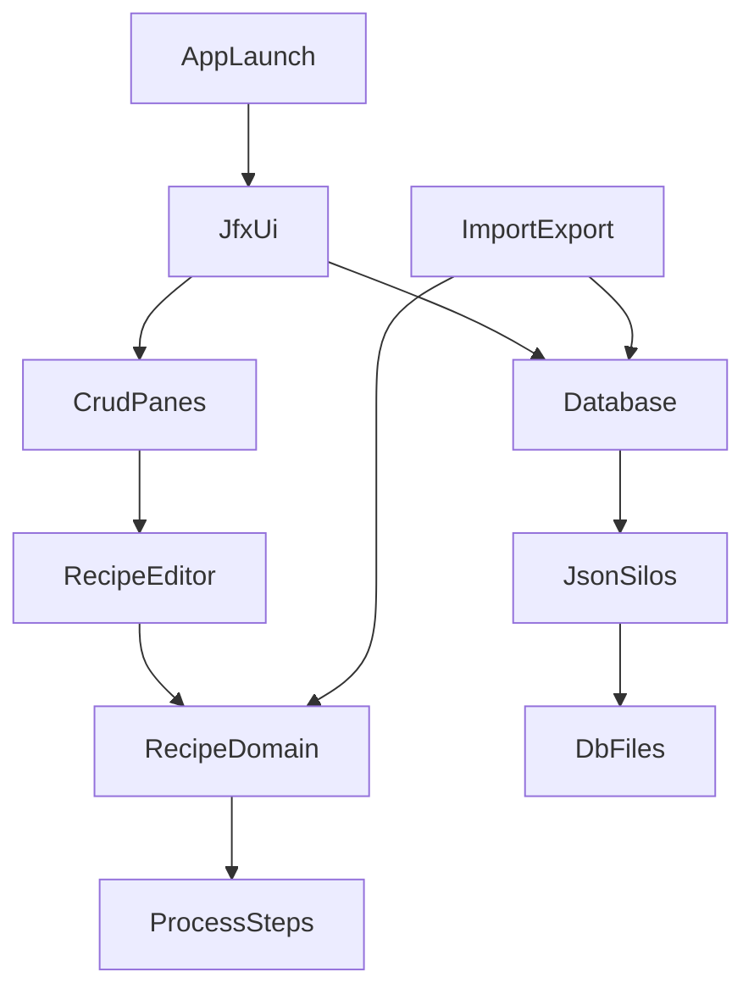

# Brewday Design Document

## Purpose and Scope

This document describes the technical design of Brewday as implemented in the current codebase. It focuses on:

- The desktop runtime architecture (JavaFX client + local JSON persistence)
- Core module boundaries and responsibilities
- End-to-end user workflows (recipe, batch, import, persistence)
- Key design decisions, tradeoffs, and known risks

This document is intended for maintainers and contributors working on new features, bug fixes, refactors, and import/export integrations.

## Product Context

Brewday is a local-first desktop application for designing and running home beer-brewing recipes. The app executes brewing process steps as a directed workflow, calculates intermediate values (volumes, gravity, chemistry), and persists user/reference data into JSON files.

- Frontend: JavaFX UI
- Domain engine: Java classes in recipe/process/math modules
- Persistence: bespoke JSON serialization layer
- Build/distribution: Ant build with bundled runtime assets

## Repository and Module Layout

Primary locations:

- App code: `src/main/java/mclachlan/brewday`
- Runtime data and defaults: `data/db`, `data/strings`, `data/templates`
- Distribution config: `src/dist`
- Build: `build.xml`
- Example/test fixtures: `test_data/test_db`

Main code module groupings:

- `ui/jfx`: JavaFX application and editors
- `db` and `db/v2`: persistence orchestration and serializers
- `recipe` and `process`: recipe graph model and step execution
- `ingredients`, `style`, `equipment`, `inventory`, `batch`: core domain entities
- `importexport`: BeerXML/CSV adapters
- `document`: document generation (FreeMarker)

## Build and Deployment Architecture

Build and packaging are Ant-based (`build.xml`), with separate concerns for compile/package and distribution assembly.

- Entry point for packaged desktop app: `mclachlan.brewday.ui.jfx.JfxUi` configured in `src/dist/launch4j.config.xml`
- Runtime defaults in `src/dist/dist.brewday.cfg` (app version, DB path, logging)
- Third-party dependencies are checked into `lib`
- Distribution assets include data files, templates, string bundles, and runtime libs

### Build Caveats

`build.xml` includes environment-specific assumptions (for example hardcoded local paths in some build targets), which reduce portability for contributors on different machines.

## Runtime Architecture Overview

### High-level Flow

1. `JfxUi` starts JavaFX and initializes app-wide state.
2. `Database.loadAll()` loads settings, reference data, and user data from JSON.
3. UI panes bind to in-memory maps exposed by `Database`.
4. Recipe editing runs domain calculations and updates the view.
5. Save/Discard actions persist or reload all modified data.

## Key Components and Responsibilities

## Application Service Layer

- `Brewday`: central service singleton for config, utility methods, recipe/batch creation helpers, and logger initialization.
- `Settings`: typed wrapper for key-value settings loaded from JSON.

Role: application-wide coordination and shared behavior.

## Persistence Layer

- `Database`: singleton repository coordinator for all entity collections.
  - `loadAll()`: loads all silos from JSON files.
  - `saveAll()`: writes all silos, with backup/restore safety behavior.
  - Optional integration with git backend for sync.
- `SimpleMapSilo<T>`: generic JSON array <-> in-memory map persistence.
- `MapSingletonSilo`: singleton map persistence (`settings.json`).
- `ReflectiveSerialiser<T>`: field-level serializer for simpler reference entities.
- Specialized serializers (`*Serialiser.java`) for polymorphic or custom object graphs.

Role: file-based persistence and serialization contracts.

## UI Layer

- `JfxUi`: main JavaFX application, navigation tree, panes/cards, global actions.
- `V2DataObjectPane<T>`: generic CRUD table/pane framework.
- Specialized panes (`RecipePane`, `BatchesPane`, inventory/settings/reference panes): entity-specific behavior and wiring.
- `RecipeEditor`: recipe-specific process editor with runtime recalculation and detailed workflow controls.

Role: presentation, edit operations, and user workflow orchestration.

## Domain and Computation Layer

- `Recipe`: aggregate root for process steps and execution ordering.
- `process/*`: step implementations (`Mash`, `Boil`, `Ferment`, `PackageStep`, etc.) and volume graph logic.
- `math/*`: domain calculations (water chemistry, gravity, units).
- `ingredients/*`, `batch/*`, `inventory/*`: persisted domain entities.

Role: brewing semantics and invariant checks.

## Startup and Initialization Sequence

1. Application launch calls `JfxUi.main()` and JavaFX `launch()`.
2. `JfxUi.start()` initializes window, assets, and UI shell.
3. `Database.getInstance().loadAll()` hydrates all in-memory collections.
4. UI panes are built and bound to loaded maps.
5. User actions mutate in-memory objects and mark dirty state.

## Primary Workflows

## Recipe Lifecycle

### Create

- UI action opens recipe creation dialog.
- New recipe is created via helper methods in `Brewday`.
- Recipe is inserted into `Database` map and marked dirty.

### Edit

- Opening a recipe invokes `RecipeEditor`.
- Editing steps/additions mutates the `Recipe` object.
- Recipe run/dry-run calculations refresh computed outputs and logs.

### Save / Discard

- Save all: `Database.saveAll()` serializes and writes all affected silos.
- Discard all: reload from disk via `Database.loadAll()` to reset in-memory state.

### Rename / Delete

- Generic operations live in `V2DataObjectPane`.
- `RecipePane` adds cascade logic so dependent batches are renamed/updated/deleted consistently.

## Batch Lifecycle

- Batches reference recipes by recipe name.
- Batch CRUD is handled through `BatchesPane`.
- Measurements and ingredient usage attach to batch state for brew-day tracking.
- Inventory consumption flag tracks whether stock has been consumed/applied.

## Import Workflows

### BeerXML Import

- Entry from JavaFX import dialogs and `ImportPane`.
- Parsing handled by `importexport/beerxml` parser/handlers.
- Imported objects merged into active in-memory collections.

### CSV Batch Import

- Import dialogs call CSV parser classes under `importexport/csv`.
- Parsed data is validated/mapped into batch entities.

### Brewday Data Import

- Import tools read Brewday-compatible data dumps and merge objects.
- Includes specific compatibility fixes for known legacy data patterns.

## Backup, Restore, and Sync

- Before full save, `Database` performs backup behavior for recoverability.
- On write failure, restore logic attempts rollback from backup.
- Optional git backend (`db/backends/git/GitBackend`) can sync DB state but introduces operational risk (see risks section).

## Data and State Management Model

- Runtime source of truth is in-memory maps in `Database`.
- UI directly manipulates object instances linked to these maps.
- Dirty tracking controls Save/Discard availability.
- Persistence writes full collection snapshots to JSON files.

This model is simple and effective for local single-user operation, but it tightly couples UI mutation and persistence timing.

## Logging and Configuration

- Runtime config is loaded from `brewday.cfg` and distribution defaults.
- DB path is configurable (`mclachlan.brewday.db`, default `data/db`).
- Logging implementation and level are configured in the app config.
- String resources for UI/process errors are loaded from `data/strings`.

## Design Decisions and Tradeoffs

## Decisions

- Local-first JSON persistence rather than relational DB.
- Generic pane framework for repeated CRUD patterns.
- Singleton service/repository access pattern.
- Rich domain model with process-step polymorphism and runtime execution.

## Tradeoffs

- Faster feature iteration and low operational complexity vs weaker schema governance.
- Less boilerplate in UI CRUD vs harder deep customization in generic base classes.
- Easy global access via singletons vs reduced test isolation and dependency clarity.
- Flexible serializers vs runtime failure risk from reflection/enums/missing fields.

## Technical Risks and Debt

1. Global mutable singletons (`Brewday`, `Database`) reduce modular testability and make future concurrency harder.
2. Serializer contracts are code-defined with no explicit versioned schema, increasing migration risk.
3. `GitBackend` uses aggressive git behaviors and shelling-out, which can create data-sync and recovery hazards.
4. Build/deployment scripts include machine-specific assumptions.
5. Mixed historical UI/runtime artifacts (legacy scripts/components) increase maintenance complexity.

## Recommended Refactor Roadmap

1. Introduce explicit schema version metadata in persisted JSON and migration steps.
2. Define repository/service interfaces for better testing and dependency injection.
3. Isolate git sync into safer, transactional workflows with stronger error handling.
4. Reduce reflection-heavy serializers in favor of explicit mappers for critical entities.
5. Improve build portability by removing hardcoded local environment assumptions.

## Glossary (Code-Aligned)

- Recipe: ordered process graph for brewing operations and ingredient additions.
- Process Step: executable operation node (`MASH`, `BOIL`, `FERMENT`, etc.).
- Silo: one persisted JSON-backed collection managed by `Database`.
- Reference Data: canonical ingredient/equipment/style datasets stored by name.
- Batch: a concrete brew run tied to a recipe, date, and measurements.

