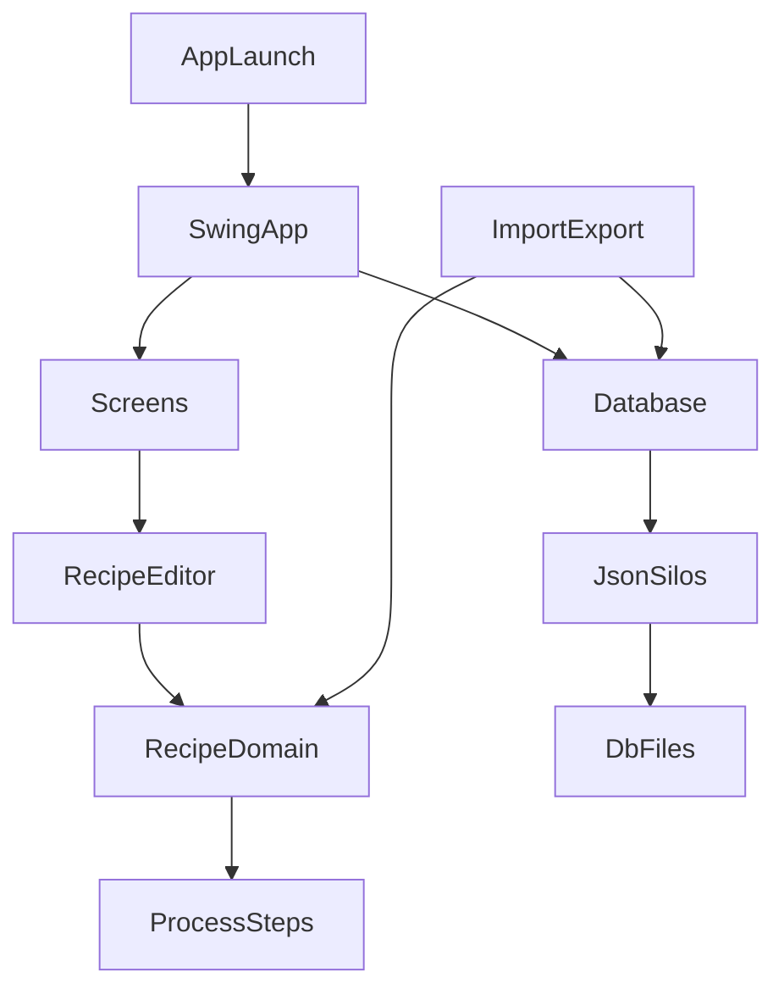

# Brewday Design Document

## Purpose and Scope

This document describes the technical design of Brewday as implemented in the current codebase. It focuses on:

- The desktop runtime architecture (Swing client + local JSON persistence)
- Core module boundaries and responsibilities
- Persistence architecture, serialization contracts, and data file layout
- End-to-end user workflows (recipe, batch, import, persistence)
- Backup, restore, and failure handling
- Schema evolution strategy
- Key design decisions, tradeoffs, and known risks

This document is intended for maintainers and contributors working on new features, bug fixes, refactors, and import/export integrations.

For the data dictionary (types, fields, enums, units, equations), see [data-model-document.md](data-model-document.md).

## Product Context

Brewday is a local-first desktop application for designing and running home beer-brewing recipes. The app executes brewing process steps as a directed workflow, calculates intermediate values (volumes, gravity, chemistry), and persists user/reference data into JSON files.

- Frontend: Swing UI
- Domain engine: Java classes in recipe/process/math modules
- Persistence: bespoke JSON serialization layer
- Build/distribution: Ant build with bundled runtime assets

## Repository and Module Layout

Primary locations:

- App code: `src/main/java/mclachlan/brewday`
- Runtime data and defaults: `data/db`, `data/strings`, `data/templates`
- Distribution config: `src/dist`
- Build: `build.xml`
- Example/test fixtures: `test_data/test_db`

Main code module groupings:

- `ui/swing`: Swing application shell, screens, dialogs, and widgets
- `db` and `db/v2`: persistence orchestration and serializers
- `recipe` and `process`: recipe graph model and step execution
- `ingredients`, `style`, `equipment`, `inventory`, `batch`: core domain entities
- `importexport`: BeerXML/CSV adapters
- `document`: document generation (FreeMarker)

## Build and Deployment Architecture

Build and packaging are Ant-based (`build.xml`), with separate concerns for compile/package and distribution assembly.

- Entry point for packaged desktop app: `mclachlan.brewday.ui.swing.app.SwingApp` (`build.xml` / `jpackage` manifest; `src/dist/launch4j.config.xml` for legacy Windows wrapper)
- Runtime defaults in `src/dist/dist.brewday.cfg` (app version, DB path, logging)
- Third-party dependencies are checked into `lib`
- Distribution assets include data files, templates, string bundles, and runtime libs

### Build Caveats

`build.xml` includes environment-specific assumptions (for example hardcoded local paths in some build targets), which reduce portability for contributors on different machines.

## Runtime Architecture Overview


```mermaid
flowchart TD
  AppLaunch --> SwingApp
  SwingApp --> Database
  SwingApp --> Screens
  Screens --> RecipeEditor
  RecipeEditor --> RecipeDomain
  RecipeDomain --> ProcessSteps
  Database --> JsonSilos
  JsonSilos --> DbFiles
  ImportExport --> RecipeDomain
  ImportExport --> Database
```

### High-level Flow

1. `SwingApp` starts the Swing shell and initializes app-wide state.
2. `Database.loadAll()` loads settings, reference data, and user data from JSON.
3. UI panes bind to in-memory maps exposed by `Database`.
4. Recipe editing runs domain calculations and updates the view.
5. Save/Discard actions persist or reload all modified data.

## Key Components and Responsibilities

## Application Service Layer

- `Brewday`: central service singleton for config, utility methods, recipe/batch creation helpers, and logger initialization.
- `Settings`: typed wrapper for key-value settings loaded from JSON.

Role: application-wide coordination and shared behavior.

## Persistence Layer

- `Database`: singleton repository coordinator for all entity collections.
  - `loadAll()`: loads all silos from JSON files.
  - `saveAll()`: writes all silos, with backup/restore safety behavior.
  - Optional integration with git backend for sync.
- `SimpleMapSilo<T>`: generic JSON array <-> in-memory map persistence.
- `MapSingletonSilo`: singleton map persistence (`settings.json`).
- `ReflectiveSerialiser<T>`: field-level serializer for simpler reference entities.
- Specialized serializers (`*Serialiser.java`) for polymorphic or custom object graphs.

Role: file-based persistence and serialization contracts.

### Persistence File Layout

Brewday persists data as JSON files in the configured DB directory (default `data/db`).

Model characteristics:

- Most persisted collections are map-like in memory (`Map<String,T>`) and stored as JSON arrays on disk.
- `settings.json` is persisted as a JSON object/map.
- No explicit schema version key is enforced globally.

### Persisted File Inventory

Files are loaded and saved centrally by `Database`.

| File | Entity Type |
|------|-------------|
| `recipes.json` | `Recipe` |
| `processtemplates.json` | `Recipe` (template recipes) |
| `batches.json` | `Batch` |
| `inventory.json` | `InventoryLineItem` |
| `fermentables.json` | `Fermentable` |
| `hops.json` | `Hop` |
| `yeasts.json` | `Yeast` |
| `miscs.json` | `Misc` |
| `water.json` | `Water` |
| `water_parameters.json` | `WaterParameters` |
| `styles.json` | `Style` |
| `equipment_profiles.json` | `EquipmentProfile` |
| `settings.json` | Settings map |

Representative examples exist under `test_data/test_db`.

### JSON Shapes

**Array-based collection files** (all files except settings):

```
[ {entityObject1}, {entityObject2}, ... ]
```

**`settings.json`:**

```
{ "settingKey": settingValue, ... }
```

Representative key sets from sample DB files:

- `recipes.json`: `name`, `equipmentProfile`, `tags`, `steps`
- Step object keys vary by subtype but include `name`, `description`, `type`, `ingredients`
- Ingredient addition object keys include `type`, `time`, `unit`, `quantity` and ingredient-specific ref keys
- `batches.json`: `name`, `recipe`, `description`, `date`, `inventoryConsumed`, `measurements`
- `inventory.json`: `ingredient`, `type`, `unit`, `quantity`

## Serialization and Data Contracts

### Primitive and Supporting Types

- `String`, `boolean`, numeric primitives/wrappers are persisted as JSON scalar values.
- Enums are persisted by enum name strings and parsed back via `Enum.valueOf(...)` in serializers.
- Domain quantities use structured `Quantity` objects, not raw numbers, to preserve units and estimate semantics.

### Quantity Serialization

Serializer: `src/main/java/mclachlan/brewday/db/QuantitySerialiser.java`

Persisted fields per `Quantity` value:

- `amount`: numeric value as string/number (serializer normalizes to `double`)
- `unit`: enum name (`Quantity.Unit`)
- `estimate`: boolean

Unknown `unit` values fail deserialization.

`QuantityValueSerialiser<T extends Quantity>` serializes any Quantity subclass by saving `t.get()` (the raw canonical value) as a string and deserializing by reflectively calling the `(double)` constructor. This relies on every subclass having a `public Constructor(double)` that accepts the canonical unit value.

### Polymorphic Discriminators

**ProcessStep**: discriminated by `type` field (string matching `ProcessStep.Type` enum). Unknown `type` values throw `BrewdayException` during deserialization.

Serializer: `src/main/java/mclachlan/brewday/db/StepSerialiser.java`

All step types share `name`, `description`, `type`, `ingredients` fields. Each step type has additional fields specific to its brewing semantics (see [data-model-document.md](data-model-document.md) for complete field listings).

**IngredientAddition**: discriminated by `type` field (string matching `IngredientAddition.Type` enum). Unknown `type` values throw `BrewdayException`.

Serializer: `src/main/java/mclachlan/brewday/db/IngredientAdditionSerialiser.java`

Common serialized fields: `name`, `type`, `quantity`, `unit`, `time` (seconds; omitted for YEAST and YEAST_CULTURE on save). Each type adds ingredient-specific FK fields and (for WATER and YEAST_CULTURE) additional embedded properties.

### Reference Data Serialization

Reference data entities (Fermentable, Hop, Yeast, Misc, Water, EquipmentProfile, Style, WaterParameters) use `ReflectiveSerialiser` with configured field allowlists in `Database`.

### Backward Compatibility Tactics

- Missing optional fields receive defaults during deserialization (`tags`, some unit fields).
- Import logic includes targeted normalization/fixes for legacy datasets.
- Ferment step: legacy `temp` field is migrated to both `startTemp` and `endTemp` on read.
- Volume metrics: legacy `BITTERNESS` key is migrated on load to the first entry in `hop.bitterness.formulas`; legacy `PH` key migrated to the first entry in `mash.ph.models`.
- Settings: deprecated `hop.bitterness.formula` (singular) migrated on load to `hop.bitterness.formulas` (plural); deprecated `mash.ph.model` migrated to `mash.ph.models`.
- YeastAddition: `time` is read for backward compatibility but not written on save.

## UI Layer

- `SwingApp` / `SwingAppFrame`: main Swing application, navigation, global actions, and dirty-state coordination.
- Data-table and settings screens under `ui/swing/screens`: entity-specific CRUD and wiring.
- Recipe and batch editing: `SwingRecipeEditorDialog`, step/addition panes under `ui/swing/widgets` and `ui/swing/dialogs`.

Role: presentation, edit operations, and user workflow orchestration.

## Domain and Computation Layer

- `Recipe`: aggregate root for process steps and execution ordering.
- `process/*`: step implementations (`Mash`, `Boil`, `Ferment`, `PackageStep`, etc.) and volume graph logic.
- `math/*`: domain calculations (water chemistry, gravity, units).
- `ingredients/*`, `batch/*`, `inventory/*`: persisted domain entities.

Role: brewing semantics and invariant checks.

## Startup and Initialization Sequence

1. Application launch calls `SwingApp.main()`.
2. `SwingApp` installs `AppContentRoot`, applies LaF, and opens `SwingAppFrame`.
3. `Database.getInstance().loadAll()` hydrates all in-memory collections.
4. UI panes are built and bound to loaded maps.
5. User actions mutate in-memory objects and mark dirty state.

## Primary Workflows

### Yeast starter (propagation / pitch)

Recipes model starters without a dedicated process step type:

1. **Starter branch:** `Stand` (optional DME liquor) → `Ferment` with `fermentType=STARTER` on a small wort volume, **or** a single `Ferment` `STARTER` with water (+ optional DME) and no input volume (liquor bootstrap). Skips wort→beer ISO/colour chemistry; cultures tagged `YeastSourceType.STARTER`.
2. **Pitch:** `Combine` with `pitchCombine=true` blends main-batch `WORT` with starter `BEER` into pitch `WORT` (OG from the wort stream; yeast cultures merged). `YeastAddition` on either input is converted to `YeastCulture` at combine.
3. **Primary:** `Ferment` with `fermentType=PRIMARY` on pitch wort applies packaging chemistry once.

**Dry yeast rehydration:** `Stand` (no input volume, water + yeast → `WORT` liquor) → normal `Combine` with main `WORT` (`pitchCombine` optional; both streams are `WORT`) → `PRIMARY`. Do not require `pitchCombine` for rehydration; use it only when pitching fermented starter **beer** into main wort.

## Recipe Lifecycle

### Create

- UI action opens recipe creation dialog.
- New recipe is created via helper methods in `Brewday`.
- Recipe is inserted into `Database` map and marked dirty.

### Edit

- Opening a recipe invokes the Swing recipe editor dialog and embedded process tree.
- Editing steps/additions mutates the `Recipe` object.
- Recipe run/dry-run calculations refresh computed outputs and logs.

### Save / Discard

- Save all: `Database.saveAll()` serializes and writes all affected silos.
- Discard all: reload from disk via `Database.loadAll()` to reset in-memory state.

### Rename / Delete

- Generic table save/undo patterns live in shared screen base classes and `DirtyStateService`.
- Recipe rename/delete uses cascade logic so dependent batches are updated consistently.

## Batch Lifecycle

- Batches reference recipes by recipe name.
- Batch CRUD is handled through the Batches screen and `SwingBatchEditorDialog`.
- Measurements and ingredient usage attach to batch state for brew-day tracking.
- Inventory consumption flag tracks whether stock has been consumed/applied.

## Import Workflows

### BeerXML Import

- Entry from Swing import dialogs and the Import screen.
- Parsing handled by `importexport/beerxml` parser/handlers.
- Imported objects merged into active in-memory collections.

### CSV Batch Import

- Import dialogs call CSV parser classes under `importexport/csv`.
- Parsed data is validated/mapped into batch entities.

### Brewday Data Import

- Import tools read Brewday-compatible data dumps and merge objects.
- Includes specific compatibility fixes for known legacy data patterns.

## Backup, Restore, and Failure Handling

### Full Save

`Database.saveAll()` copies all `*.json` to `dbDir/backup/` before writing. On write failure, `restoreDb()` replaces live files from that backup. Partial multi-file writes are rolled back as a set.

### Settings-Only Save

Settings-only save failure rolls back `settings.json` only (`backupSettingsFile` / `restoreSettingsFile`); it does not call full `restoreDb()`, which would overwrite other silos from a stale full-save backup.

### Git Sync

Optional git backend (`db/backends/git/GitBackend`) can sync DB state. Operational risk: shells out to system git; remote sync requires manual reconciliation on divergence (mitigated: no force-push/reset, commit-after-save only).

## Data and State Management Model

- Runtime source of truth is in-memory maps in `Database`.
- UI directly manipulates object instances linked to these maps.
- Dirty tracking controls Save/Discard availability.
- Persistence writes full collection snapshots to JSON files.

This model is simple and effective for local single-user operation, but it tightly couples UI mutation and persistence timing.

## Validation and Invariants

### Structural and Referential Invariants

- Step dependency graph must not contain cycles for successful topological ordering.
- Volume references used by steps must exist in current `Volumes` map.
- Enum values for types/units/metrics must be valid known names.
- Batch `date` must conform to expected parser format.

### Domain-Required Ingredient Rules

- Mash workflows require fermentable additions and strike water presence.
- Boil workflows without explicit input volume require water additions.
- Ferment workflows on wort require yeast addition.

### Capacity and Style Conformance Checks

- Equipment capacity mismatches produce warnings (mash tun, boil kettle, fermenter).
- Packaging/style checks compare measured/predicted stats against style limits and issue warnings.

### Deserialization Failure Modes

- Unknown serializer discriminator (`type`) causes immediate deserialization exceptions.
- Missing referenced volumes or invalid process wiring cause runtime `BrewdayException`.
- Invalid enum names in JSON cause load failure.

## Schema Evolution and Backward Compatibility

### Current Strategy

- No global schema version or migration framework.
- Backward compatibility handled ad hoc in serializers/import flows.

### Observed Compatibility Tactics

- Missing optional fields receive defaults during deserialization (`tags`, some unit fields).
- Import logic includes targeted normalization/fixes for legacy datasets.
- Field-level migration in serializers (e.g. Ferment `temp` -> `startTemp`/`endTemp`, legacy bitterness/pH metric keys).
- Settings key migration on load (singular -> plural for multi-model keys).

### Gap

Without explicit versioning/migrations, long-term maintainability depends on serializer defensive coding and importer patch logic.

## Data Integrity Checklist for Future Changes

When introducing or changing fields/entities:

1. Update domain class, serializer, and sample test data together.
2. Define default behavior for missing legacy fields.
3. Add import compatibility handling where external formats may omit required values.
4. Preserve stable identity keys (`name`-based maps) or provide migration rules.
5. Validate all enum expansions in parser/serializer switch logic.
6. Re-test `Database.loadAll()` and `saveAll()` round-trip against old and new datasets.
7. Verify UI rename/delete cascades for all name-based references.

## Logging and Configuration

- Runtime config is loaded from `brewday.cfg` and distribution defaults.
- DB path is configurable (`mclachlan.brewday.db`, default `data/db`).
- Logging implementation and level are configured in the app config.
- String resources for UI/process errors are loaded from `data/strings`.

## Design Decisions and Tradeoffs

## Decisions

- Local-first JSON persistence rather than relational DB.
- Generic pane framework for repeated CRUD patterns.
- Singleton service/repository access pattern.
- Rich domain model with process-step polymorphism and runtime execution.

## Tradeoffs

- Faster feature iteration and low operational complexity vs weaker schema governance.
- Less boilerplate in UI CRUD vs harder deep customization in generic base classes.
- Easy global access via singletons vs reduced test isolation and dependency clarity.
- Flexible serializers vs runtime failure risk from reflection/enums/missing fields.

## Technical Risks and Debt

1. Global mutable singletons (`Brewday`, `Database`) reduce modular testability and make future concurrency harder.
2. Serializer contracts are code-defined with no explicit versioned schema, increasing migration risk.
3. Git backend shells out to system git; remote sync requires manual reconciliation on divergence (mitigated: no force-push/reset, commit-after-save only).
4. Build/deployment scripts include machine-specific assumptions.
5. Mixed historical UI/runtime artifacts (legacy scripts/components) increase maintenance complexity.

## Recommended Refactor Roadmap

1. Introduce explicit schema version metadata in persisted JSON and migration steps.
2. Define repository/service interfaces for better testing and dependency injection.
3. Isolate git sync into safer, transactional workflows with stronger error handling.
4. Reduce reflection-heavy serializers in favor of explicit mappers for critical entities.
5. Improve build portability by removing hardcoded local environment assumptions.

## Source File Reference Index

### Persistence and Serialization

- Persistence coordinator: `src/main/java/mclachlan/brewday/db/Database.java`
- Generic silo layer: `src/main/java/mclachlan/brewday/db/v2/SimpleMapSilo.java`
- Settings silo: `src/main/java/mclachlan/brewday/db/v2/MapSingletonSilo.java`
- JSON I/O utility: `src/main/java/mclachlan/brewday/db/v2/V2Utils.java`
- Reflective serializer: `src/main/java/mclachlan/brewday/db/v2/ReflectiveSerialiser.java`
- Recipe serializer: `src/main/java/mclachlan/brewday/db/RecipeSerialiser.java`
- Step serializer: `src/main/java/mclachlan/brewday/db/StepSerialiser.java`
- Ingredient addition serializer: `src/main/java/mclachlan/brewday/db/IngredientAdditionSerialiser.java`
- Batch serializer: `src/main/java/mclachlan/brewday/db/BatchSerialiser.java`
- Volume serializer: `src/main/java/mclachlan/brewday/db/VolumeSerialiser.java`
- Quantity serializer: `src/main/java/mclachlan/brewday/db/QuantitySerialiser.java`
- Inventory serializer: `src/main/java/mclachlan/brewday/db/InventoryLineItemSerialiser.java`

### Sample Persisted Data

- `test_data/test_db/recipes.json`
- `test_data/test_db/batches.json`
- `test_data/test_db/inventory.json`

## Glossary (Code-Aligned)

- Recipe: ordered process graph for brewing operations and ingredient additions.
- Process Step: executable operation node (`MASH`, `BOIL`, `FERMENT`, etc.).
- Silo: one persisted JSON-backed collection managed by `Database`.
- Reference Data: canonical ingredient/equipment/style datasets stored by name.
- Batch: a concrete brew run tied to a recipe, date, and measurements.
- Volume: runtime container representing liquid state at a point in the process graph, carrying metrics and ingredient additions.
- Quantity: typed numeric value with unit and estimated flag; the universal value object for all physical measurements.
