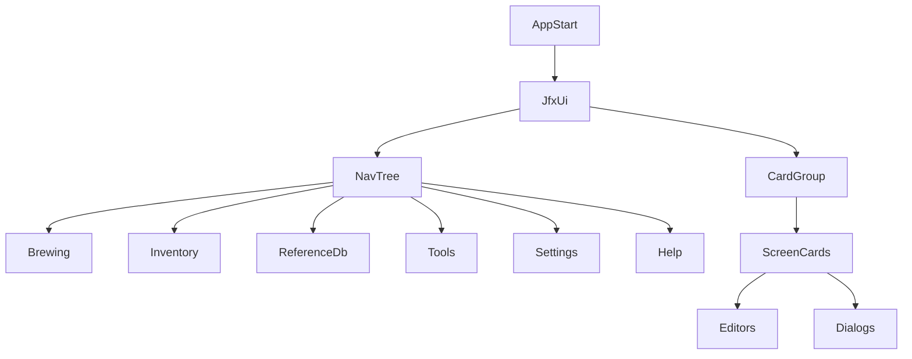
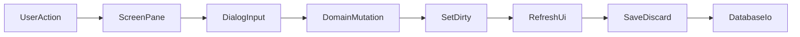

# Brewday JavaFX UI Rewrite Design Spec

## 1. Purpose and Scope

This specification documents the JavaFX UI in sufficient detail to support a full rewrite in another UI technology while preserving behavior.

Scope:

- JavaFX UI only (`src/main/java/mclachlan/brewday/ui/jfx`)
- All top-level screens/cards
- All editor panes and dialog flows
- Data elements (fields, table columns, editable controls, actions)
- Workflow/state contracts (dirty handling, save/discard, import, utility tools)

Out of scope:

- Backend redesign
- Domain logic redesign
- Serialization/data model redesign

Primary source anchors:

- `src/main/java/mclachlan/brewday/ui/jfx/JfxUi.java`
- `src/main/java/mclachlan/brewday/ui/jfx/CardGroup.java`
- `src/main/java/mclachlan/brewday/ui/jfx/V2DataObjectPane.java`
- `src/main/java/mclachlan/brewday/ui/jfx/V2ObjectEditor.java`
- `src/main/java/mclachlan/brewday/ui/jfx/RecipeEditor.java`
- `src/main/java/mclachlan/brewday/ui/jfx/BatchEditor.java`
- `src/main/java/mclachlan/brewday/data/strings/ui.properties`

## 2. Shell Architecture and Navigation

## 2.1 Startup and shell lifecycle

Implemented in `JfxUi.start(...)`:

1. Initialize icons.
2. Load database (`Database.loadAll()`).
3. Read UI theme (`Settings.UI_THEME`).
4. Build shell layout with left nav tree + center card group.
5. Create all card surfaces (`getCards()`).
6. Refresh cards from DB (`refreshCards()`).
7. Select initial nav item (Brewing > Recipes).
8. Install global uncaught exception handler that opens `ErrorDialog`.

## 2.2 Shell composition

- Root container: `MigPane`
- Left: `TreeView` navigation
- Center: `CardGroup` card stack
- About and several settings surfaces are inline/simple cards

## 2.3 Navigation model and card routing

`cardsMap` maps selected `TreeItem<Label>` to a card key. `CardGroup.setVisible(key)` activates the matching card.

Recipes supports dynamic tag children:

- Tree child key format: `RECIPE~TAG~:<tag>`
- Selection routes to Recipes card with tag filter

## 2.4 Major behavior contracts

- No global app-close save prompt in JavaFX shell.
- Save/discard is card/pane driven.
- Dirty state is tracked globally (`Set<Object> dirty`) and reflected as bold labels in nav tree.

## 3. Navigation Tree and Screen Catalog

Top-level groups and cards:

- Brewing
  - Batches
  - Recipes
  - Process Templates
  - Equipment Profiles
- Inventory
  - Inventory
- Reference Database
  - Water
  - Water Parameters
  - Fermentables
  - Hops
  - Yeast
  - Misc Ingredients
  - Styles
- Tools
  - Water Builder
  - Import Data
- Settings
  - Brewing Settings / General
  - Brewing Settings / Mash pH Models
  - Brewing Settings / Bitterness Models
  - Backend Settings / Local File System (placeholder card)
  - Backend Settings / Git Backend
  - UI Settings
- Help
  - About Brewday

Card keys are defined in `JfxUi` constants and matched in `getCards()`.

## 4. Shared UI Patterns

## 4.1 CRUD card scaffold (`V2DataObjectPane`)

Used by Recipes, Batches, Process Templates, most reference panes, and equipment/water parameters.

Common controls:

- Toolbar actions:
  - Save All
  - Undo All (discard)
  - Add
  - Copy
  - Rename
  - Delete
  - Export CSV
- TableView with icon and name columns plus pane-specific columns
- Double-click row opens pane-specific editor

Behavior contract:

- Edits mutate in-memory objects and mark dirty.
- Save All persists via `Database.saveAll()`.
- Undo All reloads via `Database.loadAll()`.

## 4.2 Object field editor scaffold (`V2ObjectEditor`)

Provides standard builders/bindings for:

- text fields
- text areas
- checkboxes
- combo boxes
- quantity/unit controls

All controls feed dirty-state updates.

## 4.3 Dirty model (`TrackDirty`)

Global in `JfxUi`:

- `setDirty(...)`: adds dirty objects, updates nav label style, refreshes cards
- `clearDirty()`: resets nav styles and clears dirty set

Pane/editor pattern:

- child editors call parent `setDirty(...)` as soon as fields change
- some editors rerun derived calculations on dirty updates

## 5. Detailed Screen Specifications

## 5.1 Brewing

### 5.1.1 Batches (`BatchesPane`)

Table columns:

- icon
- batch id/name
- recipe
- date
- description

Actions:

- New batch (opens `NewBatchDialog`)
- standard CRUD toolbar actions

Editor:

- `BatchEditor`

### 5.1.2 Batch Editor (`BatchEditor`)

Layout:

- Left details pane
- Right `TabPane` with:
  - Measurements tab
  - Recipe tab

Details controls:

- `DatePicker` batch date
- `ComboBox<String>` recipe
- `ToggleButton` consume/undo inventory
- Generate Document button
- Batch notes `TextArea`
- Analysis `TextArea` (read-only)

Measurements table columns:

- Volume
- Type
- Metric
- Estimate
- Measurement (editable cell)

Recipe tab:

- `RecipeTableView` bound to selected recipe

Key actions/workflows:

- Consume/restore inventory opens confirmation+delta table dialog inline, then mutates inventory and batch state
- Measurement edits parse quantities and recalculate batch analysis

### 5.1.3 Recipes (`RecipePane`)

Table columns:

- icon
- name
- equipment profile
- tags

Actions:

- New recipe (`NewRecipeDialog`)
- standard CRUD toolbar actions
- tag filtering via nav tree tag nodes

Editor:

- `RecipeEditor`

### 5.1.4 Recipe Editor (`RecipeEditor`)

Layout:

- Main `TabPane` with:
  - Process tab
  - Log tab
- Process tab:
  - left `RecipeTreeView` (recipe / steps / additions)
  - center `CardGroup` editor cards
- Right panel:
  - End result `TextArea` (read-only)
- Log tab:
  - `TextArea` (read-only)

Cards loaded:

- `RecipeInfoPane` (default/none selection)
- Process step panes:
  - `MashPane`
  - `MashInfusionPane`
  - `LauterPane`
  - `BatchSpargePane`
  - `BoilPane`
  - `DilutePane`
  - `CoolPane`
  - `HeatPane`
  - `FermentPane`
  - `StandPane`
  - `SplitPane`
  - `CombinePane`
  - `PackagePane`
- Addition panes (non-template mode):
  - `FermentableAdditionPane`
  - `HopAdditionPane`
  - `WaterAdditionPane`
  - `YeastAdditionPane`
  - `MiscAdditionPane`

Recipe editor behavior contract:

- Every dirty event can trigger recipe rerun/dry-run and UI refresh.
- Template mode uses `dryRun()`, recipe mode uses `run()`.

### 5.1.5 Recipe Info Pane (`RecipeInfoPane`)

Controls:

- recipe name label
- equipment profile `ComboBox`
- tags editor (`TagPane`)
- description `TextArea`
- buttons:
  - Add Step
  - Rerun Recipe
  - Generate Document
  - Apply Different Process Template

### 5.1.6 Process Templates (`ProcessTemplatePane`)

Uses same scaffold as recipes, but template mode.

Table:

- icon
- name

Editor:

- `RecipeEditor` in processTemplateMode

### 5.1.7 Equipment Profiles (`EquipmentProfilePane`)

Table columns:

- conversion efficiency
- mash tun volume
- boil kettle volume
- fermenter volume

Editor fields include:

- name/description
- elevation
- conversion efficiency
- mash tun volume/weight/specific heat
- lauter loss
- boil kettle volume
- boil evaporation rate
- boil element power
- hop utilization
- trub/chiller loss
- fermenter volume

## 5.2 Inventory

### 5.2.1 Inventory (`InventoryPane`)

Table columns:

- icon/ingredient name
- quantity + unit

Toolbar actions:

- Save All
- Undo All
- Add Fermentable
- Add Hop
- Add Yeast
- Add Misc
- Add Water
- Delete
- Export CSV

Add item flows use ingredient addition dialogs in inventory mode (`captureTime=false`).

## 5.3 Reference Database

All panes are `V2DataObjectPane` specializations.

### 5.3.1 Water (`RefWaterPane`)

Table columns:

- calcium
- bicarbonate
- sulfate
- chloride
- pH
- alkalinity
- residual alkalinity

Editor fields:

- name/description
- ions (Ca/HCO3/SO4/Cl/Na/Mg)
- pH

### 5.3.2 Water Parameters (`WaterParametersPane`)

Table columns:

- min/max calcium
- min/max bicarbonate
- min/max sulfate
- min/max alkalinity
- min/max residual alkalinity

Editor fields:

- name/description
- min/max ranges for Ca/HCO3/SO4/Cl/Na/Mg/alkalinity/residual alkalinity

### 5.3.3 Fermentables (`RefFermentablePane`)

Table columns:

- type
- origin
- supplier
- colour
- yield
- distilled water pH

Editor fields include:

- type/origin/supplier/description
- colour/yield
- coarse-fine diff
- moisture
- diastatic power
- max in batch
- distilled water pH
- buffering capacity
- lactic acid content
- add-after-boil
- recommend-mash

### 5.3.4 Hops (`RefHopPane`)

Table columns:

- type
- form
- origin
- alpha
- beta

Editor fields:

- type/form/origin/description
- alpha/beta
- humulene/caryophyllene/cohumulone/myrcene
- storage index
- substitutes

### 5.3.5 Yeast (`RefYeastPane`)

Table columns:

- laboratory
- product id
- type
- form

Editor fields:

- type/form
- lab/product id
- attenuation
- flocculation
- min/max temperature
- recommended styles
- description

### 5.3.6 Misc Ingredients (`RefMiscPane`)

Table columns:

- type
- use
- usage recommendation

Editor fields:

- type/use
- measurement type
- water addition formula
- acid content
- usage recommendation
- description

### 5.3.7 Styles (`RefStylePane`)

Table columns:

- style guide
- number
- category
- type

Editor fields:

- display name/guide/category/number/letter/type
- min/max OG
- min/max FG
- min/max IBU
- min/max color
- min/max carbonation
- min/max ABV
- notes/profile/ingredients/examples

## 5.4 Tools

### 5.4.1 Import Data (`ImportPane`)

Pane controls:

- Import BeerXML button + description
- Import Batches (CSV) button + description
- Import Brewday DB button + description

Flow:

- button opens format-specific dialog
- dialog returns imported objects + bitset of import options
- merge logic applies create/update selections by type
- sets dirty flags for changed domains and objects

### 5.4.2 Water Builder (`WaterBuilderPane`)

Complex tool surface with:

- source/dilution/target/result water panels
- ion constraints min/max
- delta display and MSE
- volume controls
- goal selector
- additive constraints and quantities
- solve action

Dialog variant exists for process-step utility use: `WaterBuilderDialog`.

## 5.5 Settings

### 5.5.1 Brewing Settings General (`BrewingSettingsGeneralPane`)

Controls:

- default equipment profile
- mash hop utilization
- first wort hop utilization
- leaf hop adjustment
- plug hop adjustment
- pellet hop adjustment

Behavior:

- immediate settings updates persisted by settings save path

### 5.5.2 Brewing Settings Mash pH (`BrewingSettingsMashPane`)

Controls:

- mash pH model selector
- model description text
- advanced settings panel/card
- MPH malt correction factor

### 5.5.3 Brewing Settings IBU (`BrewingSettingsIbuPane`)

Controls:

- bitterness model selector
- model description text
- advanced settings per formula:
  - Tinseth max utilization
  - BeerSmith Tinseth max utilization
  - Garetz yeast/pellet/bag/filter factors

### 5.5.4 Backend Settings Git (`GitBackendPane`)

Controls:

- enable/disable git backend
- remote URL field
- command log text area
- Commit and Push button
- Overwrite local with remote button

Includes confirmation via `JfxUi.OkCancelDialog`.

### 5.5.5 Backend Settings Local File System

- Placeholder card label: `coming soonish`

### 5.5.6 UI Settings (`UiSettingsPane`)

Theme choices:

- JMetro Light
- JMetro Dark
- Caspian
- Modena

## 5.6 Help

### 5.6.1 About Brewday

Inline pane fields:

- app name/version
- source URL
- local DB path
- log path
- licensing/credits text

## 6. Process Step Pane Specifications

Base class: `ProcessStepPane<T extends ProcessStep>`

Shared step controls:

- Step name text field
- Description text area
- Input volume combo(s) where applicable
- Computed volume display panes
- Dynamic unit controls via `UnitControlUtils`
- Toolbar:
  - add ingredient additions (by supported types)
  - duplicate step
  - rename step
  - delete step
- Utility bar (step-dependent):
  - Water Builder
  - Acidifier
  - Target Mash Temp

Concrete step panes:

- `MashPane`: grain temp, duration, computed mash temp/pH, input/output mash volumes
- `MashInfusionPane`: ramp/stand times, mash temp readout, in/out mash volume
- `LauterPane`: input mash, first-runnings output, lautered-mash output
- `BatchSpargePane`: mash input, existing wort input, combined/sparge outputs
- `BoilPane`: input wort, duration, time-to-boil, remove-trub flag, wort/trub outputs
- `DilutePane`: input volume, output volume
- `CoolPane`: input volume, target temp, output volume
- `HeatPane`: input volume, target temp, ramp/stand times, output volume
- `FermentPane`: input, fermentation temp/duration, remove-trub flag, estimated FG, output
- `StandPane`: input, duration, output
- `SplitPane`: input, split by percentage or absolute volume, output1/output2
- `CombinePane`: input1 + input2, output
- `PackagePane`: input, style, packaging type, forced carbonation, packaging loss, beer name (validation), output

## 7. Ingredient Addition Pane Specifications

Base class: `IngredientAdditionPane`

Shared controls:

- ingredient identity display/selector context
- quantity and unit controls
- time controls (when captured)
- actions:
  - Duplicate
  - Substitute
  - Delete

Concrete panes:

- `FermentableAdditionPane`
- `HopAdditionPane`
- `WaterAdditionPane` (includes temperature)
- `YeastAdditionPane`
- `MiscAdditionPane`

## 8. Dialog Catalog

## 8.1 CRUD and naming dialogs

- `NewItemDialog` (base generic)
- `RenameItemDialog` (base generic)
- `DuplicateItemDialog` (base generic)
- `NewRecipeDialog`
- `NewBatchDialog`
- `NewStepDialog`
- `DuplicateDialog` (step duplicate)
- `DuplicateRecipeDialog` (defined; no active callsite observed)
- `RenameRecipeDialog` (defined; no active callsite observed)

## 8.2 Recipe/process utility dialogs

- `ApplyNewProcessTemplateDialog`
- `WaterBuilderDialog`
- `AcidifierDialog`
- `TargetMashTempDialog`

## 8.3 Addition dialogs

- `IngredientAdditionDialog` (base)
- `FermentableAdditionDialog`
- `HopAdditionDialog`
- `WaterAdditionDialog`
- `YeastAdditionDialog`
- `MiscAdditionDialog`

## 8.4 Import dialogs

- `ImportBeerXmlDialog`
- `ImportBatchesCsvDialog`
- `ImportBrewdayDialog`
- `ImportPane.ProgressBarDialog` (defined inner dialog)

## 8.5 Shell/system dialogs

- `JfxUi.OkCancelDialog`
- `JfxUi.ErrorDialog`
- JavaFX `Alert`/`ChoiceDialog`/`FileChooser` usage for confirmations, template selection, and export paths

## 9. End-to-End Workflow Specifications

## 9.1 Recipe lifecycle

1. User opens Recipes card.
2. New recipe:
   - Open `NewRecipeDialog`.
   - Input name + template.
   - Validate non-empty and unique.
   - Create recipe object and mark dirty.
3. Open recipe editor (double-click row).
4. Manage steps/additions:
   - Add step (`NewStepDialog`) or apply process template.
   - Add/substitute/delete/duplicate additions via dialogs.
   - Rename/duplicate/delete steps via toolbar dialogs.
5. On edits:
   - mark dirty (recipe/step/addition)
   - rerun recipe (or dry run for template mode)
   - refresh tree/cards/log/end result
6. Save All or Undo All from pane toolbar.

## 9.2 Batch lifecycle

1. Open Batches card.
2. New batch:
   - `NewBatchDialog` date + recipe
   - create batch and mark dirty
3. Open batch editor (double-click row).
4. Edit date/recipe/notes.
5. Edit measurement cells (parse quantity text).
6. Consume/restore inventory:
   - open delta confirmation table
   - on confirm mutate inventory and batch consumed flag
   - mark batch and affected inventory items dirty
7. Generate document if needed.
8. Save All or Undo All from card toolbar.

## 9.3 Import lifecycle

1. Open Tools > Import Data.
2. Choose format-specific import dialog:
   - BeerXML
   - Batches CSV
   - Brewday DB
3. Parse selected files/folder with dialog options.
4. Select import options for new/update per entity type.
5. Merge imported objects into in-memory maps.
6. Mark affected categories/objects dirty.
7. User inspects results and commits via Save All.

## 9.4 Utility workflows from step editors

- Water Builder:
  - open `WaterBuilderDialog`
  - compute additions
  - replace/add generated water chemistry misc additions
  - mark additions and step dirty
- Acidifier:
  - open `AcidifierDialog`
  - append generated acid additions
  - mark additions and step dirty
- Target Mash Temp:
  - open `TargetMashTempDialog`
  - set water addition temperatures
  - mark additions and step dirty

## 9.5 Save/discard contract

- Save All:
  - confirm
  - call `Database.saveAll()`
  - clear dirty
  - refresh card
- Undo All:
  - confirm
  - call `Database.loadAll()`
  - clear dirty
  - refresh card

This is card-scoped in UI controls but persists/reloads global DB state.

## 10. Rewrite Behavioral Contracts (must preserve)

1. Navigation tree + card-key routing model, including recipe tag subnodes.
2. Dirty-state semantics:
   - object-level dirty tracking
   - category-level visual dirty indicators
3. Immediate in-memory mutation on field edit (not deferred forms).
4. Explicit Save All / Undo All model.
5. Recipe editor rerun behavior on step/addition edits.
6. Import merge model with per-entity new/update toggles.
7. Inventory consume/restore confirmation with previewed deltas.
8. Document generation flow:
   - template choice
   - save location
   - output generation and open file
9. Global uncaught exception handling showing a detailed error dialog.

## 11. Rewrite Risk and Coupling Notes

- High coupling between UI tree/card model and domain mutation.
- RecipeEditor tightly couples UI interactions and process recomputation.
- Step/addition editor matrix requires full parity mapping for each type.
- Import and settings flows mutate shared DB state directly.
- Some dialogs are defined but appear unused (`DuplicateRecipeDialog`, `RenameRecipeDialog`, `ImportPane.ProgressBarDialog`); rewrite should decide explicit parity policy.

## 12. Architecture and Interaction Diagrams

### 12.1 Navigation and card architecture

### 12.2 Core interaction flow

## 13. Class-to-Surface Index (Coverage Checklist)

Top-level shell and shared:

- `JfxUi`, `CardGroup`, `V2DataObjectPane`, `V2ObjectEditor`, `TableBuilder`, `TrackDirty`

Top-level cards:

- `BatchesPane`, `RecipePane`, `ProcessTemplatePane`, `EquipmentProfilePane`
- `InventoryPane`
- `RefWaterPane`, `WaterParametersPane`, `RefFermentablePane`, `RefHopPane`, `RefYeastPane`, `RefMiscPane`, `RefStylePane`
- `WaterBuilderPane`, `ImportPane`
- `BrewingSettingsGeneralPane`, `BrewingSettingsMashPane`, `BrewingSettingsIbuPane`, `GitBackendPane`, `UiSettingsPane`

Editors:

- `BatchEditor`, `RecipeEditor`, `RecipeInfoPane`, `RecipeTreeView`, `RecipeTreeViewModel`, `RecipeTableView`, `ComputedVolumePane`

Step panes:

- `ProcessStepPane`, `MashPane`, `MashInfusionPane`, `LauterPane`, `BatchSpargePane`, `BoilPane`, `DilutePane`, `CoolPane`, `HeatPane`, `FermentPane`, `StandPane`, `SplitPane`, `CombinePane`, `PackagePane`

Addition panes:

- `IngredientAdditionPane`, `FermentableAdditionPane`, `HopAdditionPane`, `WaterAdditionPane`, `YeastAdditionPane`, `MiscAdditionPane`

Dialogs:

- `NewItemDialog`, `RenameItemDialog`, `DuplicateItemDialog`, `DuplicateDialog`
- `NewRecipeDialog`, `NewBatchDialog`, `NewStepDialog`, `ApplyNewProcessTemplateDialog`
- `IngredientAdditionDialog`, `FermentableAdditionDialog`, `HopAdditionDialog`, `WaterAdditionDialog`, `YeastAdditionDialog`, `MiscAdditionDialog`
- `ImportBeerXmlDialog`, `ImportBatchesCsvDialog`, `ImportBrewdayDialog`
- `WaterBuilderDialog`, `AcidifierDialog`, `TargetMashTempDialog`
- `JfxUi.OkCancelDialog`, `JfxUi.ErrorDialog`
- `DuplicateRecipeDialog` (defined), `RenameRecipeDialog` (defined), `ImportPane.ProgressBarDialog` (defined)

