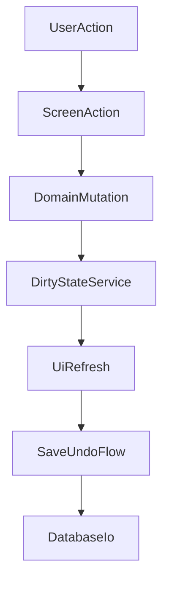

# Brewday Swing UI Design Specification

## 1. Purpose and Scope

This specification defines the target Swing UI architecture and behavior for Brewday.

Goals:
- Preserve functional behavior of the existing JavaFX UI contracts.
- Implement using modern Swing design and architecture best practices.
- Deliver in phased, functional slices with explicit TODO tracking.

In scope:
- Swing shell, navigation, screens, editors, dialogs, and cross-cutting UI behavior.
- Keyboard shortcuts, tooltips, error handling, dirty-state flow, and Save/Undo contracts.
- Phase-by-phase implementation sequencing from MVP to full parity.

Out of scope:
- Domain model redesign.
- Persistence/data-format redesign.
- Process calculation redesign.

Primary parity source:
- `doc/jfx-ui-design-spec.md`

Current implementation references:
- `src/main/java/mclachlan/brewday/ui/swing/app/SwingAppFrame.java`
- `src/main/java/mclachlan/brewday/ui/swing/screens/InventoryScreen.java`
- `src/main/java/mclachlan/brewday/ui/swing/dialogs/AddInventoryItemDialog.java`

## 2. Architectural Principles (Modern Swing)

### 2.1 Layering and package responsibilities

Keep Swing code in a layered structure:
- `ui/swing/app`: app bootstrap, frame, navigation model, shared services.
- `ui/swing/screens`: top-level cards/surfaces.
- `ui/swing/dialogs`: modal and utility dialogs.
- `ui/swing/actions`: reusable `Action` classes and key bindings.
- `ui/swing/viewmodel`: lightweight UI state adapters where needed.

Rules:
- UI layer orchestrates interactions only.
- Domain/business logic remains in existing domain/services classes.
- Persistence remains through existing `Database` contracts.

### 2.2 EDT and concurrency

- All Swing component creation/mutation occurs on EDT.
- Long-running work (import, document generation, heavy solves) uses `SwingWorker`.
- `SwingWorker` completion updates UI on EDT (`done()`).
- Do not block EDT with IO, parser loops, or solver calculations.

### 2.3 Command/action architecture

- Use `Action` objects for user commands (toolbar/menu/context/hotkey reuse).
- Register shortcuts via `InputMap` + `ActionMap` at frame/screen scope.
- Keep action enabled-state synchronized with selection/state.
- Tooltips derive from action metadata (`SHORT_DESCRIPTION`) and standardized ui strings.

### 2.4 Screen lifecycle contract

Each screen should implement:
- `onActivate()`: apply selection-dependent setup.
- `refresh()`: read latest domain state into controls.

Contract:
- Navigation selection calls `onActivate()` then `refresh()`.
- Dirty-state changes may trigger focused `refresh()`; avoid full-app redraw when unnecessary.

### 2.5 Dirty state and save model

- Keep global dirty-state service for object/category tracking.
- Display category-level dirty indicators in navigation (bold/marker).
- Navigation dirty visibility is cross-functional-area behavior:
  - dirty leaf nodes render bold,
  - ancestor/parent nodes render bold when any descendant area is dirty,
  - bold styling clears after Save All or Undo All clears dirty state.
- UI edits mutate in-memory objects immediately and mark dirty.
- Save/Undo remain explicit user actions:
  - Save All -> persist via `Database.saveAll()`, clear dirty.
  - Undo All -> reload via `Database.loadAll()`, clear dirty.

### 2.6 Validation and error handling

- Validate early at input boundaries (dialogs/edit fields).
- Use domain-safe parsing utilities for typed quantities/units.
- Route uncaught UI exceptions to a centralized error dialog.
- User-facing error dialogs must be actionable and avoid stack-trace-only messages.

### 2.7 Accessibility and UX consistency

- Keyboard-first operation for all critical workflows.
- Predictable focus traversal and default button behavior.
- Consistent confirmation prompts for destructive operations.
- Consistent icon semantics, tooltip language, and status-bar feedback.

## 3. Shell and Navigation Specification

**Phase status:** `Implemented (MVP baseline)` for shell scaffold; behavior hardening remains `TODO - Phase 23`.

Shell composition:
- Root frame with Nimbus look and feel.
- Left navigation tree.
- Center card host (`CardLayout`).
- Bottom status bar.

Navigation model:
- Tree nodes map to `ScreenKey`.
- Card key equals `ScreenKey.name()`.
- Selection changes route to matching screen and update status text.

Required behavior:
- App initializes icons/theme/db load.
- Global exception handling opens error dialog.
- Initial selection defaults to Brewing > Recipes (target parity), or nearest available MVP node.

Hotkey baseline:
- Frame-level global refresh and quit.
- Additional feature hotkeys registered as phases complete.

## 4. Cross-Cutting Contracts

### 4.1 Save/Undo contract

- Every CRUD-like surface must expose Save All and Undo All.
- Save/Undo is global DB state mutation, even when invoked from a specific card.
- Confirmations required before Save/Undo execution.

### 4.2 Table/list editing contract

- Tables are view surfaces; edit via dialogs or dedicated editors unless inline edit is explicitly designed.
- Default sorting should be deterministic and user-friendly.
- Double-click behavior opens editor for entity surfaces that have editors.
- Data-table functional areas provide a live search/filter control that narrows rows as the user types.
- Filter input may be toggleable/hidden by default; each data-table functional area must provide an explicit Filter action to show and focus it.
- Data-table functional areas support keyboard filter interaction with `Ctrl/Cmd+F` and `Alt+F` to show/focus filter input and `Escape` to hide it.
- CSV export from data-table surfaces exports currently displayed rows (post-filter/post-sort), not hidden rows.
- Dirty rows must be visually distinct (bold baseline) and return to normal after Save All or Undo All clears dirty state.

### 4.3 Dialog contract

- Dialogs are modal for create/rename/duplicate/confirm workflows.
- Dialog returns typed result object, null/cancel on abort.
- Dialog performs validation before returning success.

### 4.4 Tooltip and shortcut contract

- Every toolbar/menu action has:
  - visible name
  - icon
  - tooltip
  - shortcut (for high-frequency actions)
- Shortcut map documented per screen.
- Data-table screens must implement a consistent hybrid hotkey model:
  - Alt mnemonics (discoverability) with mnemonic letters aligned to accelerator letters where practical
  - InputMap/ActionMap accelerators (speed), routed through the same `Action` instances used by toolbar buttons
  - tooltips must include mnemonic + accelerator hints in a consistent format, for example `Add New (Alt+N, Ctrl/Cmd+N)`
  - filter shortcuts and filter tooltips follow the same consistency rules as toolbar actions

### 4.5 Import/utility workflow contract

- Expensive workflows must expose progress and cancellation where practical.
- Import merge decisions are explicit per entity type (new/update).
- Utility dialogs must produce reversible/traceable changes where feasible.

## 5. Functional Surface Specification (Phased)

## Phase 1 (MVP): Shell + Inventory

**Status:** `Implemented (MVP)` with ongoing polish in later phases.

### 5.1 Inventory screen

Surface:
- Inventory table with ingredient, type, quantity.
- Toolbar actions: add water/fermentable/hop/yeast/misc, edit, delete, export CSV.

Behavior:
- Add actions open type-specific inventory add flow.
- Edit updates selected item quantity with unit-safe parsing.
- Delete confirms and removes selected row/entity.
- Export writes CSV through file chooser.
- Every mutation marks dirty category/object.

Modern Swing requirements:
- Keep add/edit/delete/export as reusable `Action`s.
- Add keyboard shortcuts for add/edit/delete/export (Phase 23 completion gate).
- Ensure empty-state and no-selection states are clear.

## Phase 2: Help/About

**Status:** `TODO - Phase 2`.

Deliver:
- About panel with app/version/source URL/db path/log path/license credits.
- Read-only info surface with copyable values and link affordance.
- Tooltip and hotkey coverage for help entry.

## Phase 3: Reference DB - Water

**Status:** `In Progress`.

Deliver:
- Water CRUD list/editor surface.
- Columns: key water chemistry indicators per JFX parity.
- Editor fields for ions and pH/description.
- Baseline table-surface behavior contract for subsequent functional areas:
  - hybrid hotkeys (mnemonics + accelerators),
  - field/header tooltip coverage with unit hints,
  - live table filter (Filter action + `Ctrl/Cmd+F` / `Alt+F` show/focus, `Escape` hide),
  - export scoped to displayed rows.

## Phase 4: Reference DB - Water Parameters

**Status:** `TODO - Phase 4`.

Deliver:
- Water Parameters CRUD list/editor.
- Range fields for min/max chemistry constraints.

## Phase 5: Reference DB - Fermentables

**Status:** `TODO - Phase 5`.

Deliver:
- Fermentables CRUD list/editor with parity columns and advanced fields.

## Phase 6: Reference DB - Hops

**Status:** `TODO - Phase 6`.

Deliver:
- Hops CRUD list/editor with alpha/beta/oil profile and substitutes fields.

## Phase 7: Reference DB - Yeast

**Status:** `TODO - Phase 7`.

Deliver:
- Yeast CRUD list/editor with attenuation/flocculation/temperature/style guidance.

## Phase 8: Reference DB - Misc Ingredients

**Status:** `TODO - Phase 8`.

Deliver:
- Misc CRUD list/editor including usage, measurement type, formulas, and notes.

## Phase 9: Reference DB - Styles

**Status:** `TODO - Phase 9`.

Deliver:
- Styles CRUD list/editor including OG/FG/IBU/color/ABV/carbonation ranges and notes.

## Phase 10: Equipment Profiles

**Status:** `TODO - Phase 10`.

Deliver:
- Equipment Profiles CRUD list/editor.
- Fields for conversion efficiency, vessel capacities, losses, boil properties, and thermal settings.

## Phase 11: Recipes list + editor entry

**Status:** `TODO - Phase 11`.

Deliver:
- Recipes list card with columns and filtering.
- Tag-aware filtering compatible with navigation model.
- New/copy/rename/delete/export and editor open entry.

## Phase 12: Batches list + editor entry

**Status:** `TODO - Phase 12`.

Deliver:
- Batches list card with columns and filtering.
- New/copy/rename/delete/export and editor open entry.

## Phase 13: Full Recipe Editor parity

**Status:** `TODO - Phase 13`.

Deliver:
- Recipe editor process tree + editor card stack.
- Recipe info pane, process step panes, addition panes.
- Rerun/dry-run behavior parity and log/end-result panels.
- Step/addition manipulation dialogs (new/duplicate/rename/delete/substitute).

## Phase 14: Full Batch Editor parity

**Status:** `TODO - Phase 14`.

Deliver:
- Batch details and measurements editor.
- Consume/restore inventory workflow with confirmation + delta preview.
- Recipe tab binding and analysis updates.
- Document generation flow parity.

## Phase 15: Tools - Import Data

**Status:** `TODO - Phase 15`.

Deliver:
- Import BeerXML, batches CSV, Brewday DB workflows.
- Per-entity merge options and dirty tracking.
- Progress reporting and error summarization.

## Phase 16: Tools - Water Builder

**Status:** `TODO - Phase 16`.

Deliver:
- Full Water Builder screen parity and dialog variant parity.
- Constraints, target goals, additive calculations, solve interaction.

## Phase 17: Settings - Brewing General

**Status:** `TODO - Phase 17`.

Deliver:
- Brewing defaults and utilization settings panel.
- Immediate setting mutation and persistence contract parity.

## Phase 18: Settings - Brewing Mash pH

**Status:** `TODO - Phase 18`.

Deliver:
- Mash pH model selection + description + advanced controls.

## Phase 19: Settings - Brewing IBU

**Status:** `TODO - Phase 19`.

Deliver:
- Bitterness model selection + model-specific advanced controls.

## Phase 20: Settings - Backend Local File System

**Status:** `TODO - Phase 20`.

Deliver:
- Placeholder parity card (`coming soonish`) unless backend scope expands later.

## Phase 21: Settings - Backend Git

**Status:** `TODO - Phase 21`.

Deliver:
- Git backend enablement/settings panel.
- Commit/push and overwrite-local workflows with confirmations and logs.

## Phase 22: Settings - UI Settings

**Status:** `TODO - Phase 22`.

Deliver:
- UI theme settings parity adapted for Swing LAF strategy.
- Theme change behavior and restart/reload guidance.

## Phase 23: Cross-cutting polish and parity signoff

**Status:** `TODO - Phase 23`.

Deliver:
- Full hotkey matrix across all screens/dialogs.
- Full tooltip coverage and language consistency pass.
- Accessibility/focus traversal audit.
- EDT/performance audit and long-task worker compliance.
- End-to-end parity verification against `doc/jfx-ui-design-spec.md`.

## 6. Editors and Dialogs Coverage Catalog

Core CRUD dialogs:
- New item, rename item, duplicate item, delete confirmation.

Recipe/process dialogs:
- New recipe, new batch, new step, duplicate/rename step, apply process template.
- Water Builder, Acidifier, Target Mash Temp utility dialogs.

Ingredient addition dialogs:
- Fermentable, hop, water, yeast, misc addition create/edit/substitute flows.

Import dialogs:
- BeerXML import, batches CSV import, Brewday DB import.

System dialogs:
- Standard OK/Cancel confirmation.
- Global error dialog.

Contract:
- Every JFX dialog workflow must have Swing equivalent behavior before parity signoff.

## 7. Hotkeys and Tooltips Specification

Global hotkeys (minimum):
- Refresh current screen.
- Save All.
- Undo All.
- Quit.

Screen-level hotkeys (where applicable):
- Add entity.
- Edit/open entity.
- Delete entity.
- Duplicate entity.
- Export CSV.
- Focus search/filter.

Tooltip requirements:
- Every actionable toolbar/button/menu item has concise tooltip.
- Tooltips mention shortcut when assigned.

## 8. Acceptance Criteria and Quality Gates

### 8.1 Functional parity gates

For each phase:
- All in-scope controls/actions from parity source are implemented.
- Workflows produce equivalent domain mutations and dirty-state behavior.
- Save/Undo flow behaves as specified for in-scope surfaces.
- In-scope behavior is verified against corresponding sections in `doc/jfx-ui-design-spec.md`.

### 8.2 Architecture gates

- No domain logic moved into Swing UI classes.
- Long-running tasks off EDT.
- Actions reused across toolbar/menu/hotkey surfaces.
- Screen lifecycle contract implemented and respected.

### 8.3 UX gates

- Keyboard paths complete for major workflows.
- Tooltips present and consistent.
- Destructive operations confirmed.
- Errors displayed with clear remediation context.

### 8.4 Reliability gates

- No uncaught exception causes silent UI failure.
- Import/export operations handle IO errors gracefully.
- Dirty-state indicators remain consistent after save/undo/reload.

## 9. Validation Matrix

Validation types:
- Compile validation (`ant compile`).
- Targeted manual smoke checks per phase.
- Regression checklist against parity source flows.

Per-phase minimum validation:
- Phase 1-2: shell/nav/help/inventory interactive smoke tests.
- Phase 3-10: each reference/equipment CRUD surface create/edit/delete/save/undo/export checks.
- Phase 11-14: recipes/batches/editor workflows including rerun and consume/restore behavior checks.
- Phase 15-16: import and water builder workflow correctness checks with representative inputs.
- Phase 17-22: settings persistence and UI behavior checks.
- Phase 23: full-system parity pass and keyboard/accessibility audit.

## 10. Parity Checklist (High-Level)

- Navigation tree and card routing parity.
- Dirty-state semantics (object/category/global save/undo) parity.
- CRUD list/editor parity for all reference and brewing surfaces.
- Recipe editor process-step/addition matrix parity.
- Batch editor measurement and inventory consumption parity.
- Import workflows and merge-option parity.
- Utility tools and settings behavior parity.
- Help/About information parity.
- Hotkeys/tooltips/error dialogs parity.

## 10.1 JFX-to-Swing parity traceability anchors

- Shell/navigation lifecycle and routing -> JFX spec sections 2-3.
- Shared CRUD/editor/dirty patterns -> JFX spec section 4.
- Functional screen behavior parity -> JFX spec section 5.
- Step/addition editor parity -> JFX spec sections 6-7.
- Dialog and workflow parity -> JFX spec sections 8-9.
- Behavioral contract signoff -> JFX spec sections 10-11.

## 11. Implementation Notes and Constraints

- Maintain Nimbus as baseline look-and-feel unless explicitly changed.
- Preserve existing backend singletons (`Brewday`, `Database`) and load/save model.
- Keep persistence keys and serializer contracts unchanged.
- Keep this document as the source of truth for Swing rewrite phase execution and completion signoff.

## 12. Architecture and Phase Diagrams

### 12.1 Phase roadmap

### 12.2 Interaction contract

