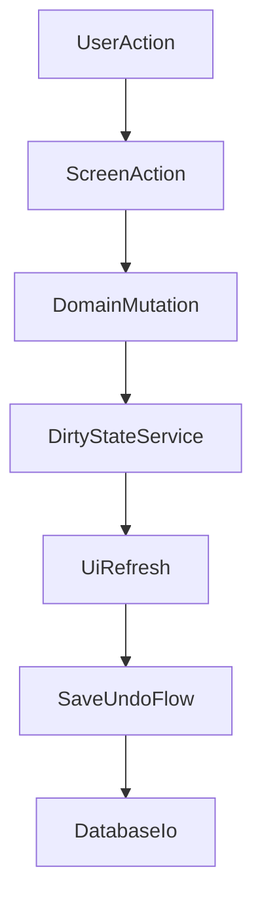

# Brewday Swing UI Design Specification

## 1. Purpose and Scope

This specification defines the target Swing UI architecture and behavior for Brewday.

Goals:
- Preserve functional behavior of the existing JavaFX UI contracts.
- Implement using modern Swing design and architecture best practices.
- Deliver in phased, functional slices with explicit TODO tracking.

In scope:
- Swing shell, navigation, screens, editors, dialogs, and cross-cutting UI behavior.
- Keyboard shortcuts, tooltips, error handling, dirty-state flow, and Save/Undo contracts.
- Phase-by-phase implementation sequencing from MVP to full parity.

Out of scope:
- Domain model redesign.
- Persistence/data-format redesign.
- Process calculation redesign.

Primary parity source:
- `doc/jfx-ui-design-spec.md`

Current implementation references:
- `src/main/java/mclachlan/brewday/ui/swing/widgets/SwingQuantityEditWidget.java`
- `src/main/java/mclachlan/brewday/ui/swing/widgets/SwingQuantitySelectAndEditWidget.java`
- `src/main/java/mclachlan/brewday/ui/swing/app/SwingAppFrame.java`
- `src/main/java/mclachlan/brewday/ui/swing/screens/InventoryScreen.java`
- `src/main/java/mclachlan/brewday/ui/swing/dialogs/AddInventoryItemDialog.java`
- `src/main/java/mclachlan/brewday/ui/swing/screens/HopsScreen.java`
- `src/main/java/mclachlan/brewday/ui/swing/dialogs/EditHopDialog.java`
- `src/main/java/mclachlan/brewday/ui/swing/screens/YeastScreen.java`
- `src/main/java/mclachlan/brewday/ui/swing/dialogs/EditYeastDialog.java`
- `src/main/java/mclachlan/brewday/ui/swing/screens/MiscsScreen.java`
- `src/main/java/mclachlan/brewday/ui/swing/dialogs/EditMiscDialog.java`
- `src/main/java/mclachlan/brewday/ui/swing/screens/StylesScreen.java`
- `src/main/java/mclachlan/brewday/ui/swing/dialogs/EditStyleDialog.java`
- `src/main/java/mclachlan/brewday/ui/swing/screens/EquipmentProfilesScreen.java`
- `src/main/java/mclachlan/brewday/ui/swing/dialogs/EditEquipmentProfileDialog.java`
- `src/main/java/mclachlan/brewday/ui/swing/screens/RecipesScreen.java`
- `src/main/java/mclachlan/brewday/ui/swing/dialogs/NewRecipeDialog.java`
- `src/main/java/mclachlan/brewday/ui/swing/screens/BatchesScreen.java`
- `src/main/java/mclachlan/brewday/ui/swing/dialogs/NewBatchDialog.java`
- `src/main/java/mclachlan/brewday/ui/swing/app/EquipmentProfileRecipeCascade.java`
- `src/main/java/mclachlan/brewday/ui/swing/app/RecipeBatchCascade.java`
- `src/main/java/mclachlan/brewday/ui/swing/app/RecipeEditorNavPort.java`
- `src/main/java/mclachlan/brewday/ui/swing/dialogs/RecipeEditorDialog.java`
- `src/main/java/mclachlan/brewday/ui/swing/screens/RecipeEditorSteps.java`
- `src/main/java/mclachlan/brewday/ui/swing/widgets/SwingCardStack.java`
- `src/main/java/mclachlan/brewday/ui/swing/widgets/SwingRecipeTree.java`
- `src/main/java/mclachlan/brewday/ui/swing/widgets/SwingRecipeInfoPanel.java`
- `src/main/java/mclachlan/brewday/ui/swing/widgets/SwingTagBarWidget.java`
- `src/main/java/mclachlan/brewday/ui/swing/dialogs/SwingNewStepDialog.java`
- `src/main/java/mclachlan/brewday/ui/swing/dialogs/SwingRenameRecipeDialog.java`
- `src/main/java/mclachlan/brewday/ui/swing/dialogs/SwingDuplicateRecipeDialog.java`
- `src/main/java/mclachlan/brewday/ui/swing/widgets/SwingProcessStepPane.java`
- `src/main/java/mclachlan/brewday/ui/swing/widgets/SwingUnitControlUtils.java`
- `src/main/java/mclachlan/brewday/ui/swing/widgets/SwingComputedVolumePane.java`
- `src/main/java/mclachlan/brewday/ui/swing/widgets/SwingHeatPane.java`
- `src/main/java/mclachlan/brewday/ui/swing/widgets/SwingCoolPane.java`
- `src/main/java/mclachlan/brewday/ui/swing/widgets/SwingStandPane.java`
- `src/main/java/mclachlan/brewday/ui/swing/widgets/SwingDilutePane.java`
- `src/main/java/mclachlan/brewday/ui/swing/widgets/SwingCombinePane.java`

## 2. Architectural Principles (Modern Swing)

### 2.1 Layering and package responsibilities

Keep Swing code in a layered structure:
- `ui/swing/app`: app bootstrap, frame, navigation model, shared services.
- `ui/swing/screens`: top-level cards/surfaces.
- `ui/swing/dialogs`: modal and utility dialogs.
- `ui/swing/widgets`: reusable composite controls (e.g. quantity editors).
- `ui/swing/actions`: reusable `Action` classes and key bindings.
- `ui/swing/viewmodel`: lightweight UI state adapters where needed.

Rules:
- UI layer orchestrates interactions only.
- Domain/business logic remains in existing domain/services classes.
- Persistence remains through existing `Database` contracts.

### 2.2 EDT and concurrency

- All Swing component creation/mutation occurs on EDT.
- Long-running work (import, document generation, heavy solves) uses `SwingWorker`.
- `SwingWorker` completion updates UI on EDT (`done()`).
- Do not block EDT with IO, parser loops, or solver calculations.

### 2.3 Command/action architecture

- Use `Action` objects for user commands (toolbar/menu/context/hotkey reuse).
- Register shortcuts via `InputMap` + `ActionMap` at frame/screen scope.
- Keep action enabled-state synchronized with selection/state.
- Tooltips derive from action metadata (`SHORT_DESCRIPTION`) and standardized ui strings.

### 2.4 Screen lifecycle contract

Each screen should implement:
- `onActivate()`: apply selection-dependent setup.
- `refresh()`: read latest domain state into controls.

Contract:
- Navigation selection calls `onActivate()` then `refresh()`.
- Dirty-state changes may trigger focused `refresh()`; avoid full-app redraw when unnecessary.

### 2.5 Dirty state and save model

- Keep global dirty-state service for object/category tracking.
- Display category-level dirty indicators in navigation (bold/marker).
- Navigation dirty visibility is cross-functional-area behavior:
  - dirty leaf nodes render bold,
  - ancestor/parent nodes render bold when any descendant area is dirty,
  - bold styling clears after Save All or Undo All clears dirty state.
- UI edits mutate in-memory objects immediately and mark dirty.
- Save/Undo remain explicit user actions:
  - Save All -> persist via `Database.saveAll()`, clear dirty.
  - Undo All -> reload via `Database.loadAll()`, clear dirty.

### 2.6 Validation and error handling

- Validate early at input boundaries (dialogs/edit fields).
- Use domain-safe parsing utilities for typed quantities/units.
- Route uncaught UI exceptions to a centralized error dialog.
- User-facing error dialogs must be actionable and avoid stack-trace-only messages.

### 2.7 Accessibility and UX consistency

- Keyboard-first operation for all critical workflows.
- Predictable focus traversal and default button behavior.
- Consistent confirmation prompts for destructive operations.
- Consistent icon semantics, tooltip language, and status-bar feedback.

### 2.8 Quantity input widgets (`SwingQuantityEditWidget`, `SwingQuantitySelectAndEditWidget`)

- **`SwingQuantityEditWidget`**: single `Quantity.Unit` + `JTextField` (optional unit label). Values are shown with `StringUtils.format(quantity.get(unit))` and committed with `Quantity.parseQuantity(text, unit)`, matching the JFX `QuantityEditWidget` contract. This prevents display/parse unit skew (historical BUG-002 / BUG-003 class bugs).
- **`SwingQuantitySelectAndEditWidget`**: same text field plus a unit `JComboBox` built from `Quantity.Type` groups (same unit lists as JFX `QuantitySelectAndEditWidget`). On unit change, the visible number is converted so the stored quantity meaning is preserved.
- **Layout**: both extend `JPanel` with `BorderLayout(4, 0)` (field `CENTER`, unit label or combo `EAST`) so the field grows horizontally inside `GridBagLayout` form rows like a plain `JTextField` did.
- **Reference DB (Phases 3-9)**: all quantity-bearing fields in the ingredient/style/water edit dialogs use `SwingQuantityEditWidget` with the unit aligned to the dialog's parser. **Colour** values are normalized to **SRM** everywhere in Reference Data (fermentable edit + fermentables table column `fermentable.colour.column`; style min/max colour already SRM). `SwingQuantitySelectAndEditWidget` is implemented for future phases (e.g. additions with user-selectable units) and covered by unit tests.

## 3. Shell and Navigation Specification

**Phase status:** `Implemented (MVP baseline)` for shell scaffold; behavior hardening remains `TODO - Phase 23`.

Shell composition:
- Root frame with Nimbus look and feel.
- Left navigation tree.
- Center card host (`CardLayout`).
- Bottom status bar.

Navigation model:
- Tree nodes map to `ScreenKey`.
- Card key equals `ScreenKey.name()`.
- Selection changes route to matching screen and update status text.

Required behavior:
- App initializes icons/theme/db load.
- Global exception handling opens error dialog.
- Initial selection defaults to Brewing > Recipes (target parity), or nearest available MVP node.

Hotkey baseline:
- Frame-level global refresh and quit.
- Additional feature hotkeys registered as phases complete.

## 4. Cross-Cutting Contracts

### 4.1 Save/Undo contract

- Every CRUD-like surface must expose Save All and Undo All.
- Save/Undo is global DB state mutation, even when invoked from a specific card.
- Confirmations required before Save/Undo execution.

### 4.2 Table/list editing contract

- Tables are view surfaces; edit via dialogs or dedicated editors unless inline edit is explicitly designed.
- Default sorting should be deterministic and user-friendly.
- Double-click behavior opens editor for entity surfaces that have editors.
- Data-table functional areas provide a live search/filter control that narrows rows as the user types.
- Filter input may be toggleable/hidden by default; each data-table functional area must provide an explicit Filter action to show and focus it.
- Data-table functional areas support keyboard filter interaction with `Ctrl/Cmd+F` and `Alt+F` to show/focus filter input and `Escape` to hide it.
- CSV export from data-table surfaces exports currently displayed rows (post-filter/post-sort), not hidden rows.
- Dirty rows must be visually distinct (bold baseline) and return to normal after Save All or Undo All clears dirty state.

### 4.3 Dialog contract

- Dialogs are modal for create/rename/duplicate/confirm workflows.
- Dialog returns typed result object, null/cancel on abort.
- Dialog performs validation before returning success.

### 4.4 Tooltip and shortcut contract

- Every toolbar/menu action has:
  - visible name
  - icon
  - tooltip
  - shortcut (for high-frequency actions)
- Shortcut map documented per screen.
- Data-table screens must implement a consistent hybrid hotkey model:
  - Alt mnemonics (discoverability) with mnemonic letters aligned to accelerator letters where practical
  - InputMap/ActionMap accelerators (speed), routed through the same `Action` instances used by toolbar buttons
  - tooltips must include mnemonic + accelerator hints in a consistent format, for example `Add New (Alt+N, Ctrl/Cmd+N)`
  - filter shortcuts and filter tooltips follow the same consistency rules as toolbar actions

### 4.5 Import/utility workflow contract

- Expensive workflows must expose progress and cancellation where practical.
- Import merge decisions are explicit per entity type (new/update).
- Utility dialogs must produce reversible/traceable changes where feasible.

## 5. Functional Surface Specification (Phased)

## Phase 1 (MVP): Shell + Inventory

**Status:** `Implemented (MVP)` with ongoing polish in later phases.

### 5.1 Inventory screen

Surface:
- Inventory table with ingredient, type, quantity.
- Toolbar actions: add water/fermentable/hop/yeast/misc, edit, delete, export CSV.

Behavior:
- Add actions open type-specific inventory add flow.
- Edit updates selected item quantity with unit-safe parsing.
- Delete confirms and removes selected row/entity.
- Export writes CSV through file chooser.
- Every mutation marks dirty category/object.

Modern Swing requirements:
- Keep add/edit/delete/export as reusable `Action`s.
- Add keyboard shortcuts for add/edit/delete/export (Phase 23 completion gate).
- Ensure empty-state and no-selection states are clear.

## Phase 2: Help/About

**Status:** `Implemented`.

Deliver:
- About panel with app/version/source URL/db path/log path/license credits.
- Read-only info surface with copyable values and link affordance.
- Tooltip and hotkey coverage for help entry.

## Phase 3: Reference DB - Water

**Status:** `Implemented`.

Deliver:
- Water CRUD list/editor surface.
- Columns: key water chemistry indicators per JFX parity.
- Editor fields for ions and pH/description.
- `EditWaterDialog`: scalar fields (name, ions, pH) in the left column; description as a wrapped `JTextArea` in a right-hand pane (same two-column pattern as other reference DB ingredient editors). Ion and pH values use `SwingQuantityEditWidget` (`PPM` / `PH`) with inline unit labels. Delete confirmation uses `water.delete.msg`; rename prompt uses `water.rename` with `editor.rename` title.
- Toolbar adds a `Duplicate` action between Edit and Rename. Duplicate opens `EditWaterDialog` prepopulated with a copy of the selected row (name cleared) and rejects an already-existing name on save. Duplicate uses mnemonic `Alt+D` and `Ctrl/Cmd+D`; Delete is invoked only by the `Delete` key.
- Baseline table-surface behavior contract for subsequent functional areas:
  - hybrid hotkeys (mnemonics + accelerators),
  - field/header tooltip coverage with unit hints,
  - live table filter (Filter action + `Ctrl/Cmd+F` / `Alt+F` show/focus, `Escape` hide),
  - export scoped to displayed rows.

## Phase 4: Reference DB - Water Parameters

**Status:** `Implemented`.

Deliver:
- Water Parameters CRUD list/editor.
- Range fields for min/max chemistry constraints.
- `EditWaterParametersDialog`: name and min/max range grid in the left column; description as a wrapped `JTextArea` in a right-hand pane with label `water.parameters.desc`. Min/max ppm fields use `SwingQuantityEditWidget` in compact mode (no per-cell unit suffix); row labels append ` (ppm)` where the unit is not already in the label text.
- Toolbar adds a `Duplicate` action between Edit and Rename. Duplicate opens `EditWaterParametersDialog` prepopulated with a copy of the selected row (name cleared) and rejects an already-existing name on save. Duplicate uses mnemonic `Alt+D` and `Ctrl/Cmd+D`; Delete is invoked only by the `Delete` key.
- Water-equivalent data-table behavior contract:
  - hybrid hotkeys (mnemonics + accelerators),
  - tooltip coverage for actions/headers/editor fields with unit hints,
  - live table filter (Filter action + `Ctrl/Cmd+F` / `Alt+F` show/focus, `Escape` hide),
  - export scoped to displayed rows,
  - dirty row bolding and clear-on-save/undo behavior.

## Phase 5: Reference DB - Fermentables

**Status:** `Implemented`.

Deliver:
- Fermentables CRUD list/editor with parity columns and advanced fields. `EditFermentableDialog` uses `SwingQuantityEditWidget` for yield, colour (**SRM**), moisture, diastatic power (Lintner), pH, buffering capacity (meq/kg), lactic acid %, etc. The fermentables table colour column header uses `fermentable.colour.column` (`Colour (SRM)`); cell values are formatted with the SRM unit suffix.
- Toolbar adds a `Duplicate` action between Edit and Rename. Duplicate opens `EditFermentableDialog` prepopulated with a copy of the selected row (name cleared) and rejects an already-existing name on save. Duplicate uses mnemonic `Alt+D` and `Ctrl/Cmd+D`; Delete is invoked only by the `Delete` key.
- Water-equivalent data-table behavior contract:
  - hybrid hotkeys (mnemonics + accelerators),
  - live filter (Filter action + `Ctrl/Cmd+F` / `Alt+F` show/focus, `Escape` hide),
  - export scoped to displayed rows,
  - dirty row bolding and clear-on-save/undo behavior.

Completed-phase parity closure notes:
- Shell hotkey refresh now refreshes current screen and initial selection explicitly routes to Recipes.
- Inventory now exposes Save All / Undo All with confirmation dialogs.
- About metadata fields are copyable read-only text fields.
- Hops now has a full CRUD surface with Save/Undo, filter, export, and hotkey/tooltip parity.
- Yeast now has a full CRUD surface with attenuation/flocculation/temperature/style fields and reference-DB parity behavior.
- Misc Ingredients now has a full CRUD surface with usage/measurement/formula fields and reference-DB parity behavior.
- Styles now has a full CRUD surface with style ranges/metadata fields and reference-DB parity behavior.

## Phase 6: Reference DB - Hops

**Status:** `Implemented`.

Deliver:
- Hops CRUD list/editor with alpha/beta/oil profile and substitutes fields. `EditHopDialog` percentage fields use `SwingQuantityEditWidget` with `PERCENTAGE_DISPLAY`.
- Toolbar adds a `Duplicate` action between Edit and Rename. Duplicate opens `EditHopDialog` prepopulated with a copy of the selected row (name cleared) and rejects an already-existing name on save. Duplicate uses mnemonic `Alt+D` and `Ctrl/Cmd+D`; Delete is invoked only by the `Delete` key.

## Phase 7: Reference DB - Yeast

**Status:** `Implemented`.

Deliver:
- Yeast CRUD list/editor with attenuation/flocculation/temperature/style guidance. `EditYeastDialog` uses `SwingQuantityEditWidget` for attenuation (`PERCENTAGE_DISPLAY`) and min/max temp (`CELSIUS`).
- Toolbar adds a `Duplicate` action between Edit and Rename. Duplicate opens `EditYeastDialog` prepopulated with a copy of the selected row (name cleared) and rejects an already-existing name on save. Duplicate uses mnemonic `Alt+D` and `Ctrl/Cmd+D`; Delete is invoked only by the `Delete` key.

## Phase 8: Reference DB - Misc Ingredients

**Status:** `Implemented`.

Deliver:
- Misc CRUD list/editor including usage, measurement type, formulas, and notes. `EditMiscDialog` acid content uses `SwingQuantityEditWidget` with `PERCENTAGE_DISPLAY`.
- Toolbar adds a `Duplicate` action between Edit and Rename. Duplicate opens `EditMiscDialog` prepopulated with a copy of the selected row (name cleared) and rejects an already-existing name on save. Duplicate uses mnemonic `Alt+D` and `Ctrl/Cmd+D`; Delete is invoked only by the `Delete` key.

## Phase 9: Reference DB - Styles

**Status:** `Implemented`.

Deliver:
- Styles CRUD list/editor including OG/FG/IBU/color/ABV/carbonation ranges and notes.
- `EditStyleDialog`: scalar fields in the left column; notes, profile, ingredients, and examples as wrapped `JTextArea` controls in a 2x2 grid on the right. Numeric ranges use `SwingQuantityEditWidget` (OG/FG `SPECIFIC_GRAVITY`, colour `SRM`, IBU, carb `VOLUMES`, ABV `PERCENTAGE_DISPLAY`).
- Toolbar adds a `Duplicate` action between Edit and Rename. Duplicate opens `EditStyleDialog` prepopulated with a copy of the selected row (name cleared) and rejects an already-existing name on save. Duplicate uses mnemonic `Alt+D` and `Ctrl/Cmd+D`; Delete is invoked only by the `Delete` key.

## Phase 10: Equipment Profiles

**Status:** `Implemented`.

Deliver:
- `EquipmentProfilesScreen` (Brewing > Equipment Profiles): CRUD table with columns matching JFX `EquipmentProfilePane` (name, conversion efficiency, mash tun volume, boil kettle volume, fermenter volume). Save/Undo, Add/Edit/Duplicate/Rename/Delete, live filter, export CSV, dirty row bolding, hybrid hotkeys (same pattern as Reference DB screens: Duplicate `Alt+D` / `Ctrl/Cmd+D`; Delete key only for delete). Dirty tokens: `equipment.profiles` and `brewing` (navigation tree bolds Brewing parent and Equipment Profiles leaf via `SwingAppFrame` dirty-token map).
- `EditEquipmentProfileDialog`: two-column layout (details left, description `JTextArea` right). All numeric fields use `SwingQuantityEditWidget` with JFX-aligned units: elevation `METRE`, conversion efficiency / boil evaporation / hop utilisation `PERCENTAGE_DISPLAY`, mash tun and lauter / boil kettle / trub & chiller / fermenter volumes `LITRES`, mash tun weight `KILOGRAMS`, mash tun specific heat `JOULE_PER_KG_CELSIUS`, boil element power `KILOWATT`.
- **Rename / delete hooks**: `EquipmentProfilesScreen.RenameHook` and `DeleteHook` fire after a successful rename or delete. `SwingAppFrame` wires `EquipmentProfileRecipeCascade` (same behavior as JFX `EquipmentProfilePane.cascadeRename` / `cascadeDelete`) so recipes referencing the equipment name are updated and marked dirty (`recipes`, `brewing`).

## Phase 11: Recipes list + editor entry

**Status:** `Implemented`.

Deliver:
- **`RecipesScreen`** (Brewing > Recipes): table columns **Name**, **Equipment Profile**, **Tags** (comma-separated), matching JFX `RecipePane` extra columns. Toolbar: Save/Undo, Add, Edit, Duplicate, Rename, Delete, Filter, Export CSV; dirty row bolding; hybrid hotkeys aligned with equipment/styles screens (Duplicate `Alt+D` / `Ctrl/Cmd+D`; Delete key only). Dirty tokens: `recipes` and `brewing`.
- **`NewRecipeDialog`**: Swing port of JFX `NewRecipeDialog` — recipe name + process template combo, live duplicate/empty validation, Esc / Ctrl+Enter; creates the recipe via `Brewday.createNewRecipe`.
- **Tag filtering (dual)**:
  - Navigation tree: dynamic tag child nodes under **Recipes**, rebuilt from `Brewday.getRecipeTags()` whenever the screen calls `onTagsMayHaveChanged()` (after add/duplicate/rename/delete/save/undo and on `SwingAppFrame` construction). Selecting a tag node calls `RecipesScreen.setTag(tag)`; selecting the **Recipes** parent clears the tag filter (`setTag(null)`).
  - In-screen **Tag** combo on the filter row (`All` + distinct tags from loaded recipes). Changing the combo filters the table only (does not change the nav tree selection).
- **Text filter**: regex substring filter across visible row text, combined with the tag predicate.
- **Duplicate**: name prompt then `new Recipe(selected)` with new name (JFX `createDuplicateItem` parity).
- **Edit**: opens the application-modal **`RecipeEditorDialog`** via `RecipeEditorNavPort` / `SwingAppFrame.openRecipeEditor` (draft recipe, OK applies / Cancel discards; Save/Undo remain on `RecipesScreen`). The placeholder `recipe.editor.coming.soon` dialog remains only as the **default** `RecipeEditorNavPort` when tests or callers construct `RecipesScreen` without an app-provided nav port.
- **CSV export**: same columns as JFX `RecipePane.getCsvColumns` (Name, Est OG, Est FG, Est ABV, IBU Tinseth, Color SRM) with `recipe.run()` + largest beer volume selection.
- **Recipe rename/delete hooks**: `RecipesScreen.RenameHook` / `DeleteHook`; `SwingAppFrame` wires `RecipeBatchCascade` in **Phase 12** so recipe rename/delete updates or removes referencing batches (JFX `RecipePane` parity).

**Phase closure note:** Equipment→recipe cascade is active. Recipe→batch cascade is wired in **Phase 12** (`RecipeBatchCascade`). **Edit** opens the modal `RecipeEditorDialog` from the live app; the coming-soon dialog is retained as the default nav fallback for isolated `RecipesScreen` tests.

## Phase 12: Batches list + editor entry

**Status:** `Implemented`.

Deliver:
- **`BatchesScreen`** (Brewing > Batches): table columns **Batch ID** (name), **Recipe**, **Date** (display `dd MMM yyyy`), **Batch Notes** (description); hidden `LocalDate` column for correct date sorting; default sort date **descending** (JFX `BatchesPane` initial sort). Toolbar: Save/Undo, Add, Edit, Duplicate, Rename, Delete, Filter, Export CSV; dirty row bolding; hybrid hotkeys matching `RecipesScreen` (Add uses `IconKey.BEER`; Duplicate `Alt+D` / `Ctrl/Cmd+D`; Delete key only). Text-only filter (no tags). Dirty tokens: `batches` and `brewing` (nav tree bolding via `SwingAppFrame`).
- **`NewBatchDialog`**: brew date (`org.jdatepicker` `JDatePicker` + `LocalDateModel`) and recipe combo (sorted); OK disabled when date is unset or there are no recipes (`batch.new.dialog.no.recipes`); Esc / Ctrl+Enter; creates the batch via `Brewday.createNewBatch(recipeName, date)` (same id deduplication as JFX).
- **Dependency**: `lib/jdatepicker/jdatepicker-2.0.1.jar` on the Ant classpath (also picked up by `zipdist` via `lib/` copy).
- **Duplicate / rename / delete**: same validation and hook pattern as `RecipesScreen` (`BatchesScreen.RenameHook` / `DeleteHook`, no-op defaults for tests/extension).
- **Edit**: placeholder info dialog (`batch.editor.coming.soon`); full batch editor is **Phase 14**.
- **CSV export**: columns Name, Recipe, Date (ISO), Description.
- **Recipe→batch cascade**: `RecipeBatchCascade` implements `RecipesScreen.RenameHook` / `DeleteHook`; `SwingAppFrame` constructs `RecipesScreen` with this adapter and a `Supplier<BatchesScreen>` so batches refresh after recipe rename/delete (mirrors JFX `RecipePane.cascadeRename` / `cascadeDelete`).

## Phase 13a: Recipe editor shell + info pane

**Status:** `Implemented`.

Deliver:
- **`RecipeEditorDialog`** (application-modal `JDialog`): toolbar **Add Step** / **Rename Step** / **Duplicate Step** / **Delete Step** (selection targets the selected `ProcessStep`; disabled on recipe root or ingredient rows); **OK** / **Cancel** apply or discard edits to a draft `Recipe` clone; **Process** tab (`SwingRecipeTree` + `SwingCardStack`) and **Log** tab; east **End result** text panel; `recipe.run()` on load/dirty-driven refresh. Hotkeys: Ctrl+N add step, Ctrl+R / F2 rename step, Ctrl+D duplicate step, Delete delete step (when the action is enabled), Ctrl+Enter OK, Esc Cancel. Recipe-level rename/duplicate remain on **`RecipesScreen`**.
- **`SwingRecipeInfoPanel`**: recipe name (read-only label), equipment profile combo, description, tag bar (`SwingTagBarWidget`); **Apply process template** and **Generate document** present but disabled with tooltips deferring to Phase **13f** / **14**; **Add step** / **Rerun** wired. Draft edits avoid navigation dirty tokens until **OK** applies (`emitNavDirtyTokens` off in the dialog).
- **`RecipeEditorNavPort`** + **`SwingAppFrame.openRecipeEditor`**: `RecipesScreen` Edit calls `openRecipeEditor`, which shows `RecipeEditorDialog` then refreshes the recipes list and nav tag nodes. **OK** marks the live recipe and steps dirty (`recipes`, `brewing`) for `RecipesScreen` Save/Undo.
- **Step / ingredient cards**: real step editor cards for **Heat**, **Cool**, **Stand**, **Dilute**, and **Combine** (`Swing*Pane` under `SwingProcessStepPane`); placeholder cards for other `ProcessStep.Type` values until **13e**; shared ingredient placeholder card; root selection shows the info card (`UiUtils.NONE` key).
- **Dialogs**: `SwingNewStepDialog`, `SwingRenameStepDialog`, `SwingDuplicateStepDialog`; list-level `SwingRenameRecipeDialog` / `SwingDuplicateRecipeDialog` remain on `RecipesScreen`. `RecipeEditorSteps` mirrors JFX new-step construction.

**Phase closure note:** Step pane editors for **Heat / Cool / Stand / Dilute / Combine** are delivered in **13b**. Ingredient editors, template apply, and doc generation remain deferred to **13c–13f** and **14** as planned.

## Phase 13b: Step framework + simple/medium steps

**Status:** `Implemented` (Heat, Cool, Stand, Dilute, Combine only; other step types remain placeholder cards until **13e**).

Deliver:
- **`SwingProcessStepPane`** base (`BorderLayout`: empty per-step `JToolBar` for 13c/13d, `GridBagLayout` form pinned to the top of the card via a `BorderLayout.NORTH` form host, computed-volume tiles in `SOUTH`) with input-volume combos (`Recipe.getAllVolumeNames()` + `UiUtils.NONE`), **`SwingUnitControlUtils`** (register-only time + temperature wiring for `SwingQuantityEditWidget` in 13b), and **`SwingComputedVolumePane`** (parity with JFX `ComputedVolumePane`). Rename/duplicate/delete remain on `RecipeEditorDialog` toolbar (Swing step dialogs already exist from 13a).
- First set of step panes: **`SwingHeatPane`**, **`SwingCoolPane`**, **`SwingStandPane`** (includes **`Stand.duration`** editor), **`SwingDilutePane`**, **`SwingCombinePane`** wired into `RecipeEditorDialog` / `SwingCardStack`; selection calls `refresh(step, draft)`; after `recipe.run()` the visible step pane is refreshed for computed volumes.
- Dirty propagation: field edits mark the draft `ProcessStep` dirty; `DirtyStateService` listener re-runs the recipe as for other editor surfaces.

**Phase closure note:** Mash, Lauter, Batch Sparge, Boil, Ferment, Mash Infusion, Split, and Package remain **TODO** for **13e** (utility-bar and high-complexity steps). Per-step ingredient-add toolbar slots are reserved (empty bar) for **13c/13d**. **13b follow-up:** step form rows are top-aligned (no vertical centering in the card); **`SwingStandPaneTest`** covers duration edit + dirty propagation.

## Phase 13c: Ingredient framework + hop/water

**Status:** `TODO - Phase 13c`.

Deliver:
- `SwingIngredientAdditionPane` and `SwingIngredientAdditionDialog` base abstractions.
- `Hop` and `Water` addition pane/dialog parity, including add/substitute/duplicate/delete wiring from step panes.
- Search/filter/inventory-only behavior parity in in-scope addition dialogs.

## Phase 13d: Remaining ingredient additions

**Status:** `TODO - Phase 13d`.

Deliver:
- `Fermentable`, `Yeast`, and `Misc` addition pane/dialog parity.
- Full enablement of ingredient-add toolbar actions across in-scope step panes.

## Phase 13e: High-complexity steps + mash tools

**Status:** `TODO - Phase 13e`.

Deliver:
- High-complexity step panes (`Split`, `Package`) and any step panes deferred from 13b.
- Utility dialog parity for mash-family tooling (`Acidifier`, `Target Mash Temp`) and associated wiring.
- Validation parity for split/package workflows.

## Phase 13f: Process-template mode + parity closure

**Status:** `TODO - Phase 13f`.

Deliver:
- `processTemplateMode` behavior parity (`dryRun`, ingredient toolbar suppression, template-mode end-result formatting).
- `ProcessTemplatesScreen` replacing placeholder wiring and opening recipe editor in template mode.
- `ApplyNewProcessTemplateDialog` parity and integration into recipe info surface.
- Phase 13 parity signoff and reference updates in this spec.

## Phase 14: Full Batch Editor parity

**Status:** `TODO - Phase 14`.

Deliver:
- Batch details and measurements editor.
- Consume/restore inventory workflow with confirmation + delta preview.
- Recipe tab binding and analysis updates.
- Document generation flow parity.

## Phase 15: Tools - Import Data

**Status:** `TODO - Phase 15`.

Deliver:
- Import BeerXML, batches CSV, Brewday DB workflows.
- Per-entity merge options and dirty tracking.
- Progress reporting and error summarization.

## Phase 16: Tools - Water Builder

**Status:** `TODO - Phase 16`.

Deliver:
- Full Water Builder screen parity and dialog variant parity.
- Constraints, target goals, additive calculations, solve interaction.

## Phase 17: Settings - Brewing General

**Status:** `TODO - Phase 17`.

Deliver:
- Brewing defaults and utilization settings panel.
- Immediate setting mutation and persistence contract parity.

## Phase 18: Settings - Brewing Mash pH

**Status:** `TODO - Phase 18`.

Deliver:
- Mash pH model selection + description + advanced controls.

## Phase 19: Settings - Brewing IBU

**Status:** `TODO - Phase 19`.

Deliver:
- Bitterness model selection + model-specific advanced controls.

## Phase 20: Settings - Backend Local File System

**Status:** `TODO - Phase 20`.

Deliver:
- Placeholder parity card (`coming soonish`) unless backend scope expands later.

## Phase 21: Settings - Backend Git

**Status:** `TODO - Phase 21`.

Deliver:
- Git backend enablement/settings panel.
- Commit/push and overwrite-local workflows with confirmations and logs.

## Phase 22: Settings - UI Settings

**Status:** `TODO - Phase 22`.

Deliver:
- UI theme settings parity adapted for Swing LAF strategy.
- Theme change behavior and restart/reload guidance.

## Phase 23: Cross-cutting polish and parity signoff

**Status:** `TODO - Phase 23`.

Deliver:
- Full hotkey matrix across all screens/dialogs.
- Full tooltip coverage and language consistency pass.
- Accessibility/focus traversal audit.
- EDT/performance audit and long-task worker compliance.
- End-to-end parity verification against `doc/jfx-ui-design-spec.md`.

## 6. Editors and Dialogs Coverage Catalog

Core CRUD dialogs:
- New item, rename item, duplicate item, delete confirmation.

Recipe/process dialogs:
- New recipe, new batch, new step, duplicate/rename step, apply process template.
- Water Builder, Acidifier, Target Mash Temp utility dialogs.

Ingredient addition dialogs:
- Fermentable, hop, water, yeast, misc addition create/edit/substitute flows.

Import dialogs:
- BeerXML import, batches CSV import, Brewday DB import.

System dialogs:
- Standard OK/Cancel confirmation.
- Global error dialog.

Contract:
- Every JFX dialog workflow must have Swing equivalent behavior before parity signoff.

## 7. Hotkeys and Tooltips Specification

Global hotkeys (minimum):
- Refresh current screen.
- Save All.
- Undo All.
- Quit.

Screen-level hotkeys (where applicable):
- Add entity.
- Edit/open entity.
- Delete entity.
- Duplicate entity.
- Export CSV.
- Focus search/filter.

Tooltip requirements:
- Every actionable toolbar/button/menu item has concise tooltip.
- Tooltips mention shortcut when assigned.

## 8. Acceptance Criteria and Quality Gates

### 8.1 Functional parity gates

For each phase:
- All in-scope controls/actions from parity source are implemented.
- Workflows produce equivalent domain mutations and dirty-state behavior.
- Save/Undo flow behaves as specified for in-scope surfaces.
- In-scope behavior is verified against corresponding sections in `doc/jfx-ui-design-spec.md`.

### 8.2 Architecture gates

- No domain logic moved into Swing UI classes.
- Long-running tasks off EDT.
- Actions reused across toolbar/menu/hotkey surfaces.
- Screen lifecycle contract implemented and respected.

### 8.3 UX gates

- Keyboard paths complete for major workflows.
- Tooltips present and consistent.
- Destructive operations confirmed.
- Errors displayed with clear remediation context.

### 8.4 Reliability gates

- No uncaught exception causes silent UI failure.
- Import/export operations handle IO errors gracefully.
- Dirty-state indicators remain consistent after save/undo/reload.

## 9. Validation Matrix

Validation types:
- Compile validation (`ant compile`).
- Targeted manual smoke checks per phase.
- Regression checklist against parity source flows.

Per-phase minimum validation:
- Phase 1-2: shell/nav/help/inventory interactive smoke tests.
- Phase 3-10: each reference/equipment CRUD surface create/edit/delete/save/undo/export checks.
- Phase 11-14: recipes/batches/editor workflows including rerun and consume/restore behavior checks (with recipe editor delivered across phases 13a-13f).
- Phase 15-16: import and water builder workflow correctness checks with representative inputs.
- Phase 17-22: settings persistence and UI behavior checks.
- Phase 23: full-system parity pass and keyboard/accessibility audit.

## 10. Parity Checklist (High-Level)

- Navigation tree and card routing parity.
- Dirty-state semantics (object/category/global save/undo) parity.
- CRUD list/editor parity for all reference and brewing surfaces.
- Recipe editor process-step/addition matrix parity.
- Batch editor measurement and inventory consumption parity.
- Import workflows and merge-option parity.
- Utility tools and settings behavior parity.
- Help/About information parity.
- Hotkeys/tooltips/error dialogs parity.

## 10.1 JFX-to-Swing parity traceability anchors

- Shell/navigation lifecycle and routing -> JFX spec sections 2-3.
- Shared CRUD/editor/dirty patterns -> JFX spec section 4.
- Functional screen behavior parity -> JFX spec section 5.
- Step/addition editor parity -> JFX spec sections 6-7.
- Dialog and workflow parity -> JFX spec sections 8-9.
- Behavioral contract signoff -> JFX spec sections 10-11.

## 11. Implementation Notes and Constraints

- Maintain Nimbus as baseline look-and-feel unless explicitly changed.
- Preserve existing backend singletons (`Brewday`, `Database`) and load/save model.
- Keep persistence keys and serializer contracts unchanged.
- Keep this document as the source of truth for Swing rewrite phase execution and completion signoff.

## 12. Architecture and Phase Diagrams

### 12.1 Phase roadmap

```mermaid
flowchart LR
  phase1Mvp[Phase1_MVP_Shell_Inventory] --> phase2Help[Phase2_Help_About]
  phase2Help --> phase3Water[Phase3_RefDb_Water]
  phase3Water --> phase4WaterParams[Phase4_RefDb_WaterParameters]
  phase4WaterParams --> phase5Fermentables[Phase5_RefDb_Fermentables]
  phase5Fermentables --> phase6Hops[Phase6_RefDb_Hops]
  phase6Hops --> phase7Yeast[Phase7_RefDb_Yeast]
  phase7Yeast --> phase8Misc[Phase8_RefDb_Misc]
  phase8Misc --> phase9Styles[Phase9_RefDb_Styles]
  phase9Styles --> phase10Equip[Phase10_EquipmentProfiles]
  phase10Equip --> phase11RecipesList[Phase11_Recipes_List_Entry]
  phase11RecipesList --> phase12BatchesList[Phase12_Batches_List_Entry]
  phase12BatchesList --> phase13aRecipeEditor[Phase13a_RecipeEditor_Shell]
  phase13aRecipeEditor --> phase13bSteps[Phase13b_StepFramework]
  phase13bSteps --> phase13cAdditionsBase[Phase13c_Additions_Hop_Water]
  phase13cAdditionsBase --> phase13dAdditionsRest[Phase13d_Additions_Remaining]
  phase13dAdditionsRest --> phase13eComplexSteps[Phase13e_ComplexSteps_Utilities]
  phase13eComplexSteps --> phase13fTemplateMode[Phase13f_TemplateMode_Closure]
  phase13fTemplateMode --> phase14BatchEditor[Phase14_BatchEditor_Parity]
  phase14BatchEditor --> phase15Import[Phase15_Tools_Import]
  phase15Import --> phase16WaterBuilder[Phase16_Tools_WaterBuilder]
  phase16WaterBuilder --> phase17BrewGeneral[Phase17_Settings_BrewingGeneral]
  phase17BrewGeneral --> phase18BrewMash[Phase18_Settings_BrewingMash]
  phase18BrewMash --> phase19BrewIbu[Phase19_Settings_BrewingIbu]
  phase19BrewIbu --> phase20BackendFs[Phase20_Settings_BackendLocalFs]
  phase20BackendFs --> phase21BackendGit[Phase21_Settings_BackendGit]
  phase21BackendGit --> phase22UiSettings[Phase22_Settings_Ui]
  phase22UiSettings --> phase23Polish[Phase23_CrossCutting_Polish]
```

### 12.2 Interaction contract

```mermaid
flowchart TD
  userAction[UserAction] --> screenAction[ScreenAction]
  screenAction --> domainMutation[DomainMutation]
  domainMutation --> dirtyService[DirtyStateService]
  dirtyService --> uiRefresh[UiRefresh]
  uiRefresh --> saveUndoFlow[SaveUndoFlow]
  saveUndoFlow --> databaseIo[DatabaseIo]
```
