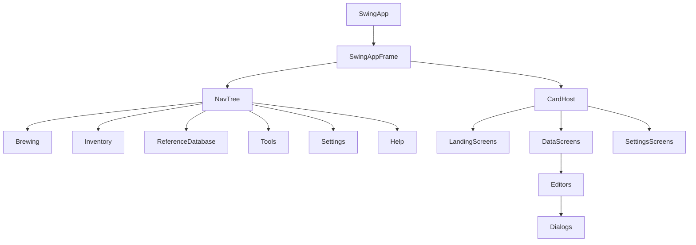
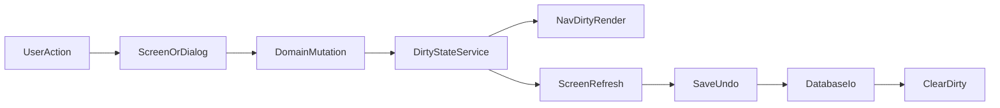
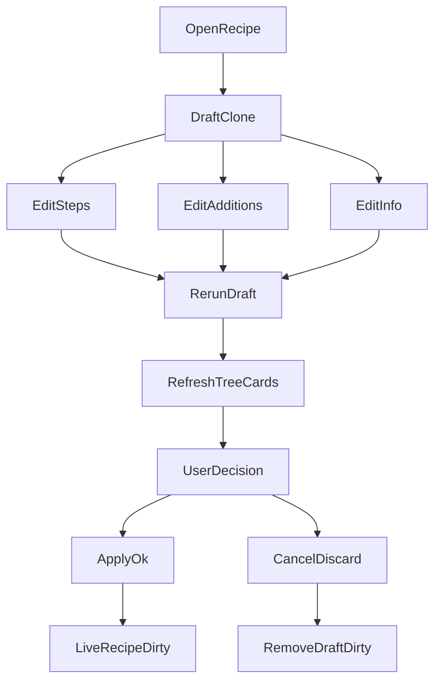
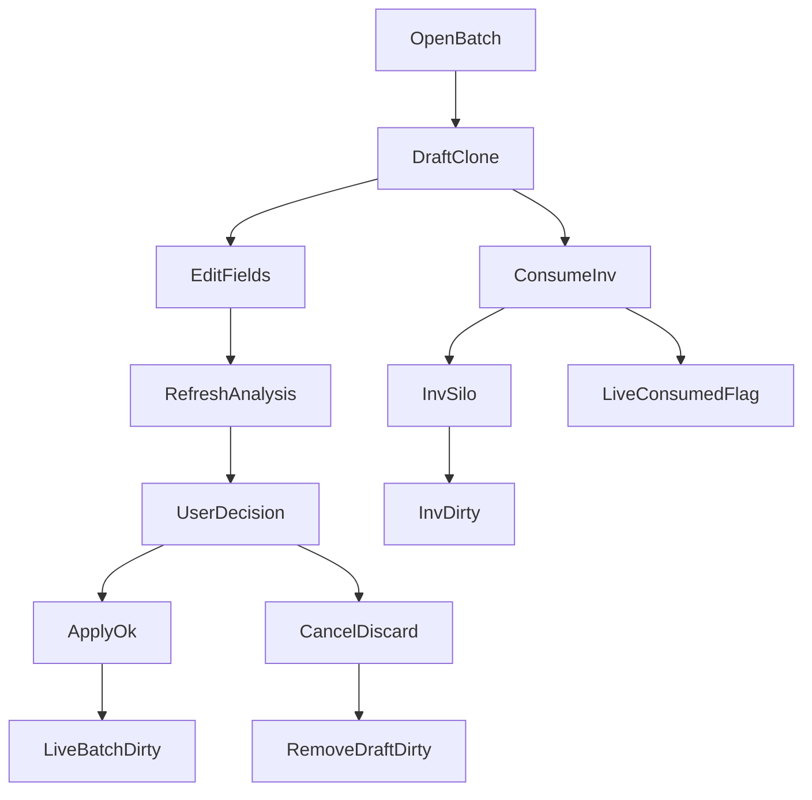

# Brewday Swing UI Design Specification

## 1. Purpose and Scope

This specification documents the completed Swing UI in sufficient detail to
maintain and extend it. The former JavaFX UI has been removed from the codebase;
historical behavior notes live only in [`doc/jfx-ui-design-spec.md`](jfx-ui-design-spec.md) (obsolete).

Scope:

- Swing UI only (`src/main/java/mclachlan/brewday/ui/swing`)
- Shell, navigation, top-level screens, editors, dialogs, and reusable widgets
- Data elements, table columns, editable controls, actions, keyboard paths, and
  dirty-state behavior
- Workflow/state contracts for Save All, Undo All, import, document generation,
  process editing, settings, and utility tools

Out of scope:

- Domain model redesign
- Persistence/data-format redesign
- Process calculation redesign
- Obsolete JavaFX documentation except where it clarifies historical parity intent

Optional historical reference:

- `doc/jfx-ui-design-spec.md` (sources removed; archived spec only)

Primary implementation anchors:

- `src/main/java/mclachlan/brewday/ui/swing/app/SwingApp.java`
- `src/main/java/mclachlan/brewday/ui/swing/app/SwingAppFrame.java`
- `src/main/java/mclachlan/brewday/ui/swing/app/ScreenKey.java`
- `src/main/java/mclachlan/brewday/ui/swing/app/SwingScreen.java`
- `src/main/java/mclachlan/brewday/ui/swing/app/DirtyStateService.java`
- `src/main/java/mclachlan/brewday/ui/swing/screens`
- `src/main/java/mclachlan/brewday/ui/swing/dialogs`
- `src/main/java/mclachlan/brewday/ui/swing/widgets`
- `src/main/java/mclachlan/brewday/data/strings/ui.properties`

## 2. Shell Architecture and Navigation

## 2.1 Startup and shell lifecycle

The Swing application is bootstrapped by `SwingApp` and hosted by
`SwingAppFrame`.

Startup sequence:

1. Construct the main frame.
2. Load the database with `Database.getInstance().loadAll()`.
3. Read Swing look-and-feel settings from `Settings.SWING_LOOK_AND_FEEL`
   (`swing.laf`).
4. Apply the look and feel with `SwingThemeSupport`.
5. Build the shell layout: navigation tree, card host, and status bar.
6. Register all `ScreenKey` cards.
7. Populate dynamic recipe tag nodes.
8. Select Brewing > Recipes as the initial screen.
9. Focus the navigation tree after startup.

Global uncaught UI errors are routed through `SwingUiErrors` where call sites
can catch and display actionable error dialogs. Long-running shell operations
use `SwingWorker` so database IO does not block the EDT.

## 2.2 Shell composition

`SwingAppFrame` extends `JFrame` and contains:

- Left navigation tree (`JTree`, name `navigation.tree`)
- Center card host (`JPanel` with `CardLayout`)
- Bottom status label (`status.label`)
- `JSplitPane` shell divider, initially around 230 px from the left
- Window icons from `SwingIcons`: `setIconImages(SwingIcons.brewdayWindowImages())` supplies multiple resolutions of **`data/img/brewday.png`** for the title bar and OS taskbar/dock; **`brewday.ico`** is not used by Swing (portable PNG only).

Default sizing is provided by `SwingWindowGeometry`:

- Main frame: approximately 89% width and 87% height of the usable screen,
  floored to avoid shrinking below 1280x720 when screen space allows.
- Recipe editor: approximately 91% width and 88% height of owner/usable bounds,
  floored around 1100x720.

### Error reporting (`SwingUiErrors`)

- **Throwable paths**: Use `SwingUiErrors.showError(Component, Throwable, title)` so failures are written to the Brewday log file (full stack), mirrored to standard output, and shown in an error dialog with a short summary plus a scrollable stack trace text area.
- **Plain messages**: Use `SwingUiErrors.showError(Component, String, title)` only for non-exception copy (for example empty-name validation).
- **Logging failures**: If writing to the application log throws, the secondary failure is printed to standard output (never swallowed silently).
- **Uncaught exceptions**: `SwingApp` routes default uncaught handlers through `SwingUiErrors.showUncaught`, which uses the same log, stdout, and scrollable dialog behavior as throwable `showError`.
- **InterruptedException** on `SwingWorker.get()` / import flows: conventional handling—restore the interrupt flag, optional one-line notice on standard output, no error dialog and no stack spam to the log file.
- **Quantity widgets** (`SwingQuantityEditWidget`, `SwingQuantitySelectAndEditWidget`): expected `NumberFormatException` during live parsing is not logged (avoids keystroke spam); editor dialogs that validate on OK still pass the caught exception into `SwingUiErrors` so the user-visible dialog includes the stack trace.

## 2.3 Navigation model and card routing

`ScreenKey` defines every route:

- Brewing
  - Recipes
  - Batches
  - Process Templates
  - Equipment Profiles
- Inventory
  - Inventory
- Reference Database
  - Water
  - Water Parameters
  - Fermentables
  - Hops
  - Yeast
  - Misc Ingredients
  - Styles
- Tools
  - Import Data
  - Water Builder
  - Keg Line Length
  - Yeast Calculator
  - Recipe Tag Manager
- Settings
  - Brewing Settings
    - General
    - Mash pH Models
    - Bitterness Models
  - Backend Settings
    - Local File System
    - Git Backend
  - UI Settings
- Help
  - About Brewday

Each tree node maps to a `ScreenKey`. The card key is `ScreenKey.name()`.
Selection changes call `screen.onActivate()`, `screen.refresh()`, then show the
matching card and update the status label.

Parent routes (`BREWING`, `REFERENCE_DATABASE`, `TOOLS`, `SETTINGS`, nested
settings groups, `HELP`) are implemented as `NavLandingScreen` hub cards.
Landing cards use square icon+label buttons ordered like the tree; each button
calls the same `selectScreen` path as tree navigation and is named
`nav.landing.<SCREEN_KEY>` for automation.

Recipes has dynamic tag children under the Recipes node. Selecting a tag child
routes to `RecipesScreen` with that tag applied. Selecting the Recipes parent
clears the navigation tag filter.

## 2.4 Dirty navigation indicators

`DirtyStateService` tracks object-level dirty state and string category tokens.
`SwingAppFrame` maps each `ScreenKey` to one or more tokens; a node is dirty if
any of its tokens are dirty.

Brewing subtree screens use **leaf** tokens only: `recipes`, `batches`,
`processTemplates`, `equipment.profiles`. Marking one of these bolds that screen
in the nav tree; it does **not** by itself bold the umbrella **Brewing** parent.
The parent route (`ScreenKey.BREWING`) listens only to the `brewing` token
(intentionally broad events, e.g. import via `SwingImportSupport`).

Batch consume/restore: toggling `inventoryConsumed` marks the batch with the
`batches` token. The `inventory` token and per-line inventory object marks run
only when `InventoryFacade.consumeInventory` / `restoreInventory` actually
mutates inventory rows (a consume that matches no stock lines does not flag
Inventory).

`inventory` marks Inventory (and inventory group). Reference tokens (`water`,
`water.parameters`, `fermentables`, `hops`, `yeast`, `misc`, `styles`) mark
their leaf nodes under Reference Database.

Dirty markers are a **UI hint** for likely unsaved work; they are not a formal
memory-vs-disk diff (`Database.saveAll()` writes all silos).

`NavigationTreeCellRenderer` renders dirty nodes in bold. Parent nodes render
bold when any descendant is dirty. Save All or Undo All clears the dirty service
and repaints the tree.

## 2.5 Global shortcuts and status feedback

Frame-level shortcuts are registered on the root pane:

- Ctrl/Cmd+R: refresh current screen
- Ctrl/Cmd+S: Save All
- Ctrl/Cmd+U: Undo All
- Ctrl/Cmd+Z: Undo All
- Ctrl/Cmd+Shift+Q: request application exit (same as closing the main window)
- F1: select Help > About Brewday

Closing the main window (title bar **X**) runs the same exit path. If
`DirtyStateService.hasDirty()` is true, a **Yes/No** warning confirms discarding
unsaved work (`editor.discard.all.msg` / `ui.exit`); **No** keeps the app open.
There is no auto-save on exit.

Global Save All and Undo All show confirmation dialogs. Save runs
`Database.saveAll()` in a `SwingWorker`; Undo runs `Database.loadAll()` in a
`SwingWorker`. On success, the frame clears dirty state, refreshes recipe tag
nodes, refreshes all screens, repaints navigation, and updates the status label.

## 3. Shared Swing UI Patterns

## 3.1 `SwingScreen` lifecycle

Top-level cards implement `SwingScreen`, normally on a `JPanel`.

Lifecycle methods:

- `onActivate()`: screen-specific activation hook; often used to reapply
  selection context or lightweight setup.
- `refresh()`: reload current domain state into Swing controls.

Navigation selection calls both methods before the card becomes visible.
Refresh methods must tolerate being called after Save All, Undo All, import,
settings changes, and dependent-object cascades.

## 3.2 Table CRUD screens

CRUD list screens use a common interaction pattern, even though each screen owns
its concrete table model:

- Non-editable `JTable` for list display
- Toolbar actions for Save All, Undo All, Add New, Edit, Duplicate, Rename, Delete,
  Filter, and Export CSV where applicable
- Primary **Add New** action: label `common.add.new`, Alt+N mnemonic, Ctrl/Cmd+N
  accelerator on standard CRUD table screens (each screen wires these in
  `wireHotkeys()`). Inventory uses multiple type-specific add buttons (see 4.2.1)
  and does not bind a single Ctrl/Cmd+N add.
- Double-click or Enter to open the selected item where supported
- `TableRowSorter` for deterministic sorting
- Optional filter panel opened by toolbar action or shortcut
- Dirty rows rendered in bold
- Export CSV writes displayed rows after sorting/filtering

Typical keyboard model:

- Alt mnemonics on toolbar buttons for discoverability
- Ctrl/Cmd accelerators on common actions through `InputMap`/`ActionMap`
- Ctrl/Cmd+F and Alt+F show/focus filters
- Escape hides a visible filter field
- F2 renames where rename is supported
- Delete deletes the selected row

Save All and Undo All toolbar buttons remain present (legacy parity intent), but
the frame owns the canonical Ctrl/Cmd+S, Ctrl/Cmd+U, and Ctrl/Cmd+Z paths.

## 3.3 Dialog contract

Swing dialogs are modal for create/edit/rename/duplicate/confirm workflows.
They validate before success and return typed values or mutate the passed draft
object according to their local contract.

Common behavior:

- Empty and duplicate names are rejected before object creation/rename.
- Esc cancels where registered.
- Ctrl+Enter accepts where registered.
- Destructive operations show confirmation prompts.
- Utility dialogs expose clear OK/Cancel semantics.

`SwingDialogFormBuilder` provides compact `GridBagLayout` form construction for
dialogs that need consistent label/control rows.

## 3.4 Quantity widgets

`SwingQuantityEditWidget` is the standard single-unit quantity field:

- Shows values with `StringUtils.format(quantity.get(unit))`.
- Commits with `Quantity.parseQuantity(text, unit)`.
- Can display an inline unit label or compact field-only layout.
- Uses `BorderLayout(4, 0)` so it expands like a normal text field in forms.

`SwingQuantitySelectAndEditWidget` adds a unit combo:

- Unit options come from `QuantityUnitOptions` grouped by `Quantity.Type`.
- Changing unit converts the visible value while preserving the stored quantity
  meaning.

Reference DB dialogs normalize colour to SRM and percentage display fields to
the same units used by the prior desktop editors.

## 3.5 Actions, icons, tooltips, and layout density

Reusable commands are represented as Swing `Action` objects where an action is
shared by toolbar buttons, hotkeys, and enabled-state updates. Icons come from
`SwingIcons`.

**Sizes:** Navigation and recipe trees use `navIcon()` / `treeIcon()` at **32px**
(`NAV_ICON_SIZE`, `TREE_ICON_SIZE`); toolbar and dialog action buttons use
`toolbarIcon()` at **32px** (`TOOLBAR_ICON_SIZE`). `JTree` row height is
`TREE_ROW_HEIGHT` (36px) on the shell nav tree and recipe editor tree. Landing
hub tiles remain **48px** (`LANDING_NAV_ICON_SIZE`). Process step graph nodes
draw step glyphs at `TOOLBAR_ICON_SIZE`. Window/title-bar icons are unchanged.

**Semantic keys:** Toolbar actions use dedicated keys where meanings differ —
`SAVE`, `UNDO`, `CANCEL`, `FILTER`, `OK` (not `EDIT`/`DELETE` overloads).
Process steps, output volumes, and some nav/tools screens use distinct
`IconKey`s; assets awaiting final art live under `data/img/placeholder/` (see
`README.txt` there). Recipe tree water additions use `WATER`; dilute steps use
`DILUTE`.

**Ingredient icons (shared resolution):** `SwingIcons.iconKeyFor` / `iconForReference`,
`iconForAddition`, `iconForInventoryLine`, and `iconForReferenceName` align icons
with the reference database: fermentable and misc subtypes; fixed `HOPS`/`YEAST`
for hop/yeast rows; water uses `WATER`. `Misc.Type.WATER_AGENT` uses measurement
type: `WEIGHT` (or null) → sugar-cubes (`MISC`); `VOLUME` → acid-flask
(`MISC_WATER_AGENT`).

**Ingredient tables:** Reference DB lists (Fermentables, Hops, Yeast, Misc) and
inventory use `TABLE_ICON_SIZE` (24px) and `TABLE_ROW_HEIGHT` (28px). Column 0
(name) is rendered by `IngredientNameTableCellRenderer` (icon + name, dirty bold).
Inventory resolves icons by ingredient name + `IngredientAddition.Type` (subtype
when fermentable/misc).

**Recipe tree:** `SwingRecipeTree` uses `iconForAddition` at `TREE_ICON_SIZE` (32px)
for ingredient nodes (same rules as reference DB).

**Pickers:** `SwingIngredientAdditionDialog` (Add and Substitute) shows icon + name
in column 0 (A–Z sorted). `AddInventoryItemDialog` name combo is sorted A–Z with
`IngredientComboBoxRenderer`.

### Tooltips

**Coverage requirement:** Every `JButton` and `JToggleButton`, and every text entry
control (`JTextField`, `JTextArea`, `SwingQuantityEditWidget`, and similar), must
have a tooltip. Use `ui.readonly.copy.tooltip` for read-only text areas where
copy is the only action.

Interactive controls that are not fully explained by a visible label should have
a tooltip: toolbar buttons, filter fields, navigation nodes, landing tiles,
settings controls, and primary editor fields.

**Dialog forms:** Prefer a private `wireTooltips()` method (see
`EditWaterDialog`) that sets tooltips after fields are constructed, using
`{domain}.tooltip.{field}` keys in `ui.properties`.

**Process step forms:** `SwingProcessStepPane.applyLabelTooltip(labelKey, component)`
loads `{labelKey}.tooltip` when present (for example `mash.duration.tooltip`).

**Copy and i18n:** Tooltip text lives in `data/strings/ui.properties` using the
`*.tooltip` suffix (for example `tooltip.toolbar.save.all`,
`recipe.editor.add.step.tooltip`). Legacy `*.tt` keys remain for historical
reference but new work should use `*.tooltip`.

**Button format:** `{What it does}. ({shortcuts})` — omit the parenthetical when
no shortcuts apply. Use `Ctrl/Cmd` for the platform menu-shortcut mask (not
`Ctrl` alone on macOS). Document mnemonics as `Alt+{Letter}` when
`Action.MNEMONIC_KEY` is set. Include extra bindings where wired (`F2`, `Delete`,
`Enter`, `Double-click`, `Escape`).

**Wiring helpers** (`ui/swing/app`):

- `ActionHotkeySupport.applyTooltipText` / `applyTooltip` — set
  `Action.SHORT_DESCRIPTION` (shown on `JButton(action)` tooltips).
- `EntityListToolbarTooltips` — standard Save/Undo/CRUD/Filter/Export toolbars on
  entity-list screens.
- `NavTooltipSupport` — navigation tree and landing hub tiles (`nav.tooltip.*`).
- `DialogButtonTooltips` — shared OK/Cancel/Close/Add dialog button tooltips.

Toolbar buttons and dialog buttons should expose text labels unless the
surrounding screen already establishes an icon-only convention.

Default screen padding:

- Compact table/tool screens: 4 px empty border.
- Forms/settings: around 10 px.
- Mixed split layouts: around 8 px or local panel spacing.
- Landing hubs: larger tile and section margins.
- Passive placeholder cards: centered text with generous insets.

## 3.6 EDT and background work

All Swing component creation and mutation must occur on the EDT.

Background work uses `SwingWorker` or equivalent EDT handoff:

- Global Save All / Undo All
- BeerXML, batches CSV, and Brewday DB import parsing/apply flows
- Git backend enable/disable/sync operations
- Any document generation or future long-running utility workflow that would
  otherwise block UI interaction

Worker completion updates Swing state in `done()` or by `SwingUtilities`.

## 4. Detailed Screen Specifications

## 4.1 Brewing

### 4.1.1 Recipes (`RecipesScreen`)

Table columns:

- Name
- Equipment Profile
- Tags

Actions:

- Save All
- Undo All
- Add (`NewRecipeDialog`)
- Edit (`RecipeEditorDialog` through `RecipeEditorNavPort`)
- Duplicate (`SwingDuplicateRecipeDialog`)
- Rename (`SwingRenameRecipeDialog`)
- Delete
- Filter
- Export CSV
- Packaged Beers report (Alt+B, Ctrl/Cmd+B)

The recipe table supports multiple-row selection.

Filtering:

- Text filter matches visible row text.
- Tag combo contains All plus distinct loaded recipe tags.
- Navigation tag child nodes apply a separate tag route into the same screen.

CSV export columns: name, estimated OG, estimated FG, estimated ABV, one IBU column
per reported bitterness model from settings (`IBU (Tinseth)`, etc.), and SRM colour,
calculated from `recipe.run()` and the largest beer volume.

Packaged Beers report writes a markdown (`.md`) file describing the packaged beer
outputs of the highlighted (multi-selected) recipes. For each selected recipe it runs
`recipe.run()` and lists every packaged beer volume (`recipe.getBeers()`) with the same
metrics as the recipe editor's End Result panel: volume, OG, FG, ABV, carbonation
(vol CO₂) for beer volumes, one IBU line per reported bitterness formula, one pH line per
reported mash pH model, and SRM colour.

Dependency cascades:

- Equipment profile rename/delete cascades through `EquipmentProfileRecipeCascade`.
- Recipe rename/delete cascades to batches through `RecipeBatchCascade`.

Dirty tokens:

- `recipes`
- `brewing`

### 4.1.2 Recipe editor (`RecipeEditorDialog`)

`RecipeEditorDialog` is an application-modal draft editor. It clones the live
recipe on open. OK applies the draft to the live recipe and marks the live
recipe/steps dirty; Cancel or window close removes draft dirty entries and
leaves the live recipe unchanged.

Layout:

- North toolbar: Add Step, Rename Step, Duplicate Step, Delete Step
- Main tabs:
  - Process
  - Process Graph (read-only volume-flow DAG: layered node layout with crossing
    reduction, obstacle-aware edge polylines, wrapped edge labels at path
    midpoints, compact arrowheads, 30px top/left inset, volume labels including
    `Volume.Type` when known after rerun, step type icons; refreshes with rerun)
  - Log
- Default horizontal layout ~**25% / 50% / 25%** (tree / cards / end result) via
  `SwingWindowGeometry.applyRecipeEditorSplitDividers` after the dialog is sized;
  `resizeWeight` on each `JSplitPane` matches those proportions (avoids growth
  sticking to the card column). Cards sit in a horizontal scroll pane when wider
  than their column.
- Process tab: left `SwingRecipeTree` (ingredient nodes use reference-aligned icons
  via `iconForAddition`), center `SwingCardStack` in `JScrollPane`
- Main split: tabbed process/graph/log area, east end-result `JTextArea` (volume,
  OG, FG, ABV, carbonation in vol CO₂ for beer outputs, IBU/pH per settings, SRM)

Cards:

- Recipe info card (`SwingRecipeInfoPanel`)
- One step card for every implemented `ProcessStep.Type`
- One ingredient addition card for every `IngredientAddition.Type` in normal
  recipe mode

Step cards:

- `SwingMashPane`
- `SwingMashInfusionPane`
- `SwingLauterPane`
- `SwingBatchSpargePane`
- `SwingFlySpargePane`
- `SwingBoilPane`
- `SwingFermentPane`
- `SwingSplitPane`
- `SwingPackagePane`
- `SwingHeatPane`
- `SwingCoolPane`
- `SwingStandPane`
- `SwingDilutePane`
- `SwingCombinePane`
- `SwingFreezeConcentratePane`

Addition cards:

- `SwingFermentableAdditionPane`
- `SwingHopAdditionPane`
- `SwingWaterAdditionPane`
- `SwingYeastAdditionPane` (yeast strain + pitch amount; no schedule/time field)
- `SwingMiscAdditionPane`

Recipe info controls:

- Read-only recipe name
- Equipment profile combo
- Tag editor (`SwingTagBarWidget`)
- Description text area
- Add Step
- Rerun
- Generate Document button, present but disabled in recipe-info context
- Apply Different Process Template

Behavior:

- Normal recipe mode uses `recipe.run()` for rerun/end-result updates.
- Process-template mode uses `recipe.dryRun()`.
- The **Log** tab renders the `ProcessLog` from the last run. A **Verbose**
  checkbox toggles `recipe.run(verbose)`:
  - Default (non-verbose): for each step, a header line, a single step-detail
    line (`Type: <type> | <properties>`), and the input/output volumes (each
    volume on one line with all metrics via `Volume.describeOneLine()`), plus
    any errors/warnings.
  - Verbose: additionally logs each ingredient addition on one line (type,
    quantity, time, and best-effort calculated metrics: grist %, gravity
    contribution, or bitterness contribution) and all informational
    calculation messages from `ProcessStep.apply` (e.g. strike water profile,
    boil-off volume, per-hop contribution). These calculation messages are
    emitted via `ProcessLog.addVerboseMessage` and are suppressed in the
    default log.
  - Per-hop contribution lines name the hop, its form, quantity, and timing
    (`Name [Form], qty @ time` via `ProcessStep.describeHopAddition`, with timing
    in minutes for kettle-side steps and days for dry/late hopping) and are
    step-aware about what the hop does to IBU/alpha-acid (AA) content:
    - Boil and Stand isomerise hops, so they log a bitterness contribution for
      every user-selected formula (`Settings.parseReportedFormulas`), formatted
      by `ProcessStep.formatPerFormulaBitterness` (e.g.
      `Tinseth: 12.30 IBU; Rager: 14.10 IBU`).
    - Mash (mash hops) and Lauter (first-wort hops) also isomerise (at their
      reduced mash-hop / first-wort-hop utilisation), so they log the same
      per-formula IBU contribution line per hop.
    - Ferment and Package treat hops as dry/late additions (no boil
      isomerisation), so they log the alpha-acid mass added via
      `ProcessStep.formatDryHopAlpha`; pre-isomerized forms instead report the
      iso-alpha mass they contribute directly.
- The **Process Graph** tab (`SwingProcessStepGraphScrollPane` hosting
  `SwingProcessStepGraphPanel`) shows the same DAG as `Recipe.buildProcessStepDag`
  (same rules as step ordering). Layout is computed in the panel itself (longest-path
  layers, median crossing reduction, obstacle-aware polylines, wrapped edge labels at
  path midpoints) and is **not** recomputed on every recipe rerun — use the toolbar
  **Refresh** button (or open the tab for the first automatic layout). A `JToolBar`
  also provides **zoom in/out** buttons, **Export PNG**, and **Refresh**. A
  `JScrollPane` exposes scroll bars when the graph exceeds the tab; the **mouse wheel**
  zooms toward the cursor via `GraphCamera` (wheel scrolling on the scroll pane is
  disabled). **Left-drag** pans; **double-click** fits the graph to the viewport.
  Rendering uses `Graphics2D` with anti-aliasing and the camera transform. Nodes are
  rounded rectangles with step type icons; edges use compact arrowheads and volume
  labels including `Volume.Type` when known after rerun. Node tooltips (HTML) list step
  properties and bulleted ingredient additions via `ProcessStepGraphTooltipBuilder` (volume
  names and state are on edge tooltips only, not nodes); edge tooltips use world-coordinate
  hit testing and include `Volume.describe()` after rerun. After rerun, edge labels and tooltips
  update without relayout; a stale-layout hint appears when step topology changes until
  Refresh. Circular dependencies and empty recipes show an explanatory message instead
  of the graph. `SwingProcessStepGraphView` and `mclachlan.brewday.ui.processgraph`
  remain in the tree but are not used by the recipe editor.
- Ingredient addition cards and add-ingredient toolbar actions are suppressed in
  process-template mode.
- Step/addition edits mark the draft dirty and refresh computed output.
- Apply Different Process Template opens `SwingApplyNewProcessTemplateDialog`.

Editor shortcuts:

- Ctrl/Cmd+N: add step
- Ctrl/Cmd+R or F2: rename selected step
- Ctrl/Cmd+D: duplicate selected step
- Delete: delete selected step where enabled
- Ctrl+Enter: OK
- Esc: Cancel

### 4.1.3 Process Templates (`ProcessTemplatesScreen`)

Table columns:

- Name
- Steps (count of process steps)

Actions:

- Save All
- Undo All
- Add
- Edit
- Duplicate
- Rename
- Delete
- Filter (collapsible substring filter; Alt+F, Ctrl/Cmd+F; Escape hides panel)
- Export CSV (Alt+X, Ctrl/Cmd+X)

The editor is `RecipeEditorDialog` in process-template mode. Template edits use
dry-run behavior, omit ingredient additions, and mark `processTemplates` dirty.

CSV export is UTF-8 with columns `Name` and `Steps`; exported row order matches
the current table view (sort and filter apply).

### 4.1.4 Batches (`BatchesScreen`)

Table columns:

- Batch ID
- Recipe
- Date (`dd MMM yyyy` display; hidden `LocalDate` sort value)
- Batch Notes

Actions:

- Save All
- Undo All
- Add (`NewBatchDialog`)
- Edit (`SwingBatchEditorDialog` through `BatchEditorNavPort`)
- Duplicate
- Rename
- Delete
- Filter
- Export CSV

Default sorting is date descending. CSV export includes name, recipe, ISO date,
and description.

Dirty tokens:

- `batches`
- `brewing`

### 4.1.5 Batch editor (`SwingBatchEditorDialog`)

`SwingBatchEditorDialog` is an application-modal draft editor. It clones the live
batch on open. OK applies the draft to the live batch and marks the live batch
dirty; Cancel or window close removes draft dirty entries and leaves other live
batch fields unchanged.

The batch editor is a modal dialog for batch details, measurements, recipe bill
of materials, inventory consumption, and document generation.

Ingredient substitutions are **not** modeled on the batch: the Ingredients tab
and inventory consume path follow the linked recipe. Brewers may record what
they actually used (including substitutions) in **batch notes**; editing the
recipe is the way to align BOM, inventory deltas, and process estimates with
changed ingredients.

Layout:

- Default size targets **1400×880** (clamped to `GraphicsEnvironment` maximum
  window bounds with a small margin so the dialog fits the screen).
- Minimum size is **960×600**, capped down on smaller displays so it never
  exceeds the available bounds.
- Horizontal `JSplitPane` between the left details pane and the tabbed pane:
  `resizeWeight` **0.38**; initial divider at **38%** after layout (`invokeLater`).
- Left details pane (`GridBagLayout`):
  - Date picker (`JDatePicker`)
  - Recipe combo
  - Consume/Undo Inventory toggle + Generate Document (`invRow`)
  - **Batch notes:** label on its own row (left-aligned); `JScrollPane` on the
    next row, full width (`gridwidth` 2), `fill` BOTH, `weighty` **1.0**
  - **Analysis:** same pattern as batch notes (label above, scroll pane below,
    `weighty` **1.0**)
  - The two scroll areas share leftover vertical space **evenly** (~50/50)
    because they use equal `weighty` on the same column; fixed rows above keep
    `weighty` 0.
  - `JTextArea` defaults remain larger than the historical baseline for
    readability once the dialog has been opened.
- Right tabs:
  - Measurements
  - Recipe

Measurements table columns:

- Volume
- Type
- Metric
- Estimate
- Measurement

The Measurements tab supports a key-volumes-only filter. Measurement edits parse
quantity text on the draft and recalculate analysis. Draft field edits mark the
draft dirty with the `batches` token.

Inventory workflow (exception to draft-only edits):

- Consume/restore uses `SwingBatchInventoryDeltaDialog` for preview and
  confirmation (recipe name from the draft combo).
- Confirmed changes mutate inventory through `InventoryFacade` immediately.
- Live `inventoryConsumed` is updated immediately; the draft copy is synced for
  the toggle UI.
- Dirty markers for this path: affected `InventoryLineItem` instances and the
  `"inventory"` token only (not `batches` / `brewing` nav tokens; the
  `inventoryConsumed` flag on the live batch still persists with **`Save All`**).

Batch document generation uses `SwingDocumentGeneration` and `DocumentCreator`
(read-only; uses the draft recipe selection).

South panel: **OK** and **Cancel**. Keyboard: **Escape** = Cancel,
**Ctrl/Cmd+Enter** = OK, via `ActionHotkeySupport` on the root pane.

### 4.1.6 Equipment Profiles (`EquipmentProfilesScreen`)

Table columns:

- Name
- Conversion Efficiency
- Mash Tun Volume
- Boil Kettle Volume
- Fermenter Volume

Actions:

- Save All
- Undo All
- Add/Edit (`EditEquipmentProfileDialog`)
- Duplicate
- Rename
- Delete
- Filter
- Export CSV

Editor fields include:

- Name and description
- Elevation
- Conversion efficiency
- Mash tun volume, weight, and specific heat
- Lauter loss
- Boil kettle volume
- Boil evaporation rate
- Boil element power
- Hop utilisation
- Trub/chiller loss
- Fermenter volume

Rename/delete cascades update recipes that reference the equipment profile and
mark recipes dirty.

Dirty tokens:

- `equipment.profiles`
- `brewing`

## 4.2 Inventory

### 4.2.1 Inventory (`InventoryScreen`)

Table columns:

- Ingredient
- Type
- Quantity

Toolbar actions:

- Save All
- Undo All
- Add New Water
- Add New Fermentable
- Add New Hop
- Add New Yeast
- Add New Misc
- Edit
- Delete
- Filter (collapsible substring filter; Alt+F, Ctrl/Cmd+F; Escape hides panel)
- Export CSV

Add flows use `AddInventoryItemDialog` in type-specific mode. **Enter** confirms
add (default button); **Escape** cancels and closes the dialog. Editing updates
the selected item quantity with unit-safe parsing. Every mutation marks the
inventory dirty. Delete confirms before removing the selected item. **Export CSV**
writes **visible table rows** only (respects the active row filter).

Dirty token:

- `inventory`

Dirty **line items** render in **bold** in the table (same dirty-row bolding pattern as reference database CRUD screens). The **ingredient** column shows a leading type icon (24px) beside the name, matching reference DB icons via name lookup (`iconForInventoryLine`). `AddInventoryItemDialog` lists reference ingredients A–Z with the same icons in the name combo.

## 4.3 Reference Database

Reference database screens all follow the CRUD table pattern: Save All, Undo
All, Add New/Edit, Duplicate, Rename, Delete, Filter, Export CSV, dirty-row bolding,
and duplicate-name validation.

### 4.3.1 Water (`WaterScreen`)

Table columns include key water chemistry values:

- Calcium
- Bicarbonate
- Sulfate
- Chloride
- pH
- Alkalinity
- Residual Alkalinity

`EditWaterDialog` uses a two-column layout: scalar fields and ions on the left,
description on the right. Ion and pH values use `SwingQuantityEditWidget`.

Dirty token:

- `water`

### 4.3.2 Water Parameters (`WaterParametersScreen`)

Table columns include min/max ranges for water chemistry constraints:

- Calcium
- Bicarbonate
- Sulfate
- Chloride
- Sodium
- Magnesium
- Alkalinity
- Residual Alkalinity

`EditWaterParametersDialog` edits name, description, and min/max ppm ranges.

Dirty token:

- `water.parameters`

### 4.3.3 Fermentables (`FermentablesScreen`)

The **name** column shows an icon from `Fermentable.Type` (grain, sugar, extract, etc.) plus the name.

Table columns include:

- Type
- Origin
- Supplier
- Colour (SRM)
- Yield
- Distilled water pH

`EditFermentableDialog` fields include type, origin, supplier, description,
colour, yield, coarse-fine difference, moisture, diastatic power, max in batch,
distilled water pH, buffering capacity, lactic acid content, add-after-boil, and
recommend-mash.

Dirty token:

- `fermentables`

### 4.3.4 Hops (`HopsScreen`)

The **name** column shows the shared `HOPS` category icon plus the name (not per `Hop.Type`).

Table columns include:

- Type
- Form
- Origin
- Alpha
- Beta

`EditHopDialog` fields include type, form, origin, description, alpha, beta,
humulene, caryophyllene, cohumulone, myrcene, storage index, and substitutes.
Percentage fields use `SwingQuantityEditWidget`.

Dirty token:

- `hops`

### 4.3.5 Yeast (`YeastScreen`)

The **name** column shows the shared `YEAST` category icon plus the name (not per `Yeast.Type`).

Table columns include:

- Laboratory
- Product ID
- Type
- Form

`EditYeastDialog` fields include type, form, laboratory, product ID,
attenuation, flocculation, min/max temperature, recommended styles, and
description.

Dirty token:

- `yeast`

### 4.3.6 Misc Ingredients (`MiscsScreen`)

The **name** column shows an icon from misc type and measurement (water agents:
weight → sugar cubes, volume → acid flask) plus the name.

Table columns include:

- Type
- Use
- Usage Recommendation

`EditMiscDialog` fields include type, use, measurement type, water-addition
formula (optional **(none)**), acid content, usage recommendation, and description.

Dirty token:

- `misc`

### 4.3.7 Styles (`StylesScreen`)

Table columns include:

- Style Guide
- Number
- Category
- Type

`EditStyleDialog` fields include display name, guide, category, number, letter,
type, min/max OG, FG, IBU, colour, carbonation, ABV, notes, profile,
ingredients, and examples.

Dirty token:

- `styles`

## 4.4 Tools

### 4.4.1 Import Data (`ImportDataScreen`)

Controls:

- Import BeerXML
- Import Batches CSV
- Import Brewday DB

Dialogs:

- `SwingImportBeerXmlDialog`
- `SwingImportBatchesCsvDialog`
- `SwingImportBrewdayDialog`
- `SwingImportOptionsDialog`
- `SwingImportProgressDialog`

Workflow:

1. User chooses the import format.
2. Format-specific dialog collects file/folder and parse options.
3. Parsing runs with progress feedback.
4. Imported objects are presented with per-entity merge options.
5. `SwingImportSupport` applies new/update selections to in-memory maps.
6. Dirty objects and category tokens are marked.
7. User commits or discards through Save All / Undo All.

### 4.4.2 Water Builder (`WaterBuilderScreen`, `SwingWaterBuilderPanel`)

The Water Builder tool uses `SwingWaterBuilderPanel` inside a scrollable screen.
The form is top-left aligned in the viewport (extra window height stays blank below).

Major controls:

- Source water
- Dilution water
- Target water parameters
- Result water
- Ion constraint ranges
- Delta and mean squared error display
- Volume controls
- Goal selector
- Additive constraints and quantities (ten salt additives including pickling lime / `CALCIUM_HYDROXIDE`)
- Solve/apply interactions

Dialog variant:

- `SwingWaterBuilderDialog` is used from mash-family step utilities.
- Applying from a step replaces prior generated water-treatment misc additions
  and adds newly computed additions while marking additions and step dirty.

### 4.4.3 Keg Line Length (`KegLineLengthScreen`, `SwingKegLineLengthPanel`)

Forward-only calculator for balanced keg beer line length using Bernoulli,
Darcy–Weisbach, and Swamee–Jain (Mike Soltys, 2012). Math lives in
`KegLineLengthCalculator` with Brewday `Quantity` inputs and SI internals;
UI uses metric display units. The form is top-left aligned in the scroll viewport.

Inputs:

- Specific gravity
- CO₂ gauge pressure (kPa)
- Hose internal diameter (mm), with presets for common tubing sizes
- Tap height above keg centre (m)
- Pint pour time (s)
- Elevation (m), optional carbonation-chart pressure correction

Outputs:

- Recommended hose length (m)
- Reynolds number and friction factor (read-only detail line)

No persistence or dirty-state integration. Attribution and model assumptions
are shown at the bottom of the panel.

### 4.4.4 Yeast Calculator (`YeastCalculatorScreen`, `SwingYeastCalculatorPanel`)

Forward-only calculator for yeast cell-count estimation, viability, and pitch-rate
adequacy. Math lives in `YeastCalculator` (shared with `FermentationCalculator`);
UI uses Brewday `Quantity` inputs. Layout is compact for a single viewport: top
**wort bar**, **50/50** left **inputs** and right **results** (equal width, top-aligned),
footer assumptions in two columns. `JScrollPane` viewport starts at `(0,0)` for small windows.

**Wort bar** (one row): wort volume always **litres**; original gravity and fermentation
temperature use `Settings.getUnitForStepAndIngredient` for `FERMENT` + `YEAST` (typically
specific gravity, °C).

**Inputs** (titled borders):

- Pitch: yeast strain, source type, pitch amount
- Cell count: mode combo (`ESTIMATE_FROM_QUANTITY`, `MANUAL_TOTAL`, `SLURRY_DENSITY`);
  conditional row via `CardLayout` (manual billions or slurry cells/mL only when active)
- Viability: mode combo (`DEFAULT_BY_SOURCE`, `MANUAL`, `FROM_PACKAGE_AGE`);
  conditional manual % or **vertically stacked** production date, pitch date, storage temp
- All combos use `DefaultListCellRenderer` so dropdown list selection/hover highlighting works

**Results** (live recalculation, always visible beside inputs):

- Total / effective / required cells, pitch ratio (emphasised, colour-coded),
  weighted pitch rate, recommended dry g or liquid mL to reach ratio 1.0
- Process-style warnings when estimates are low-confidence

No persistence or dirty-state integration. Assumptions footer (two columns, smaller
font) cites White & Zainasheff heuristics and model limits.

### 4.4.5 Recipe Tag Manager (`RecipeTagManagerScreen`)

Global maintenance for recipe tags (strings carried on each `Recipe`; see persistence
overview in [`data-model-document.md`](data-model-document.md)). Domain helpers live in
`Brewday`: `renameRecipeTagAcrossAll`, `deleteRecipeTagEverywhere`,
`addTagToRecipesIfAbsent`, `removeTagFromRecipes`, and single-recipe equivalents.

Surfaces:

- Left: tag list sorted with usage counts; **New tag**, **Rename**, and **Delete** are stacked vertically above the list so every action stays visible at the default split width (no horizontal wrap clipping).
- Right: sorted recipe table (default sort recipe name via `TableRowSorter`); **Filter** reveals a collapsible row that narrows recipes by **name** substring (reuse `recipe.filter` / `tooltip.toolbar.filter`; **Ctrl/Cmd+F**, **Alt+F**, Escape to hide/clear — same shortcut pattern as entity list screens). When a tag is selected in the list, inline **Assigned** booleans edit per-recipe assignments; **Assign to selected** / **Remove from selected** operates on multi-selected rows;
  **Select tagged** / **Clear recipe selection** for faster bulk workflows.

Creates require at least one selected recipe—tags are only defined by attachment to recipes.

**Save All** / **Discard All** follow the Recipes screen semantics (`Database.saveAll` /
`Database.loadAll`, `dirtyState`). After mutations the frame refreshes dynamic recipe-tag tree nodes
under Recipes and refreshes `RecipesScreen` so combos and grids stay coherent.

## 4.5 Settings

Settings screens mutate `Database.getInstance().getSettings()` and save settings
immediately with `Database.saveSettings()`.

### 4.5.1 Brewing Settings General (`BrewingSettingsGeneralScreen`)

Controls:

- Default equipment profile
- Mash hop utilisation
- First wort hop utilisation
- Leaf hop adjustment
- Plug hop adjustment
- Pellet hop adjustment

Percentage values are displayed with `SwingQuantityEditWidget` and persisted in
the units expected by the corresponding settings keys.

### 4.5.2 Brewing Settings Mash pH (`BrewingSettingsMashScreen`)

Layout follows the tag-manager master-detail pattern (§4.5.3 IBU settings,
[`BrewingSettingsIbuScreen`](BrewingSettingsIbuScreen)): horizontal `JSplitPane`
(`resizeWeight` 0.28, divider ~304px).

Controls:

- **West:** titled scrollable `JList` of all `MashPhModel` values; each row shows a
  report checkbox plus model label (checkbox toggles membership in the reported group;
  click checkbox hit area or press Space on the selected row)
- **East:** model description (`mash.ph.model.desc.*`) and formula-specific advanced
  card stack for the **selected** list row (not only reported models)
- North hint: list order (top to bottom) sets the primary mash pH model (first reported)
- MPH malt buffering correction factor (MPH card only)

Persisted setting: `mash.ph.models` — comma-separated `MashPhModel` enum names in
**enum declaration order** among checked models. Legacy `mash.ph.model` is migrated on
load. At least one model must remain reported (defaults to MPH if none).

Volumes store separate pH metrics per model (`Volume.Metric.PH_*`). Process logs,
`Volume.describe()`, recipe editor end result, and the acidifier tool use reported
models. Primary pH (`Volume.getPh()`, acidifier) uses the first reported model in list order.

pH is propagated through the whole process graph (mash, runnings, sparge, boil, wort,
and beer volumes) and blended by hydrogen-ion concentration when streams mix. The
packaged beer's computed volume pane therefore shows finished beer pH (per reported
model) alongside OG, FG, ABV, IBU, and colour. Process logs surface pH warnings for
out-of-range mash pH, high sparge water / runoff pH, and out-of-range predicted beer pH.

The MPH advanced setting is shown only on the MPH card. EZ Water and Kaiser Water
use an empty advanced card (no model-specific settings).

### 4.5.3 Brewing Settings IBU (`BrewingSettingsIbuScreen`)

Layout follows the tag-manager master-detail pattern ([`RecipeTagManagerScreen`](RecipeTagManagerScreen)):
horizontal `JSplitPane` (`resizeWeight` 0.28, divider ~304px).

Controls:

- **West:** titled scrollable `JList` of all `HopBitternessFormula` values; each row shows a
  report checkbox plus model label (checkbox toggles membership in the reported group;
  click checkbox hit area or press Space on the selected row)
- **East:** model description (`bitterness.model.desc.*`) and formula-specific advanced
  card stack for the **selected** list row (not only reported models)
- North hint: list order (top to bottom) sets style IBU checks (first reported model)
- Tinseth max utilisation (also used by mIBU boil-time factor)
- BeerSmith Tinseth max utilisation
- Garetz yeast, pellet, bag, and filter factors

Persisted setting: `hop.bitterness.formulas` — comma-separated `HopBitternessFormula`
enum names in **enum declaration order** among checked models. Legacy
`hop.bitterness.formula` is migrated on load. At least one model must remain reported
(defaults to Tinseth if none).

Volumes store separate IBU metrics per model (`Volume.Metric.BITTERNESS_*`). Process
logs, `Volume.describe()`, recipe editor output, and CSV export list all reported
models. `Volume.describe()` also shows `ALPHA_ACIDS_MG` and `ISO_ALPHA_ACIDS_MG`
when computed. Style min/max IBU warnings (`PackageStep`) use the first reported model in
list order.

**mIBU:** Boil-step hop IBU uses the Tinseth-style boil portion only; post-flameout
IBU is added on **Stand** steps for the **MIBU** and **SMPH** metrics (other models use the
shared hop-stand path on Stand). Kettle diameter fields on the equipment profile
improve the wort-cooling estimate (`EditEquipmentProfileDialog`).

**Brewday:** Derived IBU from `ISO_ALPHA_ACIDS_MG / volume_L` (see `BitternessVolumes.syncBrewday`). No tunable parameters on the IBU settings screen. Opt-in via reported models checklist.

### 4.5.4 Backend Settings Local File System (`BackendSettingsLocalFilesystemScreen`)

Read-only informational screen for the JSON file-system backend. Does not persist
settings (unlike brewing/UI settings panes).

Controls:

- Intro text (`settings.local.storage.intro`) explaining backup-on-Save-All,
  Restore Backup vs toolbar Undo All, and `brewday.cfg` path changes.
- Read-only fields: absolute database directory, absolute backup directory,
  `mclachlan.brewday.db` config value, content root (`brewday.content.root`).
- **Restore Backup** — confirms (`settings.local.storage.restore.backup.*`),
  then runs `Database.restoreDb()` and `loadAll()` on a background worker via
  `SwingAppFrame.reloadAfterLocalBackupRestore()`. Clears dirty state and
  refreshes all screens. Disabled when `Database.hasLocalStorageBackup()` is
  false (no `*.json` in `dbDir/backup/` yet).

### 4.5.5 Backend Settings Git (`GitBackendScreen`)

Git backup supports two explicit setup workflows only (see `GitNewBackupSetupDialog`,
`GitRestoreSetupDialog`). Brewday does not offer arbitrary repo attachment, merge
resolution, force-push, or credential management.

**When git is disabled:**

- Intro text and read-only current database directory
- **Set up Git backup…** — Workflow 1 wizard: local-only or SSH remote to empty GitHub repo;
  `git init -b main`, initial commit `Initial Brewday repository`, optional safe first push
- **Use existing Git repository…** — Workflow 2 wizard: adopt local folder (validation +
  optional dirty confirm) or clone SSH remote to a new folder; may update `brewday.cfg` and
  require restart
**Command log (always visible, right-hand panel):**

- Session-wide log of every git subprocess command line and stdout/stderr (includes Save All
  git steps via `GitCommandSessionLog`)
- Word-wrapped monospaced `JTextArea` with vertical scroll; each logged git command line is
  prefixed with a timestamp (`ddMMMyyyy HH:mm:ss`, e.g. `19May2026 14:30:45`)
- **Clear log** — clears session log and view

**When git is enabled:**

- Status summary (branch, origin, ahead/behind)
- Auto-push checkbox (`backend.git.auto.push`)
- **Add remote backup…** — only when no `origin` (local-only setup); same remote checks as Workflow 1
- **Sync with remote** — commit if needed, `fetch`, `pull --ff-only`, `push` (no force, no reset)
- **Disable Git tracking…** — clears `backend.git.enabled`; leaves `.git` on disk
- Refresh status

Save All always writes JSON first, then `git add` / `git commit -m "Brewday save"`; push only
if auto-push is on. Git failures never block saves. Backend operations run in background
workers (`runGitBackendTask`) and append subprocess I/O to the session log and command log view.

### 4.5.6 UI Settings (`UiSettingsScreen`)

Swing appearance is controlled by `Settings.SWING_LOOK_AND_FEEL`
(`swing.laf`), independent of any legacy UI theme key in settings.

Supported look-and-feel tokens:

- `flat.light`
- `flat.dark`
- `flat.darcula`
- `flat.intellij`
- `nimbus`
- `metal`
- `system`

Changes are applied live through `SwingThemeSupport.applySwingLafLive`, which
updates displayable windows after installing the selected look and feel.
Unknown tokens fall back to `flat.light`.

## 4.6 Help

### 4.6.1 About Brewday (`AboutScreen`)

The About screen is an inline read-only card containing copyable values for:

- Application name/version
- Source URL
- Local database path
- Log path
- Licensing and credits text

F1 routes to this screen from anywhere in the main frame.

## 5. Process Step Pane Specifications

Base class: `SwingProcessStepPane<T extends ProcessStep>`.

Shared step controls:

- Step name and description where applicable
- Input volume combo boxes
- Computed output-volume tiles (`SwingComputedVolumePane`): leading icon
  denoting the volume's `Volume.Type` (MASH/WORT/BEER via `VOLUME_*` keys,
  distinct from step-type icons), bold volume name,
  `Volume.describe()` body, and a **Rename...** action on each tile that opens
  `SwingRenameOutputVolumeDialog`. Confirming a rename invokes
  `Recipe.renameVolume(old, new)`, which rewrites the producing step's output
  field, every downstream step's input field, and the runtime `Volumes`
  registry in one pass; the host editor then reruns and refreshes tree labels
  via the `SwingProcessStepPane.setOnVolumesChanged` callback.
- Quantity, time, temperature, and volume unit controls via
  `SwingUnitControlUtils`
- Add-ingredient toolbar actions for step-supported addition types
- Utility actions where step-specific tools apply

Concrete step panes:

- `SwingMashPane`: grain temperature, duration, computed mash temperature/pH,
  input/output mash volumes, Acidifier, Target Mash Temp, Grain Proportion Adjuster,
  Water Builder
- `SwingMashInfusionPane`: ramp/stand times, mash temperature readout, in/out
  mash volume, Water Builder support
- `SwingLauterPane`: input mash, first-runnings output, lautered-mash output
- `SwingBatchSpargePane`: mash input, existing wort input, combined/sparge
  outputs, Water Builder support
- `SwingFlySpargePane`: mash input, sparge water (Water Builder support),
  collected-wort output, spent-grain output (continuous single-pass sparge)
- `SwingBoilPane`: input wort, duration, time-to-boil, remove-trub flag,
  wort/trub outputs
- `SwingDilutePane`: input volume, dilution water, remove-trub flag (kettle trub
  and chiller loss from equipment profile), output volume
- `SwingCoolPane`: input volume, target temperature, remove-trub flag, output volume
- `SwingHeatPane`: input volume, target temperature, ramp/stand times, output
  volume
- `SwingFermentPane`: input, **ferment phase** (`PRIMARY`, `SECONDARY`,
  `TERTIARY`, `STARTER`, `CONDITIONING`, `SOURING`), fermentation start/end
  temperature, duration, remove-trub flag, estimated FG, output
- `SwingStandPane`: input, duration, cooling coefficient (k per hour) with scenario presets, remove-trub flag, output; hop-stand IBU and volume cooling use equipment ambient temperature + step k  
  Prefer enabling removal on **one** kettle-side transition (boil vs cool /
  dilute vs stand vs ferment) so equipment trub/chiller loss is not applied
  more than once in the same pipeline unless intentional.
- `SwingSplitPane`: input, split by percentage or absolute volume,
  output1/output2
- `SwingCombinePane`: input1, input2, **pitch combine** (blend `WORT` +
  `BEER` starter into pitch `WORT`), output
- `SwingPackagePane`: step toolbar (ingredient-add buttons plus PACKAGE-icon
  carbonation-calculator button, tooltip `package.calc.button.tooltip`, opens
  `SwingCarbonationCalculatorDialog`); input, style, packaging type (vessel:
  `BOTTLE` / `KEG` / `CASK`), carbonation method (`FORCE_CARB` / `PRIMING_SUGAR`
  / `SPEISE` / `SPUNDING` / `KRAUSENING`), full-width combination warning label
  (Bottle + force carb / Speise / Spunding / Krausening), then a `SwingCardStack`
  of method-specific carbonation panels (force-carb target, priming hint, Speise
  `WORT` volume combo, Spunding read-only predicted FG from `FermentationCalculator`,
  Krausening source recipe + volume combos — volume list from an ephemeral run of
  the selected recipe, WORT and BEER only), packaging loss. **CASK** excludes
  force carbonation from the carbonation-method combo; switching to CASK from
  force carb clears carbonation fields and selects priming sugar. User carbonation
  method changes and Bottle selection clear `forcedCarbonation`, `speiseVolume`,
  and krausen source fields before applying the new method. Selecting **Bottle**
  auto-sets carbonation to priming sugar (with the same clear). Cross-recipe
  krausen references are informational only (not DAG inputs). Process rerun logs
  mirror the Bottle warning matrix via `PackageStep.validatePackagingConfiguration`.
  The packaged beer's output-volume name is edited via the shared in-tile Rename
  action on its computed-volume tile, not a dedicated text field on the form.
- `SwingFreezeConcentratePane`: beer input, freeze duration, freezer
  temperature, beer output. No ingredient additions. Advanced model fields
  (retention factors, process efficiency, water-removal override) are persisted
  but not exposed in the form.

Step utility dialogs:

- `SwingWaterBuilderDialog`
- `SwingAcidifierDialog`
- `SwingTargetMashTempDialog`
- `SwingGrainProportionAdjusterDialog`
- `SwingCarbonationCalculatorDialog` (Package step): style carbonation range with
  min/mid/max quick-set; target CO₂; style-range and packaging safety warnings;
  method-specific required quantities (priming mass, Speise/krausen volume, Spunding
  max achievable); keg force-carb serving temperature and equilibrium gauge pressure
  (bidirectional with target CO₂ via `Equations.calcEquilibriumCo2` /
  `calcEquilibriumPressureFromCo2`). OK applies priming fermentable addition or
  force-carb target to the step; Speise/Krausen/Spunding results are advisory only.

Step edits mark the selected draft step dirty and trigger recipe rerun/dry-run
through the editor.

## 6. Ingredient Addition Pane Specifications

Base class: `SwingIngredientAdditionPane`.

Shared addition controls:

- Ingredient identity display/selection context
- Quantity and unit controls
- Time controls when the addition captures process time
- Duplicate
- Substitute
- Delete

Concrete addition panes:

- `SwingFermentableAdditionPane`
- `SwingHopAdditionPane`
- `SwingWaterAdditionPane` (includes temperature)
- `SwingYeastAdditionPane` (yeast strain + pitch amount; no schedule/time field)
- `SwingMiscAdditionPane`

Addition dialogs:

- `SwingFermentableAdditionDialog`
- `SwingHopAdditionDialog`
- `SwingWaterAdditionDialog`
- `SwingYeastAdditionDialog` (strain + amount only; no pitch-time field)
- `SwingMiscAdditionDialog`

Addition create/edit/substitute flows support filtering and inventory-only modes
where the corresponding legacy dialogs did. Addition edits mark the draft
addition and owning step/recipe context dirty.

## 7. Dialog Catalog

## 7.1 CRUD and naming dialogs

- `AddInventoryItemDialog`
- `NewRecipeDialog`
- `NewBatchDialog`
- `SwingNewStepDialog`
- `SwingRenameStepDialog`
- `SwingDuplicateStepDialog`
- `SwingRenameRecipeDialog`
- `SwingDuplicateRecipeDialog`
- `EditEquipmentProfileDialog`
- `EditWaterDialog`
- `EditWaterParametersDialog`
- `EditFermentableDialog`
- `EditHopDialog`
- `EditYeastDialog`
- `EditMiscDialog`
- `EditStyleDialog`

## 7.2 Recipe, batch, and utility dialogs

- `RecipeEditorDialog`
- `SwingBatchEditorDialog`
- `SwingBatchInventoryDeltaDialog`
- `SwingApplyNewProcessTemplateDialog`
- `SwingWaterBuilderDialog`
- `SwingAcidifierDialog`
- `SwingTargetMashTempDialog`

## 7.3 Ingredient addition dialogs

- `SwingIngredientAdditionDialog`
- `SwingFermentableAdditionDialog`
- `SwingHopAdditionDialog`
- `SwingWaterAdditionDialog`
- `SwingYeastAdditionDialog` (strain + amount only; no pitch-time field)
- `SwingMiscAdditionDialog`

## 7.4 Import dialogs

- `SwingImportBeerXmlDialog`
- `SwingImportBatchesCsvDialog`
- `SwingImportBrewdayDialog`
- `SwingImportOptionsDialog`
- `SwingImportProgressDialog`

## 7.5 Shell/system dialogs

- `JOptionPane` confirmations for save, undo, destructive CRUD actions, and
  backend operations
- `JFileChooser` for export/import/document paths
- `SwingUiErrors` for user-visible errors

## 8. End-to-End Workflow Specifications

## 8.1 Recipe lifecycle

1. User opens Brewing > Recipes.
2. New recipe opens `NewRecipeDialog`, validates name and template, then calls
   Brewday recipe creation.
3. Edit opens `RecipeEditorDialog` on a draft clone.
4. User edits recipe info, steps, and additions.
5. Dirty edits rerun the draft recipe and refresh tree/cards/log/end result.
6. OK applies the draft and marks live recipe state dirty; Cancel discards draft
   changes.
7. Save All persists through `Database.saveAll()`. Undo All reloads through
   `Database.loadAll()`.

## 8.2 Process template lifecycle

1. User opens Brewing > Process Templates.
2. New/edit opens `RecipeEditorDialog` in process-template mode.
3. Editor uses dry-run calculations and hides ingredient addition editing.
4. OK marks the template dirty with `processTemplates` and `brewing` tokens.
5. Save All or Undo All commits or discards through the global database model.

## 8.3 Batch lifecycle

1. User opens Brewing > Batches.
2. New batch opens `NewBatchDialog`, collects date and recipe, validates input,
   and creates the batch.
3. Edit opens `SwingBatchEditorDialog` on a draft clone.
4. User edits date, recipe, notes, or measurements on the draft, consumes or
   restores inventory (immediate inventory silo + live `inventoryConsumed`), or
   generates a document.
5. Draft edits recalculate analysis and mark the draft dirty; confirmed consume
   marks inventory dirty.
6. OK applies the draft and marks the live batch dirty; Cancel discards draft
   field changes (inventory consume/restore is not reverted).
7. Save All or Undo All commits or discards through the global database model.

## 8.4 Import lifecycle

1. User opens Tools > Import Data.
2. User chooses BeerXML, batches CSV, or Brewday DB import.
3. The selected import dialog collects options and parses input with progress.
4. User chooses merge options for new/update entities.
5. `SwingImportSupport` applies selected imports to in-memory maps.
6. Affected objects and category tokens are marked dirty.
7. User reviews results and commits or discards with Save All / Undo All.

## 8.5 Utility workflows from step editors

Water Builder:

- Open `SwingWaterBuilderDialog`.
- Solve/compute target additions.
- Apply removes previous generated water-treatment additions for the step and
  adds the newly computed additions.
- Mark additions and step dirty.

Acidifier:

- Open `SwingAcidifierDialog`.
- Append generated acid additions.
- Mark additions and step dirty.

Target Mash Temp:

- Open `SwingTargetMashTempDialog`.
- Set water addition temperatures.
- Mark additions and step dirty.

Grain Proportion Adjuster:

- Open `SwingGrainProportionAdjusterDialog` from `SwingMashPane`.
- Edit bill percentages; counter row is chosen by base-malt heuristic (GRAIN,
  `recommendMash`, highest diastatic power) or largest weight fallback.
- On OK, update fermentable addition quantities (total weight unchanged) and
  mark additions and step dirty.

## 8.6 Save/Undo contract

Save All:

- Confirm with the user.
- Call `Database.saveAll()`.
- Clear dirty state.
- Refresh all screens and dynamic recipe tag nodes.
- Repaint navigation.

Undo All:

- Confirm with the user.
- Call `Database.loadAll()`.
- Clear dirty state.
- Refresh all screens and dynamic recipe tag nodes.
- Repaint navigation.

This model is global even when invoked from a specific screen toolbar.

## 9. Behavioral Contracts

The Swing UI must preserve these contracts:

1. Navigation tree and card-key routing through `ScreenKey`.
2. Dynamic recipe tag nodes under the Recipes tree node.
3. Parent navigation hub cards through `NavLandingScreen`.
4. Object/category dirty tracking with bold navigation indicators.
5. Immediate in-memory mutation for committed field/dialog edits.
6. Explicit Save All / Undo All database model.
7. Draft OK/Cancel semantics for recipe and process-template editor dialogs.
8. Recipe rerun/dry-run refresh after step/addition edits.
9. Import merge model with per-entity new/update choices.
10. Inventory consume/restore confirmation with previewed deltas.
11. Batch document generation via the existing `DocumentCreator` path.
12. Swing look-and-feel persistence through `swing.laf`.
13. Long-running IO/backend operations off the EDT.
14. User-visible errors and confirmations for destructive or failing operations.

## 10. Validation and Quality Gates

Documentation-only changes to this specification do not require a Java compile.
Code changes that affect Swing UI behavior should be validated with the most
targeted practical combination of:

- `ant compile`
- Targeted Swing test classes under `src/test/java/mclachlan/brewday/ui/swing`
- Manual smoke checks for the affected screen/dialog
- Optional comparison against archived `doc/jfx-ui-design-spec.md` for historical behavior only

Current Swing test coverage includes focused tests for:

- Navigation and dirty styling (`SwingAppFrameNavigationTest`)
- Quantity widgets
- Recipe tree and tag widgets
- Step panes and computed volume panes
- Addition panes/dialogs
- New/rename/duplicate dialogs

Quality gates:

- No domain/process calculation logic moves into Swing UI classes.
- Persistence keys and serializer contracts remain unchanged.
- Screen refresh works after Save All, Undo All, import, and dependency cascades.
- Dirty indicators clear after successful Save All or Undo All.
- Long-running work does not block the EDT.
- Dialog validation prevents invalid names, duplicate names, and invalid
  quantity text before mutating live state.

## 11. Class-to-Surface Index

Top-level app and shared:

- `SwingApp`
- `SwingAppFrame`
- `ScreenKey`
- `SwingScreen`
- `DirtyStateService`
- `NavigationTreeCellRenderer`
- `SwingIcons`
- `IngredientNameTableCellRenderer`
- `IngredientComboBoxRenderer`
- `SwingThemeSupport`
- `SwingUiErrors`
- `SwingWindowGeometry`
- `ActionHotkeySupport`
- `EntityListToolbarTooltips`
- `NavTooltipSupport`
- `DialogButtonTooltips`

Top-level screens:

- `NavLandingScreen`
- `RecipesScreen`
- `BatchesScreen`
- `ProcessTemplatesScreen`
- `EquipmentProfilesScreen`
- `InventoryScreen`
- `WaterScreen`
- `WaterParametersScreen`
- `FermentablesScreen`
- `HopsScreen`
- `YeastScreen`
- `MiscsScreen`
- `StylesScreen`
- `ImportDataScreen`
- `WaterBuilderScreen`
- `KegLineLengthScreen`
- `YeastCalculatorScreen`
- `SwingYeastCalculatorPanel`
- `RecipeTagManagerScreen`
- `BrewingSettingsGeneralScreen`
- `BrewingSettingsMashScreen`
- `BrewingSettingsIbuScreen`
- `BackendSettingsLocalFilesystemScreen`
- `GitBackendScreen`
- `UiSettingsScreen`
- `AboutScreen`

Editor and support ports:

- `RecipeEditorDialog`
- `SwingBatchEditorDialog`
- `RecipeEditorNavPort`
- `ProcessTemplateEditorNavPort`
- `BatchEditorNavPort`
- `EquipmentProfileRecipeCascade`
- `RecipeBatchCascade`
- `SwingDocumentGeneration`
- `SwingImportSupport`

Recipe/process widgets:

- `SwingRecipeTree`
- `SwingProcessStepGraphScrollPane` (Process Graph tab host in recipe editor)
- `SwingProcessStepGraphPanel` (layered graph renderer inside scroll pane)
- `ProcessStepGraphTooltipBuilder` (HTML node tooltips for process graph)
- `GraphCamera` (zoom/pan transform for process graph panel)
- `SwingProcessStepGraphView` (force-layout graph; retained, unused by editor)
- `mclachlan.brewday.ui.processgraph` (layout/routing helpers for the view; retained, unused by editor)
- `SwingRecipeInfoPanel`
- `SwingRecipeBillOfMaterialsPanel`
- `SwingCardStack`
- `SwingComputedVolumePane`
- `SwingProcessStepPane`
- `SwingMashPane`
- `SwingMashInfusionPane`
- `SwingLauterPane`
- `SwingBatchSpargePane`
- `SwingFlySpargePane`
- `SwingBoilPane`
- `SwingFermentPane`
- `SwingSplitPane`
- `SwingPackagePane`
- `SwingHeatPane`
- `SwingCoolPane`
- `SwingStandPane`
- `SwingDilutePane`
- `SwingCombinePane`
- `SwingFreezeConcentratePane`

Ingredient widgets:

- `SwingIngredientAdditionPane`
- `SwingFermentableAdditionPane`
- `SwingHopAdditionPane`
- `SwingWaterAdditionPane`
- `SwingYeastAdditionPane` (yeast strain + pitch amount; no schedule/time field)
- `SwingMiscAdditionPane`

Shared widgets:

- `SwingQuantityEditWidget`
- `SwingQuantitySelectAndEditWidget`
- `QuantityUnitOptions`
- `SwingUnitControlUtils`
- `SwingTagBarWidget`
- `SwingWaterBuilderPanel`

Dialogs:

- `AddInventoryItemDialog`
- `NewRecipeDialog`
- `NewBatchDialog`
- `EditEquipmentProfileDialog`
- `EditWaterDialog`
- `EditWaterParametersDialog`
- `EditFermentableDialog`
- `EditHopDialog`
- `EditYeastDialog`
- `EditMiscDialog`
- `EditStyleDialog`
- `SwingDialogFormBuilder`
- `SwingNewStepDialog`
- `SwingRenameStepDialog`
- `SwingDuplicateStepDialog`
- `SwingRenameRecipeDialog`
- `SwingDuplicateRecipeDialog`
- `SwingBatchInventoryDeltaDialog`
- `SwingApplyNewProcessTemplateDialog`
- `SwingWaterBuilderDialog`
- `SwingAcidifierDialog`
- `SwingTargetMashTempDialog`
- `SwingIngredientAdditionDialog`
- `SwingFermentableAdditionDialog`
- `SwingHopAdditionDialog`
- `SwingWaterAdditionDialog`
- `SwingYeastAdditionDialog` (strain + amount only; no pitch-time field)
- `SwingMiscAdditionDialog`
- `SwingImportBeerXmlDialog`
- `SwingImportBatchesCsvDialog`
- `SwingImportBrewdayDialog`
- `SwingImportOptionsDialog`
- `SwingImportProgressDialog`

## 12. Architecture and Interaction Diagrams

### 12.1 Navigation and card architecture

```mermaid
flowchart TD
  SwingApp --> SwingAppFrame
  SwingAppFrame --> NavTree
  SwingAppFrame --> CardHost
  NavTree --> Brewing
  NavTree --> Inventory
  NavTree --> ReferenceDatabase
  NavTree --> Tools
  NavTree --> Settings
  NavTree --> Help
  CardHost --> LandingScreens
  CardHost --> DataScreens
  CardHost --> SettingsScreens
  DataScreens --> Editors
  Editors --> Dialogs
```

### 12.2 Dirty and save interaction flow

```mermaid
flowchart LR
  UserAction --> ScreenOrDialog
  ScreenOrDialog --> DomainMutation
  DomainMutation --> DirtyStateService
  DirtyStateService --> NavDirtyRender
  DirtyStateService --> ScreenRefresh
  ScreenRefresh --> SaveUndo
  SaveUndo --> DatabaseIo
  DatabaseIo --> ClearDirty
```

### 12.3 Recipe editor draft flow

```mermaid
flowchart TD
  OpenRecipe --> DraftClone
  DraftClone --> EditSteps
  DraftClone --> EditAdditions
  DraftClone --> EditInfo
  EditSteps --> RerunDraft
  EditAdditions --> RerunDraft
  EditInfo --> RerunDraft
  RerunDraft --> RefreshTreeCards
  RefreshTreeCards --> UserDecision
  UserDecision --> ApplyOk
  UserDecision --> CancelDiscard
  ApplyOk --> LiveRecipeDirty
  CancelDiscard --> RemoveDraftDirty
```

### 12.4 Batch editor draft flow

```mermaid
flowchart TD
  OpenBatch --> DraftClone
  DraftClone --> EditFields
  DraftClone --> ConsumeInv
  EditFields --> RefreshAnalysis
  RefreshAnalysis --> UserDecision
  ConsumeInv --> InvSilo
  ConsumeInv --> LiveConsumedFlag
  InvSilo --> InvDirty
  UserDecision --> ApplyOk
  UserDecision --> CancelDiscard
  ApplyOk --> LiveBatchDirty
  CancelDiscard --> RemoveDraftDirty
```
